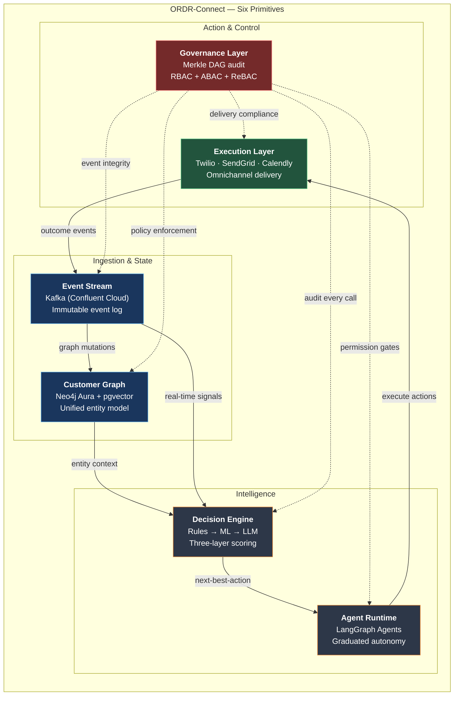
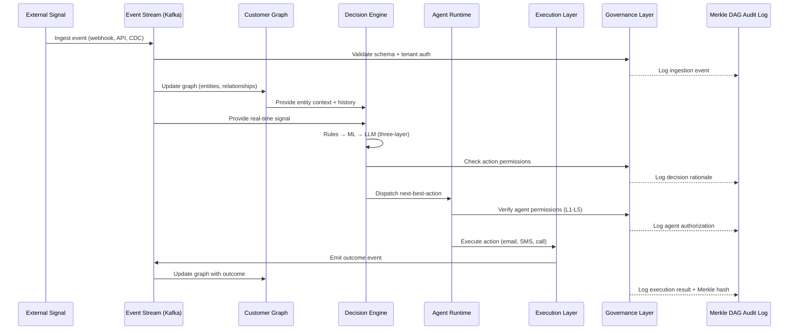
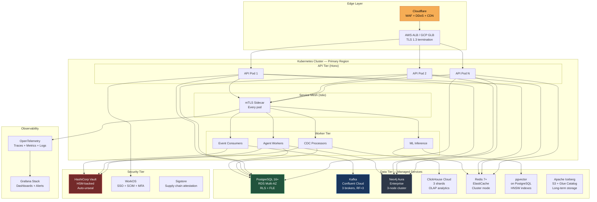
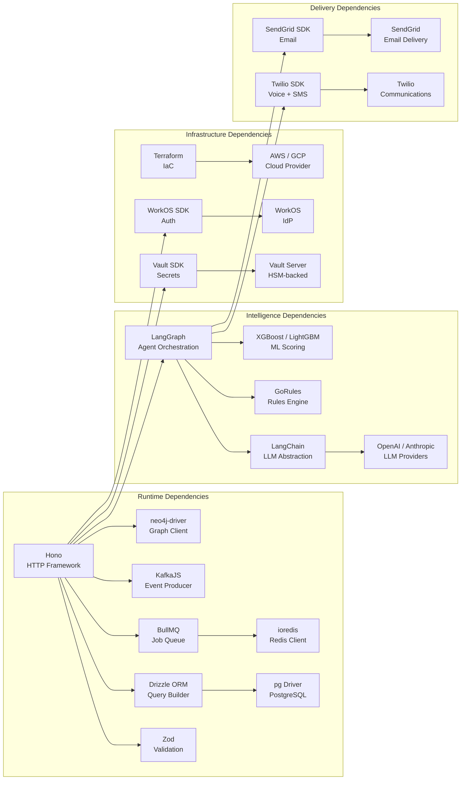

# ORDR-Connect — System Architecture Overview

> **Classification:** Confidential — Internal Engineering
> **Compliance Scope:** SOC 2 Type II | ISO 27001:2022 | HIPAA
> **Last Updated:** 2026-03-24
> **Owner:** Platform Engineering

---

## 1. Architectural Philosophy

ORDR-Connect is a **Customer Operations OS** built on six composable primitives. Every
primitive enforces tenant isolation, audit logging, and encryption by default — there is
no "opt-in" security. The architecture follows a strict **event-driven, polyglot-persistent,
zero-trust** model designed to satisfy SOC 2 Type II, ISO 27001:2022, and HIPAA simultaneously.

### Design Principles

| Principle | Implementation |
|---|---|
| **Tenant Isolation** | PostgreSQL RLS, Neo4j namespace isolation, Kafka topic-per-tenant, Redis ACLs |
| **Defense in Depth** | mTLS everywhere, field-level encryption, Vault-managed secrets, AMD SEV-SNP |
| **Event Sourcing** | Every state mutation emits an immutable event to Kafka before acknowledgment |
| **Polyglot Persistence** | Right database for the right workload — no compromises |
| **Graduated Autonomy** | AI agents operate within explicit permission boundaries with kill switches |
| **Compliance by Construction** | Audit trails, retention policies, and access controls are structural, not bolted on |

---

## 2. Six Primitives — High-Level Architecture

### Primitive Responsibilities

| # | Primitive | Purpose | Primary Store | SLA |
|---|---|---|---|---|
| 1 | **Customer Graph** | Unified entity model — people, companies, deals, tickets, products | Neo4j Aura + pgvector | p99 < 50ms read |
| 2 | **Event Stream** | Immutable log of every state change and external signal | Kafka (Confluent) | p99 < 15ms publish |
| 3 | **Decision Engine** | Three-layer intelligence: rules → ML → LLM reasoning | ClickHouse + Redis | p99 < 100ms (rules) |
| 4 | **Agent Runtime** | Autonomous AI agents with graduated permissions | LangGraph + Redis | p99 < 2s per step |
| 5 | **Execution Layer** | Omnichannel action delivery — email, SMS, call, calendar | Twilio, SendGrid, API | p99 < 500ms dispatch |
| 6 | **Governance Layer** | Audit, compliance, access control, encryption | PostgreSQL + Vault | p99 < 10ms policy check |

---

## 3. Data Flow Cycle

Every operation in ORDR-Connect follows a closed-loop cycle. No data transformation
happens outside this cycle, ensuring complete auditability.

---

## 4. Deployment Topology

### Infrastructure Overview

All components deploy to **Kubernetes** (EKS/GKE) across three availability zones.
Stateful services use managed offerings (RDS, Confluent Cloud, Neo4j Aura) to
eliminate operational burden while maintaining compliance guarantees.

---

## 5. Component Dependency Diagram

---

## 6. Tech Stack Reference

### Application Layer

| Component | Technology | Version | Purpose |
|---|---|---|---|
| Language | TypeScript (strict mode) | 5.4+ | Type-safe application code |
| HTTP Framework | Hono | 4.x | Edge-ready, zero-dependency HTTP |
| ORM | Drizzle ORM | 0.30+ | Type-safe SQL with RLS support |
| Validation | Zod | 3.x | Runtime schema validation |
| Job Queue | BullMQ | 5.x | Background job processing |
| Agent Framework | LangGraph | 0.2+ | Stateful multi-agent orchestration |

### Data Layer

| Component | Technology | Version | Purpose |
|---|---|---|---|
| Primary DB | PostgreSQL | 16+ | OLTP, RLS, field-level encryption |
| Graph DB | Neo4j Aura | 5.x | Customer relationship graph |
| OLAP | ClickHouse | 24.x | Analytics, materialized views |
| Vector Store | pgvector + pgvectorscale | 0.7+ | Embedding similarity search |
| Event Streaming | Kafka (Confluent Cloud) | 3.7+ | Event sourcing, CDC |
| Cache | Redis | 7+ | Session, rate limiting, feature flags |
| Cold Storage | Apache Iceberg | 1.5+ | Long-term event archival |

### Security & Infrastructure

| Component | Technology | Version | Purpose |
|---|---|---|---|
| Auth Provider | WorkOS | latest | SSO, SCIM, MFA, Directory Sync |
| Secret Management | HashiCorp Vault | 1.16+ | HSM-backed secret lifecycle |
| IaC | Terraform | 1.7+ | Infrastructure provisioning |
| Container Runtime | Kubernetes | 1.29+ | Orchestration, auto-scaling |
| Service Mesh | Istio | 1.21+ | mTLS, traffic management |
| CI/CD | GitHub Actions | latest | Build, test, deploy pipelines |
| Supply Chain | Sigstore + SLSA | L3 | Artifact signing, provenance |

### External Services

| Component | Technology | Purpose |
|---|---|---|
| Voice & SMS | Twilio | Outbound communications |
| Email | SendGrid | Transactional + marketing email |
| Calendar | Calendly API | Meeting scheduling |
| Enrichment | Clearbit / Apollo | Contact data enrichment |

---

## 7. Cross-Cutting Concerns

### Observability

Every service emits structured telemetry via **OpenTelemetry**:

- **Traces:** Distributed tracing with W3C Trace Context propagation across all services
- **Metrics:** RED metrics (Rate, Errors, Duration) per endpoint, per tenant
- **Logs:** Structured JSON logs with `tenant_id`, `request_id`, `trace_id` correlation
- **Alerts:** PagerDuty integration with severity-based routing and escalation

### Multi-Tenancy

Tenant isolation is enforced at every layer:

1. **Network:** Istio `AuthorizationPolicy` restricts cross-tenant traffic
2. **Application:** Middleware injects `tenant_id` from JWT into every request context
3. **Database:** PostgreSQL RLS policies filter all queries by `tenant_id`
4. **Cache:** Redis ACLs scope keys to `tenant:{id}:*` patterns
5. **Events:** Kafka topics partitioned by `tenant_id` hash
6. **Graph:** Neo4j property-level tenant filtering on every traversal

### Compliance Mapping

| Requirement | SOC 2 | ISO 27001 | HIPAA |
|---|---|---|---|
| Access Control | CC6.1-6.8 | A.9 | 164.312(a)(1) |
| Audit Logging | CC7.1-7.4 | A.12.4 | 164.312(b) |
| Encryption at Rest | CC6.7 | A.10.1 | 164.312(a)(2)(iv) |
| Encryption in Transit | CC6.7 | A.13.1 | 164.312(e)(1) |
| Incident Response | CC7.3-7.5 | A.16 | 164.308(a)(6) |
| Data Retention | CC6.5 | A.8.3 | 164.530(j) |
| Availability | CC9.1 | A.17 | 164.308(a)(7) |

---

## 8. Scalability Targets

| Metric | Target | Burst |
|---|---|---|
| API requests/sec | 10,000 | 50,000 |
| Events/sec (Kafka) | 100,000 | 500,000 |
| Graph queries/sec | 5,000 | 20,000 |
| Agent executions/min | 1,000 | 5,000 |
| Concurrent tenants | 500 | 2,000 |
| Data retention | 7 years (Iceberg) | — |

### Horizontal Scaling Strategy

- **API Tier:** Kubernetes HPA based on CPU/memory and custom metrics (request latency)
- **Worker Tier:** KEDA-based autoscaling tied to Kafka consumer lag
- **Database Tier:** Read replicas (PostgreSQL), shard expansion (ClickHouse), auto-scaling (Neo4j Aura)
- **Cache Tier:** Redis Cluster with automatic resharding

---

## 9. Failure Modes & Recovery

| Failure | Detection | Recovery | RTO |
|---|---|---|---|
| API pod crash | Kubernetes liveness probe | Auto-restart + HPA scale-up | < 30s |
| Database failover | RDS Multi-AZ heartbeat | Automatic failover to standby | < 60s |
| Kafka broker loss | Confluent health check | Partition reassignment (RF=3) | < 120s |
| Neo4j node failure | Aura monitoring | Cluster self-healing | < 90s |
| Redis node failure | Sentinel/Cluster detection | Automatic failover | < 10s |
| Region outage | Route 53 health check | DNS failover to DR region | < 300s |
| Vault seal event | Audit log + health check | Auto-unseal via KMS | < 60s |

---

*Next: [02-security-architecture.md](./02-security-architecture.md) — Zero-trust security model, Merkle DAG audit, post-quantum readiness*
