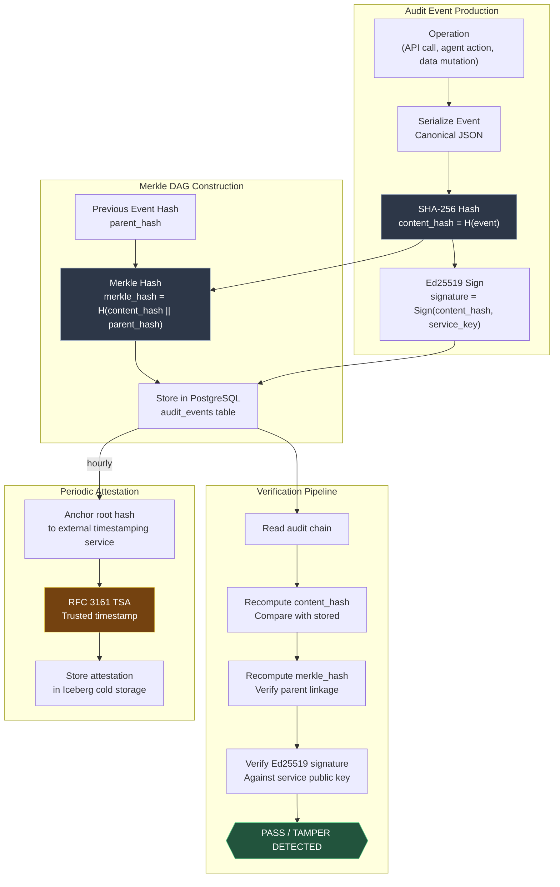
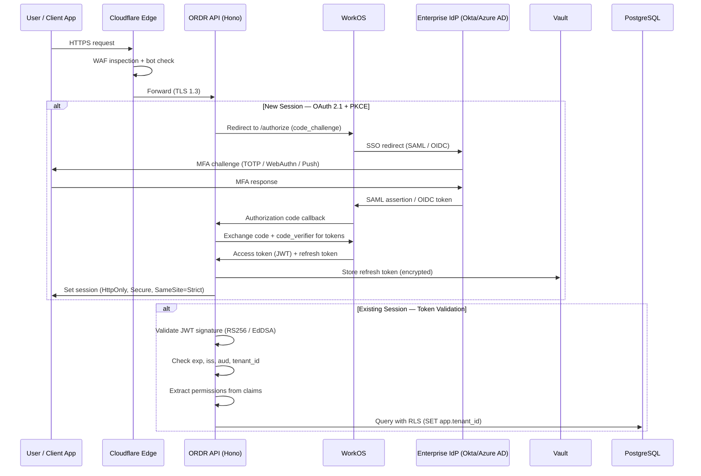
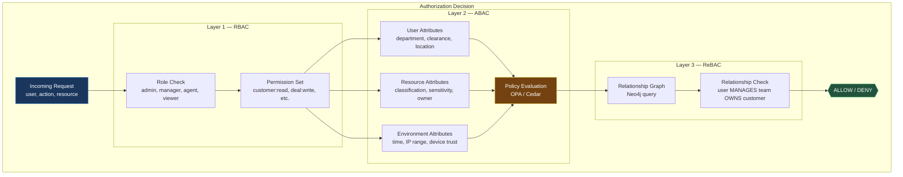
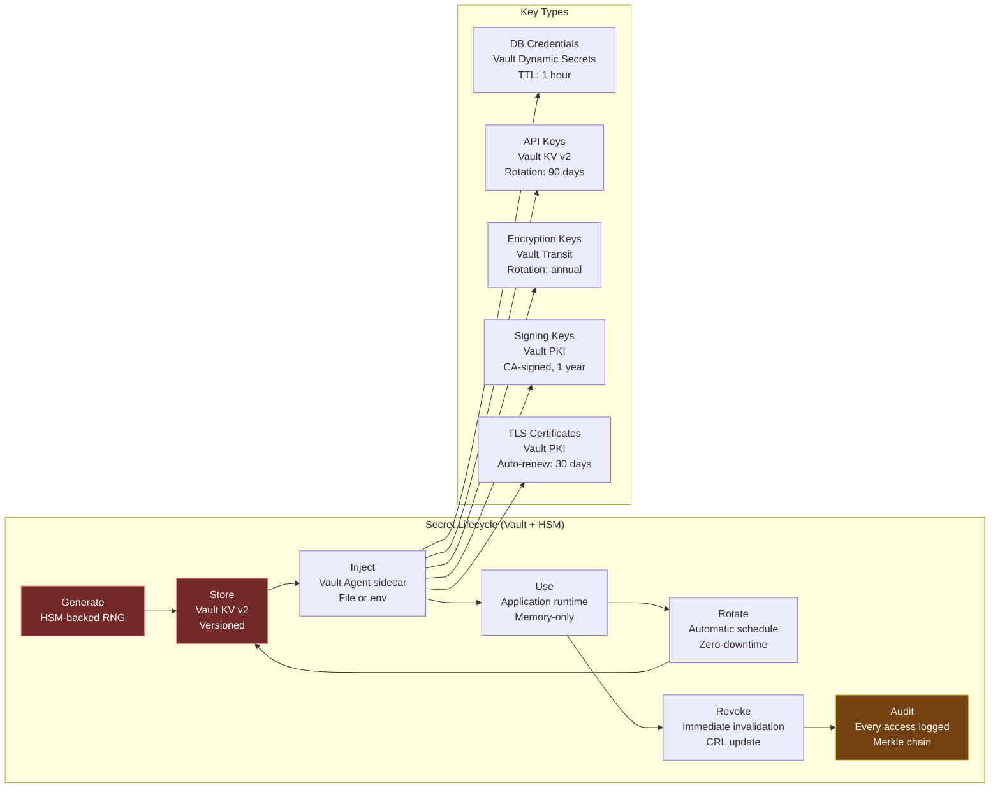

# ORDR-Connect — Security Architecture

> **Classification:** Confidential — Internal Engineering
> **Compliance Scope:** SOC 2 Type II | ISO 27001:2022 | HIPAA
> **Last Updated:** 2026-03-24
> **Owner:** Security Engineering

---

## 1. Security Philosophy

Security is the **primary differentiator** of ORDR-Connect. Every component is designed
with a zero-trust posture: no implicit trust between services, no plaintext secrets at
rest, no unaudited operations. The architecture satisfies SOC 2 Type II, ISO 27001:2022,
and HIPAA requirements structurally — compliance is not a checklist applied after the fact.

### Core Tenets

1. **Zero Trust:** Every request is authenticated, authorized, and encrypted — internal or external
2. **Defense in Depth:** Multiple independent security layers — breach of one does not compromise others
3. **Immutable Audit:** Every state mutation produces a cryptographically chained, tamper-evident record
4. **Least Privilege:** Services, agents, and users receive the minimum permissions required
5. **Post-Quantum Readiness:** Hybrid cryptographic schemes prepared for quantum computing threats

---

## 2. Zero-Trust Network Topology

```mermaid
graph TB
    subgraph "Public Internet"
        USER["User / Client"]
        WEBHOOK["External Webhooks"]
    end

    subgraph "Edge — Cloudflare"
        WAF["WAF<br/>OWASP CRS + Custom Rules"]
        DDOS["DDoS Mitigation<br/>L3/L4/L7"]
        BOT["Bot Management<br/>Challenge Page"]
    end

    subgraph "DMZ — Load Balancer"
        ALB["ALB<br/>TLS 1.3 termination<br/>Client cert validation"]
    end

    subgraph "Kubernetes Cluster — Istio Service Mesh"
        subgraph "Ingress Zone"
            GW["Istio Ingress Gateway<br/>JWT validation + rate limit"]
        end

        subgraph "Application Zone"
            API["API Services<br/>mTLS sidecar"]
            WORKER["Worker Services<br/>mTLS sidecar"]
            AGENT["Agent Runtime<br/>mTLS sidecar + sandboxed"]
        end

        subgraph "Data Zone"
            PG_PROXY["PgBouncer<br/>Connection pooling<br/>SSL required"]
            REDIS_PROXY["Redis Sentinel<br/>ACL enforced"]
        end

        subgraph "Security Zone"
            VAULT["Vault Agent<br/>Sidecar injector"]
            OPA["OPA / Gatekeeper<br/>Policy enforcement"]
            FALCO["Falco<br/>Runtime threat detection"]
        end
    end

    subgraph "Data Tier — Private Subnet"
        PG["PostgreSQL<br/>RLS + FLE<br/>No public endpoint"]
        NEO["Neo4j Aura<br/>Private Link"]
        KF["Kafka<br/>Private Link<br/>SASL + mTLS"]
        CH["ClickHouse<br/>Private Link"]
    end

    USER --> WAF --> DDOS --> BOT --> ALB
    WEBHOOK --> WAF
    ALB --> GW
    GW --> API
    API -->|"mTLS"| WORKER
    API -->|"mTLS"| AGENT
    API --> PG_PROXY --> PG
    API --> REDIS_PROXY
    WORKER --> KF
    WORKER --> CH
    AGENT --> NEO
    VAULT -.->|"secret injection"| API & WORKER & AGENT
    OPA -.->|"policy check"| GW & API
    FALCO -.->|"anomaly detection"| API & WORKER & AGENT

    style WAF fill:#742a2a,stroke:#fc8181,color:#fff
    style VAULT fill:#742a2a,stroke:#fc8181,color:#fff
    style OPA fill:#742a2a,stroke:#fc8181,color:#fff
    style FALCO fill:#742a2a,stroke:#fc8181,color:#fff
    style PG fill:#22543d,stroke:#68d391,color:#fff
    style KF fill:#1a365d,stroke:#63b3ed,color:#fff
```



### Network Policies

- **Default deny:** All pod-to-pod traffic is blocked unless explicitly allowed
- **Namespace isolation:** Each service tier (ingress, app, data, security) runs in a separate namespace
- **Egress filtering:** Pods can only reach explicitly whitelisted external endpoints
- **Private Link:** All managed databases are accessed via cloud-provider Private Link — zero public endpoints

---

## 3. Merkle DAG Audit Verification

Every auditable operation produces a content-addressed record chained via Merkle DAG.
This makes the audit trail **tamper-evident** — any modification to a historical record
breaks the hash chain and is immediately detectable.



### Audit Record Schema

```typescript
interface AuditEvent {
  id: string;                // UUIDv7
  tenant_id: string;         // Tenant scope
  actor_id: string;          // User, service, or agent ID
  actor_type: 'user' | 'service' | 'agent';
  action: string;            // e.g., 'customer.update', 'agent.execute'
  resource_type: string;     // e.g., 'customer', 'deal', 'ticket'
  resource_id: string;       // Target resource ID
  details: JsonB;            // Action-specific payload (redacted PHI)
  content_hash: string;      // SHA-256 of canonical event
  parent_hash: string;       // Previous event's merkle_hash
  merkle_hash: string;       // H(content_hash || parent_hash)
  signature: string;         // Ed25519 signature over content_hash
  signing_key_id: string;    // Key identifier for verification
  ip_address: string;        // Client IP (encrypted at rest)
  user_agent: string;        // Client user agent
  created_at: Date;          // Immutable timestamp
}
```

---

## 4. Encryption Architecture

### Four Layers of Encryption

| Layer | Scope | Algorithm | Key Management |
|---|---|---|---|
| **Transport** | All network traffic | TLS 1.3 (ECDHE + AES-256-GCM) | Cloudflare + Istio auto-rotation |
| **At Rest** | Disk-level | AES-256 (AWS KMS / GCP CMEK) | Cloud KMS with annual rotation |
| **Field-Level** | Sensitive columns (PHI, PII) | AES-256-GCM with per-tenant KEK | Vault Transit engine |
| **Application-Layer** | Audit records, agent memories | ChaCha20-Poly1305 | Vault-managed, per-resource |

### Field-Level Encryption Flow

```
Client Request
  → API receives plaintext field (e.g., SSN, email)
  → Vault Transit: encrypt(plaintext, key=tenant/{id}/pii)
  → Store ciphertext + key_version in PostgreSQL
  → On read: Vault Transit: decrypt(ciphertext, key=tenant/{id}/pii)
  → Return plaintext to authorized caller only
```

### Post-Quantum Readiness

ORDR-Connect implements **hybrid cryptographic schemes** to prepare for quantum threats:

- **Key Exchange:** X25519 + ML-KEM-768 (hybrid) for all TLS handshakes
- **Digital Signatures:** Ed25519 + ML-DSA-65 (hybrid) for audit records and artifact signing
- **Migration Plan:** Crypto-agility layer allows algorithm swap without application changes
- **Timeline:** Full post-quantum migration targeted before NIST 2030 deadline

---

## 5. Authentication Flow



### Authentication Requirements

| Control | Implementation | Compliance |
|---|---|---|
| MFA Required | WebAuthn (FIDO2) or TOTP via WorkOS | SOC 2 CC6.1, HIPAA 164.312(d) |
| SSO Integration | SAML 2.0 + OIDC via WorkOS | ISO 27001 A.9.4 |
| Session Timeout | 15 min idle, 8 hour absolute | SOC 2 CC6.1 |
| Token Rotation | Access: 15 min, Refresh: 7 days (sliding) | ISO 27001 A.9.4 |
| Brute Force Protection | 5 failed attempts → 15 min lockout → progressive | HIPAA 164.312(a)(1) |
| Device Binding | Optional device trust via client certificate | SOC 2 CC6.6 |

---

## 6. Authorization Model — RBAC + ABAC + ReBAC

ORDR-Connect uses a **three-layer authorization model** that combines role-based,
attribute-based, and relationship-based access control.



### Role Hierarchy

| Role | Permissions | ReBAC Scope |
|---|---|---|
| **Super Admin** | Full system access | All tenants (platform operator) |
| **Tenant Admin** | Tenant configuration, user management | Own tenant |
| **Manager** | Team oversight, approval workflows | Own team + reports |
| **Operator** | Execute actions, manage customers | Assigned customers |
| **Agent (AI)** | Scoped by autonomy level (L1-L5) | Assigned segments |
| **Viewer** | Read-only access to dashboards | Assigned resources |
| **Auditor** | Read-only access to audit logs | Tenant audit scope |

---

## 7. Secret Management Lifecycle



### Vault Policies

- **Principle of Least Privilege:** Each service has a Vault policy granting access only to its required secrets
- **Dynamic Secrets:** Database credentials are generated on-demand with short TTLs (1 hour)
- **Transit Engine:** Application never sees raw encryption keys — Vault performs encrypt/decrypt operations
- **Auto-Unseal:** KMS-based auto-unseal eliminates manual intervention during pod restarts
- **Disaster Recovery:** Vault HA with Raft consensus, cross-region replication

---

## 8. Threat Model — STRIDE Analysis

| Threat | Category | Attack Vector | Mitigation |
|---|---|---|---|
| **Token Theft** | Spoofing | XSS exfiltration of JWT | HttpOnly cookies, CSP, short-lived tokens |
| **Tenant Escape** | Tampering | Manipulated tenant_id in request | RLS enforcement, JWT-bound tenant_id, server-side extraction |
| **Audit Tampering** | Tampering | Direct DB modification of audit records | Merkle DAG hash chain, Ed25519 signatures, RFC 3161 timestamps |
| **Data Exfiltration** | Information Disclosure | SQL injection, IDOR | Drizzle parameterized queries, RBAC + ReBAC checks, field-level encryption |
| **PHI Exposure** | Information Disclosure | Log leakage, error messages | Structured logging with PHI redaction, error sanitization |
| **Service Impersonation** | Spoofing | Rogue service in mesh | mTLS with Istio, SPIFFE identity verification |
| **DDoS** | Denial of Service | Volumetric / application-layer | Cloudflare DDoS, per-tenant rate limiting, circuit breakers |
| **Agent Abuse** | Elevation of Privilege | LLM prompt injection for escalation | Permission boundaries, tool allowlists, kill switches, budget limits |
| **Supply Chain** | Tampering | Compromised dependency | SLSA L3, Sigstore attestation, SBOM generation, Dependabot |
| **Insider Threat** | All categories | Malicious administrator | Break-glass procedures, dual-approval, comprehensive audit trail |

---

## 9. Supply Chain Security

### SLSA Level 3 Compliance

| SLSA Requirement | Implementation |
|---|---|
| **Source Integrity** | Signed commits (GPG/SSH), branch protection, CODEOWNERS |
| **Build Integrity** | GitHub Actions with hardened runners, no self-hosted |
| **Provenance** | SLSA provenance attestation via Sigstore |
| **Artifact Signing** | Container images signed via cosign + Sigstore Rekor |
| **SBOM** | Syft-generated SBOM in SPDX format, stored with each release |
| **Dependency Scanning** | Dependabot + Snyk, auto-PR for critical CVEs |
| **Admission Control** | Kubernetes admission webhook rejects unsigned images |

---

## 10. Confidential Computing

For highest-sensitivity workloads (PHI processing, encryption key operations):

- **AMD SEV-SNP:** Memory encryption for Vault pods and agent runtime
- **Attestation:** Remote attestation verifies TEE integrity before secret injection
- **Use Cases:** PHI de-identification, encryption key ceremonies, audit signature generation
- **Scope:** Deployed for Vault, Agent Runtime, and Decision Engine pods

---

## 11. Zero-Knowledge Compliance Proofs

ORDR-Connect supports **zero-knowledge proofs** for compliance verification without
exposing underlying data:

- **Proof of Retention:** Prove data exists and was retained for N years without revealing content
- **Proof of Access Control:** Prove a user's access was restricted without revealing the access matrix
- **Proof of Encryption:** Prove data was encrypted with a compliant algorithm without revealing keys
- **Implementation:** zk-SNARKs via circom/snarkjs for lightweight proofs, Groth16 proving system

### Compliance Mapping — Security Controls

| Control | SOC 2 | ISO 27001 | HIPAA | Implementation |
|---|---|---|---|---|
| Encryption in Transit | CC6.7 | A.13.1.1 | 164.312(e)(1) | TLS 1.3, mTLS |
| Encryption at Rest | CC6.7 | A.10.1.1 | 164.312(a)(2)(iv) | AES-256, Vault Transit |
| Access Control | CC6.1 | A.9.2 | 164.312(a)(1) | RBAC + ABAC + ReBAC |
| Audit Logging | CC7.2 | A.12.4.1 | 164.312(b) | Merkle DAG, 7-year retention |
| Incident Detection | CC7.2 | A.12.6 | 164.308(a)(6)(ii) | Falco, SIEM integration |
| Key Management | CC6.7 | A.10.1.2 | 164.312(a)(2)(iv) | Vault + HSM |
| Vulnerability Management | CC7.1 | A.12.6.1 | 164.308(a)(1) | Snyk, Dependabot, SLSA |

---

*Next: [03-data-layer.md](./03-data-layer.md) — Polyglot data architecture with tenant isolation*
