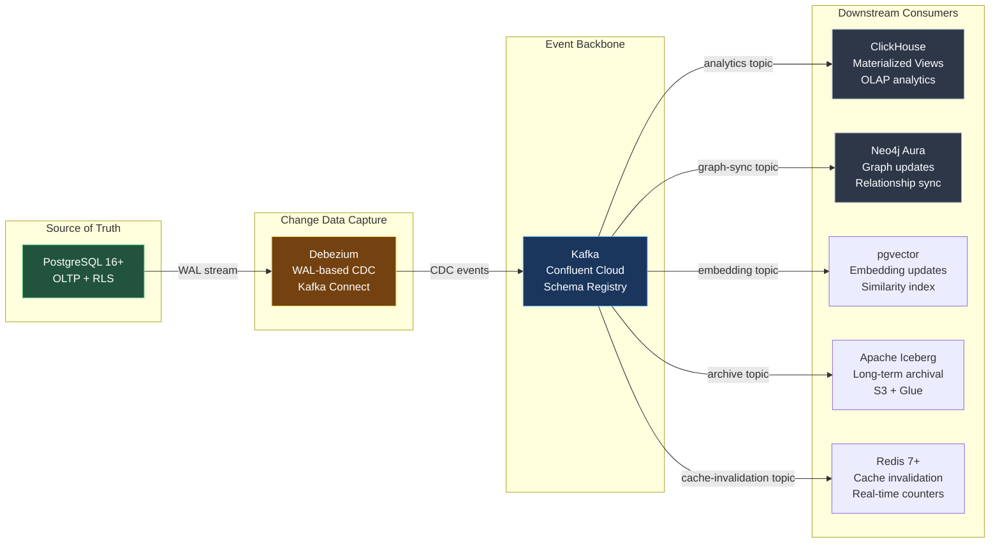
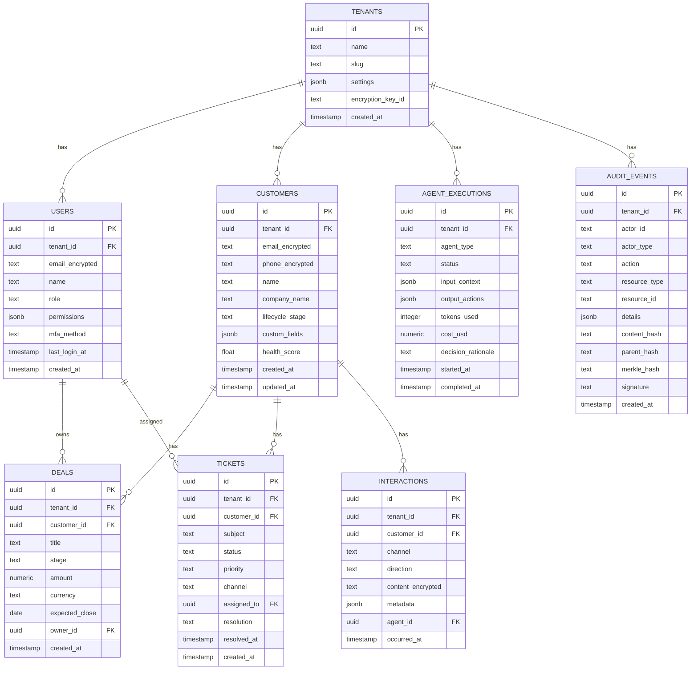
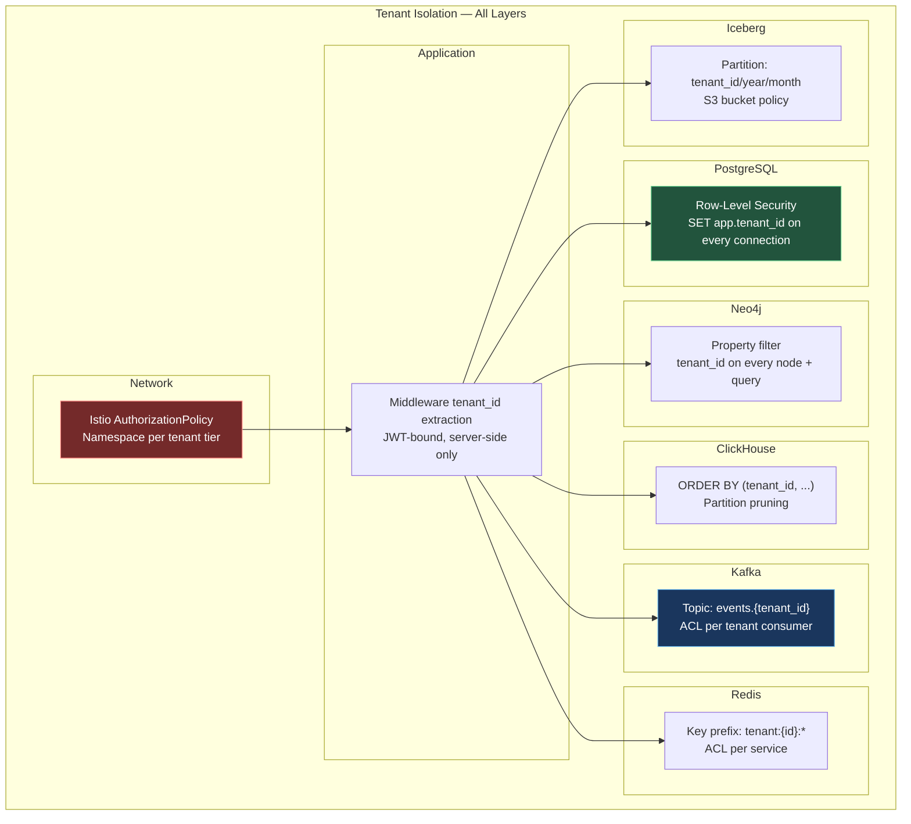

# ORDR-Connect — Data Layer Architecture

> **Classification:** Confidential — Internal Engineering
> **Compliance Scope:** SOC 2 Type II | ISO 27001:2022 | HIPAA
> **Last Updated:** 2026-03-24
> **Owner:** Data Engineering

---

## 1. Polyglot Persistence Strategy

ORDR-Connect uses the right database for each workload. There is no single-database
compromise — each store is selected for its unique strengths and all are connected
via Kafka CDC for eventual consistency.

| Workload | Store | Justification |
|---|---|---|
| OLTP (core state) | PostgreSQL 16+ | ACID, RLS, JSON support, battle-tested |
| Relationship traversal | Neo4j Aura | Native graph, O(1) multi-hop traversals |
| Analytics / OLAP | ClickHouse | Columnar, sub-second aggregations on billions of rows |
| Vector similarity | pgvector + pgvectorscale | Co-located with OLTP data, HNSW indexes |
| Event streaming | Kafka (Confluent) | Exactly-once, durable, ordered event log |
| Caching + rate limiting | Redis 7+ | Sub-ms reads, ACLs, Streams for real-time |
| Long-term archival | Apache Iceberg | Schema evolution, time-travel, S3-backed |

---

## 2. Data Flow — CDC Pipeline



### CDC Configuration

- **Debezium connector:** PostgreSQL logical replication (pgoutput plugin)
- **Capture scope:** All tables with `cdc_enabled = true` flag
- **Event format:** Avro with Schema Registry (backward-compatible evolution)
- **Delivery guarantee:** At-least-once with idempotent consumers
- **Latency target:** p99 < 500ms from commit to downstream consumer
- **Tombstone events:** Emitted for deletes, with configurable retention

---

## 3. PostgreSQL 16+ — Primary OLTP Store

### Schema Design Principles

1. **UUIDv7 primary keys:** Time-ordered, globally unique, no sequence contention
2. **Tenant isolation via RLS:** Every table has `tenant_id` column with enforced RLS policy
3. **Field-level encryption:** PHI/PII columns encrypted via Vault Transit before storage
4. **Soft deletes:** `deleted_at` timestamp, never hard delete (compliance retention)
5. **Audit columns:** `created_at`, `updated_at`, `created_by`, `updated_by` on every table

### Core Entity-Relationship Diagram



### Row-Level Security Policies

```sql
-- Enable RLS on every table
ALTER TABLE customers ENABLE ROW LEVEL SECURITY;
ALTER TABLE customers FORCE ROW LEVEL SECURITY;

-- Tenant isolation policy
CREATE POLICY tenant_isolation ON customers
    USING (tenant_id = current_setting('app.tenant_id')::uuid);

-- Role-based read policy
CREATE POLICY role_read ON customers FOR SELECT
    USING (
        tenant_id = current_setting('app.tenant_id')::uuid
        AND (
            current_setting('app.user_role') IN ('admin', 'manager')
            OR id = ANY(
                SELECT customer_id FROM customer_assignments
                WHERE user_id = current_setting('app.user_id')::uuid
            )
        )
    );

-- Write policy — only operators and admins
CREATE POLICY role_write ON customers FOR ALL
    USING (
        tenant_id = current_setting('app.tenant_id')::uuid
        AND current_setting('app.user_role') IN ('admin', 'operator')
    );
```

### Field-Level Encryption

| Table | Column | Classification | Encryption |
|---|---|---|---|
| customers | email | PII | Vault Transit AES-256-GCM |
| customers | phone | PII | Vault Transit AES-256-GCM |
| interactions | content | PHI-eligible | Vault Transit AES-256-GCM |
| users | email | PII | Vault Transit AES-256-GCM |
| audit_events | ip_address | PII | Vault Transit AES-256-GCM |

---

## 4. ClickHouse — OLAP Analytics

### Purpose

ClickHouse provides sub-second analytical queries across billions of event records.
It serves dashboards, reporting, and Decision Engine feature engineering.

### Table Design

```sql
CREATE TABLE events_olap ON CLUSTER '{cluster}'
(
    event_id       UUID,
    tenant_id      UUID,
    event_type     LowCardinality(String),
    entity_type    LowCardinality(String),
    entity_id      UUID,
    properties     String,  -- JSON, parsed via JSONExtract
    occurred_at    DateTime64(3),
    ingested_at    DateTime64(3),
    INDEX idx_event_type event_type TYPE set(100) GRANULARITY 4,
    INDEX idx_entity_type entity_type TYPE set(50) GRANULARITY 4
)
ENGINE = ReplicatedMergeTree('/clickhouse/{cluster}/events_olap', '{replica}')
PARTITION BY toYYYYMM(occurred_at)
ORDER BY (tenant_id, event_type, occurred_at)
TTL occurred_at + INTERVAL 2 YEAR
SETTINGS index_granularity = 8192;
```

### Materialized Views

| View | Purpose | Refresh |
|---|---|---|
| `mv_daily_engagement` | Customer engagement scores per day | Real-time (on insert) |
| `mv_funnel_conversion` | Deal stage conversion rates | Real-time |
| `mv_agent_performance` | Agent execution metrics | Real-time |
| `mv_channel_attribution` | Interaction channel effectiveness | Real-time |
| `mv_retention_cohorts` | Weekly/monthly cohort retention | Hourly batch |

---

## 5. Neo4j Aura — Graph Store

### Graph Schema

See [05-customer-graph.md](./05-customer-graph.md) for full graph design.

**Summary:** Nodes for Person, Company, Deal, Ticket, Product, Channel. Edges for
WORKS_AT, REPORTS_TO, OWNS, INTERACTED_WITH, PURCHASED, ASSIGNED_TO, ESCALATED_TO.

### Tenant Isolation

```cypher
// Every node carries tenant_id property
// Queries always filter by tenant
MATCH (c:Customer {tenant_id: $tenantId})-[:WORKS_AT]->(co:Company {tenant_id: $tenantId})
RETURN c, co

// Composite indexes for performance
CREATE INDEX customer_tenant FOR (c:Customer) ON (c.tenant_id, c.id)
CREATE INDEX company_tenant FOR (c:Company) ON (c.tenant_id, c.id)
```

### Sync from Kafka

The Neo4j consumer group reads from `graph-sync` topic and applies mutations:
- **Node create/update:** Upsert via `MERGE` with `tenant_id` + `entity_id`
- **Relationship create:** `MERGE` with idempotency key
- **Soft delete:** Set `deleted_at` property, do not remove node

---

## 6. pgvector + pgvectorscale — Vector Store

### Purpose

pgvector stores embeddings for semantic search, customer similarity, and RAG retrieval.
By co-locating vectors in PostgreSQL, we avoid a separate vector database and benefit
from RLS tenant isolation.

### Schema

```sql
CREATE TABLE embeddings (
    id          UUID PRIMARY KEY DEFAULT gen_random_uuid(),
    tenant_id   UUID NOT NULL REFERENCES tenants(id),
    entity_type TEXT NOT NULL,       -- 'customer', 'interaction', 'ticket', 'knowledge'
    entity_id   UUID NOT NULL,
    model       TEXT NOT NULL,       -- 'text-embedding-3-small'
    embedding   vector(1536) NOT NULL,
    content     TEXT,                -- Original text (encrypted for PHI)
    metadata    JSONB DEFAULT '{}',
    created_at  TIMESTAMPTZ NOT NULL DEFAULT now()
);

-- HNSW index for fast approximate nearest neighbor
CREATE INDEX embeddings_hnsw ON embeddings
    USING hnsw (embedding vector_cosine_ops)
    WITH (m = 16, ef_construction = 200);

-- pgvectorscale StreamingDiskANN for large-scale
CREATE INDEX embeddings_diskann ON embeddings
    USING diskann (embedding);

-- RLS policy
ALTER TABLE embeddings ENABLE ROW LEVEL SECURITY;
CREATE POLICY tenant_isolation ON embeddings
    USING (tenant_id = current_setting('app.tenant_id')::uuid);
```

### Query Patterns

```sql
-- Semantic search within tenant
SELECT entity_type, entity_id, content,
       1 - (embedding <=> $query_embedding) AS similarity
FROM embeddings
WHERE tenant_id = $tenant_id
  AND entity_type = 'knowledge'
ORDER BY embedding <=> $query_embedding
LIMIT 10;

-- Customer similarity (find similar customers)
SELECT c.id, c.name, 1 - (e.embedding <=> $target_embedding) AS similarity
FROM embeddings e
JOIN customers c ON c.id = e.entity_id
WHERE e.tenant_id = $tenant_id
  AND e.entity_type = 'customer'
  AND (e.embedding <=> $target_embedding) < 0.3  -- cosine distance threshold
ORDER BY e.embedding <=> $target_embedding
LIMIT 20;
```

---

## 7. Apache Iceberg — Cold Storage

### Purpose

Apache Iceberg provides long-term event archival on S3 with schema evolution,
time-travel queries, and partition pruning. It satisfies the **7-year retention
requirement** for SOC 2 and HIPAA.

### Configuration

| Parameter | Value |
|---|---|
| Storage | S3 (SSE-S3 encryption) |
| Catalog | AWS Glue Data Catalog |
| File Format | Parquet (Zstd compression) |
| Partition Strategy | `tenant_id`, `year`, `month` |
| Schema Evolution | Additive columns only, backward compatible |
| Retention | 7 years minimum, configurable per tenant |

### Data Lifecycle

```
PostgreSQL (hot, 0-90 days)
  → Kafka CDC → ClickHouse (warm, 0-2 years)
  → Kafka CDC → Iceberg/S3 (cold, 0-7+ years)
  → Glacier Deep Archive (frozen, 7+ years, legal hold)
```

---

## 8. Redis 7+ — Cache & Real-Time

### Caching Strategy

| Cache Pattern | Key Pattern | TTL | Purpose |
|---|---|---|---|
| Session | `session:{session_id}` | 15 min | User session data |
| Entity | `tenant:{id}:customer:{id}` | 5 min | Hot entity cache |
| Query | `tenant:{id}:query:{hash}` | 2 min | Frequent query results |
| Feature Flag | `tenant:{id}:flags` | 30 sec | Feature flag evaluation |
| Rate Limit | `ratelimit:{tenant_id}:{endpoint}` | sliding window | API rate limiting |
| Agent State | `agent:{execution_id}:state` | 1 hour | Agent working memory |

### ACL Configuration

```
# Per-service ACL rules
ACL SETUSER api-service on >$VAULT_PASSWORD ~tenant:*:* ~session:* &* +@read +@write -@admin
ACL SETUSER worker-service on >$VAULT_PASSWORD ~tenant:*:* ~agent:* &* +@read +@write -@admin
ACL SETUSER agent-runtime on >$VAULT_PASSWORD ~agent:* &* +@read +@write -@admin -@dangerous
```

### Rate Limiting (Sliding Window)

```typescript
async function checkRateLimit(tenantId: string, endpoint: string, limit: number, windowSec: number): Promise<boolean> {
  const key = `ratelimit:${tenantId}:${endpoint}`;
  const now = Date.now();
  const windowStart = now - (windowSec * 1000);

  const pipe = redis.pipeline();
  pipe.zremrangebyscore(key, 0, windowStart);
  pipe.zadd(key, now, `${now}:${crypto.randomUUID()}`);
  pipe.zcard(key);
  pipe.expire(key, windowSec);
  const results = await pipe.exec();

  const count = results[2][1] as number;
  return count <= limit;
}
```

---

## 9. Tenant Isolation Summary



### Compliance Mapping — Data Layer

| Control | SOC 2 | ISO 27001 | HIPAA | Implementation |
|---|---|---|---|---|
| Data Classification | CC6.5 | A.8.2.1 | 164.312(a)(1) | Column-level sensitivity tags |
| Data Retention | CC6.5 | A.8.3.2 | 164.530(j) | Iceberg 7-year, TTL policies |
| Data Disposal | CC6.5 | A.8.3.2 | 164.310(d)(2)(i) | Crypto-shredding via key destruction |
| Backup & Recovery | CC9.1 | A.12.3.1 | 164.308(a)(7)(ii)(A) | Automated daily, tested monthly |
| Access Logging | CC7.2 | A.12.4.1 | 164.312(b) | Every query logged in audit_events |

---

*Next: [04-event-stream-design.md](./04-event-stream-design.md) — Event streaming architecture with Kafka*
