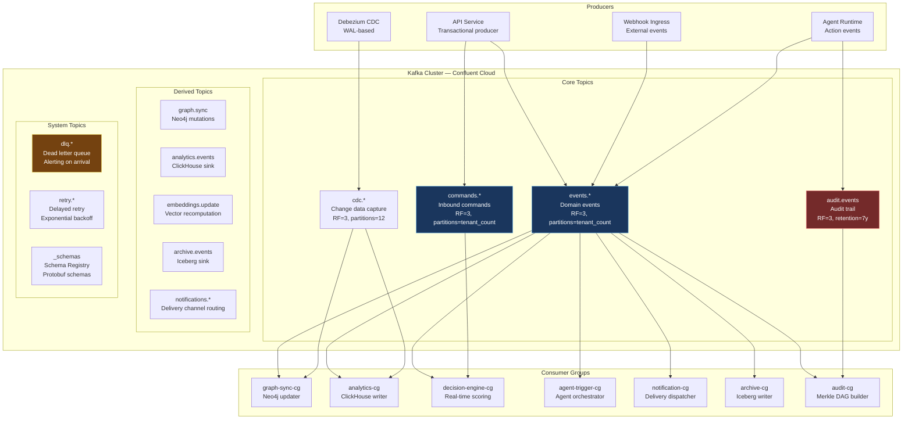
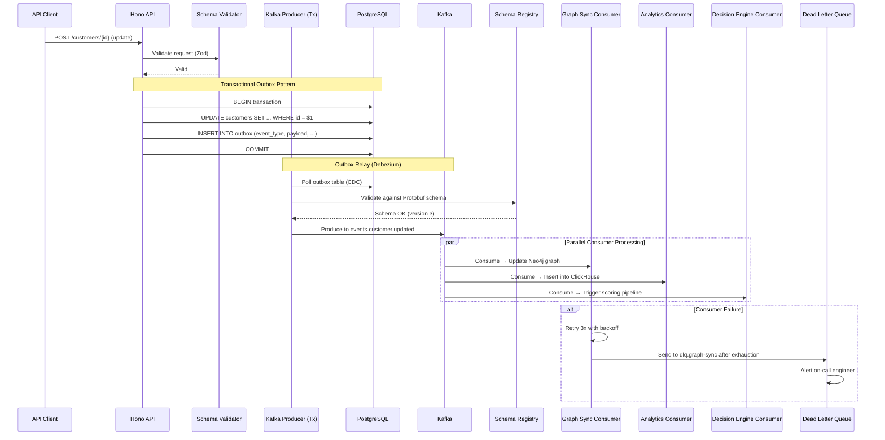
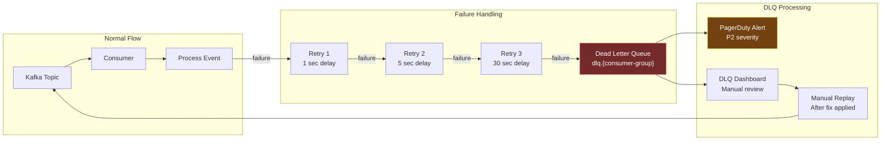

# ORDR-Connect — Event Stream Design

> **Classification:** Confidential — Internal Engineering
> **Compliance Scope:** SOC 2 Type II | ISO 27001:2022 | HIPAA
> **Last Updated:** 2026-03-24
> **Owner:** Platform Engineering

---

## 1. Event-Driven Architecture Overview

Every state mutation in ORDR-Connect is represented as an **immutable event** in Kafka.
This provides a complete, ordered, replayable history of every operation — satisfying
audit requirements (SOC 2 CC7.2, ISO 27001 A.12.4, HIPAA 164.312(b)) while enabling
real-time reactive processing across all six primitives.

### Design Principles

| Principle | Implementation |
|---|---|
| **Event First** | State changes emit events before returning success to caller |
| **Immutable Log** | Events are append-only, never modified or deleted from Kafka |
| **Schema Evolution** | Protobuf with Schema Registry, backward-compatible changes only |
| **Exactly-Once** | Kafka transactions + idempotent producers + consumer offset management |
| **Tenant Partitioning** | Events partitioned by `tenant_id` for ordering and isolation |
| **Replay Capability** | Any consumer can replay from any offset for recovery or reprocessing |

---

## 2. Kafka Topology



### Topic Configuration

| Topic Pattern | Partitions | Replication | Retention | Cleanup Policy |
|---|---|---|---|---|
| `commands.*` | By tenant count | 3 | 7 days | delete |
| `events.*` | By tenant count | 3 | 30 days | delete |
| `cdc.*` | 12 per table | 3 | 7 days | delete |
| `audit.events` | 24 | 3 | 7 years | delete (+ Iceberg archive) |
| `graph.sync` | 12 | 3 | 3 days | delete |
| `analytics.events` | 24 | 3 | 7 days | delete |
| `dlq.*` | 6 | 3 | 30 days | delete |
| `retry.*` | 6 | 3 | 7 days | delete |

### Partition Strategy

Events are partitioned by `tenant_id` to guarantee **per-tenant ordering**:

```typescript
function partitionKey(event: DomainEvent): string {
  // Primary partition by tenant for ordering guarantee
  // Secondary partition by entity for high-volume tenants
  if (event.metadata.highVolume) {
    return `${event.tenantId}:${event.entityId}`;
  }
  return event.tenantId;
}
```

---

## 3. Event Schema Design

### Event Envelope

All events share a common envelope with domain-specific payload:

```protobuf
syntax = "proto3";
package ordr.events.v1;

import "google/protobuf/timestamp.proto";
import "google/protobuf/struct.proto";

message EventEnvelope {
  // Identity
  string event_id = 1;            // UUIDv7 — time-ordered
  string correlation_id = 2;      // Request trace correlation
  string causation_id = 3;        // ID of event that caused this

  // Routing
  string tenant_id = 4;
  string event_type = 5;          // e.g., "customer.updated"
  int32  schema_version = 6;      // Schema version for evolution

  // Payload
  google.protobuf.Struct payload = 7;

  // Metadata
  string actor_id = 8;
  string actor_type = 9;          // "user", "service", "agent"
  string source_service = 10;
  google.protobuf.Timestamp occurred_at = 11;
  google.protobuf.Timestamp ingested_at = 12;

  // Integrity
  string content_hash = 13;       // SHA-256 of canonical payload
  string signature = 14;          // Ed25519 signature
}
```

### Event Flow Through the System



### Domain Event Types

| Domain | Event Type | Trigger |
|---|---|---|
| **Customer** | `customer.created` | New customer record |
| **Customer** | `customer.updated` | Profile or attribute change |
| **Customer** | `customer.health_changed` | Health score threshold crossed |
| **Deal** | `deal.stage_changed` | Pipeline stage transition |
| **Deal** | `deal.closed_won` | Deal marked as won |
| **Deal** | `deal.closed_lost` | Deal marked as lost |
| **Ticket** | `ticket.created` | New support ticket |
| **Ticket** | `ticket.escalated` | Priority escalation |
| **Ticket** | `ticket.resolved` | Resolution recorded |
| **Interaction** | `interaction.received` | Inbound communication |
| **Interaction** | `interaction.sent` | Outbound communication |
| **Agent** | `agent.execution.started` | Agent begins work |
| **Agent** | `agent.execution.completed` | Agent finishes |
| **Agent** | `agent.action.executed` | Agent performs an action |
| **Decision** | `decision.score.computed` | ML/rules score calculated |
| **Decision** | `decision.action.recommended` | Next-best-action selected |
| **Audit** | `audit.access.granted` | Authorization check passed |
| **Audit** | `audit.access.denied` | Authorization check failed |

---

## 4. Event Sourcing & CQRS

### Event Sourcing Pattern

For critical domains (Customer Lifecycle, Deal Pipeline), ORDR-Connect maintains
an **event-sourced** model where the current state is derived from replaying events:

```typescript
interface EventSourcedAggregate<TState, TEvent> {
  id: string;
  tenantId: string;
  version: number;
  state: TState;

  apply(event: TEvent): TState;
  rehydrate(events: TEvent[]): TState;
}

// Example: Customer aggregate
class CustomerAggregate implements EventSourcedAggregate<CustomerState, CustomerEvent> {
  apply(event: CustomerEvent): CustomerState {
    switch (event.type) {
      case 'customer.created':
        return { ...this.state, ...event.payload, lifecycle: 'new' };
      case 'customer.health_changed':
        return { ...this.state, healthScore: event.payload.newScore };
      case 'customer.churned':
        return { ...this.state, lifecycle: 'churned', churnedAt: event.occurredAt };
      default:
        return this.state;
    }
  }

  rehydrate(events: CustomerEvent[]): CustomerState {
    return events.reduce((state, event) => this.apply(event), initialState);
  }
}
```

### CQRS Separation

| Concern | Write Side | Read Side |
|---|---|---|
| Store | PostgreSQL (event store + projections) | ClickHouse, Neo4j, Redis |
| Consistency | Strong (ACID transactions) | Eventual (via Kafka consumers) |
| Latency | p99 < 50ms | p99 < 100ms (cached: < 5ms) |
| Scaling | Vertical + read replicas | Horizontal (independent per store) |

---

## 5. Schema Evolution Strategy

### Rules

1. **Backward compatible only:** New consumers must read old events, old consumers must tolerate new fields
2. **No field removal:** Fields can be deprecated (ignored) but never removed from the Protobuf schema
3. **No type changes:** A field's type is immutable once published
4. **Additive only:** New optional fields, new event types — never breaking changes
5. **Version tracking:** Every event carries `schema_version` for routing to version-aware handlers

### Schema Registry Workflow

```
1. Developer adds new field to .proto file
2. CI runs: confluent schema-registry test --compatibility BACKWARD
3. If compatible → merge PR, register new schema version
4. If incompatible → block PR, require new event type instead
5. Consumers use schema version to route to correct handler
```

---

## 6. Exactly-Once Semantics

### Producer Side

```typescript
const producer = kafka.producer({
  idempotent: true,
  transactionalId: `ordr-api-${process.env.POD_NAME}`,
  maxInFlightRequests: 5,
});

async function publishWithTransaction(events: DomainEvent[]): Promise<void> {
  const transaction = await producer.transaction();
  try {
    for (const event of events) {
      await transaction.send({
        topic: `events.${event.domain}.${event.type}`,
        messages: [{
          key: event.tenantId,
          value: await serialize(event),
          headers: {
            'event-id': event.eventId,
            'correlation-id': event.correlationId,
            'schema-version': String(event.schemaVersion),
          },
        }],
      });
    }
    await transaction.commit();
  } catch (error) {
    await transaction.abort();
    throw error;
  }
}
```

### Consumer Side

```typescript
const consumer = kafka.consumer({
  groupId: 'decision-engine-cg',
  readUncommitted: false,  // Only read committed messages
});

// Idempotent processing with deduplication
async function processEvent(event: DomainEvent): Promise<void> {
  const dedupeKey = `processed:${event.eventId}`;
  const alreadyProcessed = await redis.get(dedupeKey);
  if (alreadyProcessed) return; // Skip duplicate

  await handleEvent(event);

  // Mark as processed with TTL matching topic retention
  await redis.set(dedupeKey, '1', 'EX', 7 * 24 * 3600);
}
```

---

## 7. Dead Letter Queue & Retry



### Retry Configuration

| Attempt | Delay | Max Attempts | After Exhaustion |
|---|---|---|---|
| 1 | 1 second | — | — |
| 2 | 5 seconds | — | — |
| 3 | 30 seconds | 3 | Send to DLQ |

### DLQ Monitoring

- **Alert:** PagerDuty P2 on any DLQ message arrival
- **Dashboard:** Grafana panel showing DLQ depth, age, and event type distribution
- **SLA:** DLQ must be drained within 4 hours during business hours
- **Audit:** Every DLQ event logged in audit trail (compliance requirement)

---

## 8. Event Replay & Temporal Queries

### Replay Use Cases

| Use Case | Method | Scope |
|---|---|---|
| **Consumer recovery** | Reset consumer group offset | Single consumer group |
| **State reconstruction** | Replay from beginning | Single aggregate |
| **Backfill new consumer** | Create new consumer group at earliest offset | All events |
| **Point-in-time query** | Replay events up to timestamp T | Single aggregate at time T |
| **Bug fix reprocessing** | Reset offset to before bug introduction | Affected consumer group |

### Temporal Query Implementation

```typescript
async function getCustomerStateAtTime(
  customerId: string,
  tenantId: string,
  asOf: Date,
): Promise<CustomerState> {
  // Fetch all events for this customer up to the requested time
  const events = await eventStore.getEvents({
    aggregateId: customerId,
    tenantId,
    before: asOf,
    orderBy: 'occurred_at ASC',
  });

  // Replay to reconstruct state at that point in time
  const aggregate = new CustomerAggregate(customerId, tenantId);
  return aggregate.rehydrate(events);
}
```

---

## 9. Backpressure Handling

| Layer | Mechanism | Action |
|---|---|---|
| **Producer** | Buffer memory limit (32MB) | Block send until buffer drains |
| **Kafka** | Quota per client (MB/s, requests/s) | Throttle producer/consumer |
| **Consumer** | Max poll records (500) | Process batch then poll next |
| **Processing** | Concurrency semaphore (per partition) | Limit parallel handlers |
| **Downstream** | Circuit breaker (Opossum) | Open circuit on >50% error rate for 30s |

### Circuit Breaker Configuration

```typescript
import CircuitBreaker from 'opossum';

const clickhouseBreaker = new CircuitBreaker(insertToClickHouse, {
  timeout: 5000,        // 5 second timeout per call
  errorThresholdPercentage: 50,
  resetTimeout: 30000,  // Try again after 30 seconds
  volumeThreshold: 10,  // Minimum 10 calls before tripping
});

clickhouseBreaker.on('open', () => {
  logger.warn('ClickHouse circuit breaker OPEN — buffering events');
  metrics.increment('circuit_breaker.open', { service: 'clickhouse' });
});
```

---

## 10. Compliance — Event Stream

| Requirement | SOC 2 | ISO 27001 | HIPAA | Implementation |
|---|---|---|---|---|
| Audit Trail Integrity | CC7.2 | A.12.4.1 | 164.312(b) | Content hashing, Merkle chain |
| Event Retention | CC6.5 | A.8.3.2 | 164.530(j) | 7-year Iceberg archival |
| Encryption in Transit | CC6.7 | A.13.1.1 | 164.312(e)(1) | SASL + TLS for all Kafka |
| Access Control | CC6.1 | A.9.2 | 164.312(a)(1) | Kafka ACLs per tenant + service |
| Replay Auditability | CC7.2 | A.12.4.1 | 164.312(b) | Replay operations logged |
| PHI in Events | — | — | 164.312(a)(2)(iv) | PHI fields encrypted before publish |

---

*Next: [05-customer-graph.md](./05-customer-graph.md) — Customer Graph design with Neo4j*
