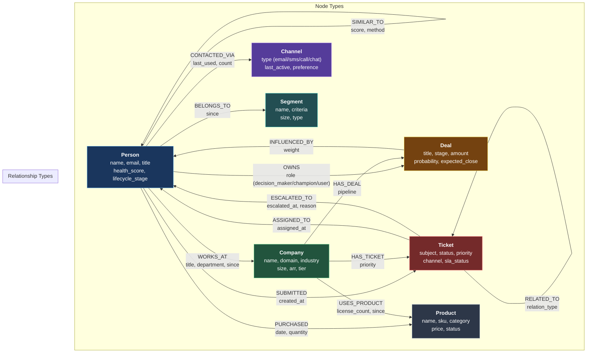
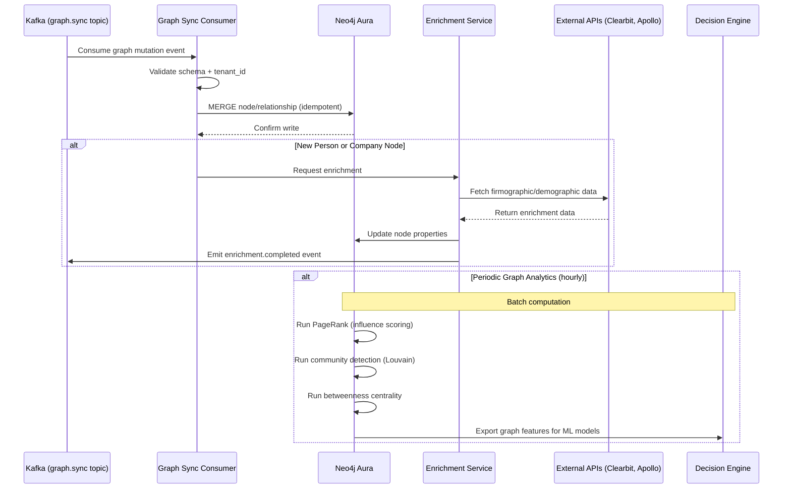

# ORDR-Connect — Customer Graph Design

> **Classification:** Confidential — Internal Engineering
> **Compliance Scope:** SOC 2 Type II | ISO 27001:2022 | HIPAA
> **Last Updated:** 2026-03-24
> **Owner:** Data Engineering

---

## 1. Purpose

The Customer Graph is the **unified entity model** for ORDR-Connect. It represents
every person, company, deal, ticket, product, and channel as a node in a property
graph, with typed edges capturing relationships. This enables multi-hop traversals
that are impossible with relational joins — answering questions like "which executives
at companies with open escalations also have expiring deals this quarter?"

### Design Goals

| Goal | Implementation |
|---|---|
| **Unified View** | Single graph spanning all customer-facing entities |
| **Real-Time Updates** | Kafka consumer syncs mutations within 500ms |
| **Multi-Hop Queries** | O(1) traversal regardless of dataset size |
| **Tenant Isolation** | Property-level `tenant_id` on every node and query |
| **Decision Engine Feed** | Graph features (centrality, clustering) feed ML models |
| **Compliance** | All graph data encrypted in transit, audit logged |

---

## 2. Graph Schema



### Node Properties

| Node Type | Core Properties | Computed Properties |
|---|---|---|
| **Person** | `id`, `tenant_id`, `email`, `name`, `title`, `phone` | `health_score`, `engagement_level`, `churn_risk`, `lifetime_value` |
| **Company** | `id`, `tenant_id`, `name`, `domain`, `industry`, `size` | `arr`, `tier`, `expansion_probability`, `nps` |
| **Deal** | `id`, `tenant_id`, `title`, `stage`, `amount`, `currency` | `win_probability`, `days_in_stage`, `velocity_score` |
| **Ticket** | `id`, `tenant_id`, `subject`, `status`, `priority` | `sla_status`, `resolution_time`, `csat`, `reopen_count` |
| **Product** | `id`, `tenant_id`, `name`, `sku`, `category`, `price` | `adoption_rate`, `feature_usage`, `stickiness` |
| **Channel** | `id`, `tenant_id`, `type`, `provider` | `response_rate`, `avg_response_time`, `preference_rank` |

### Edge Properties

All edges carry metadata:

```typescript
interface EdgeProperties {
  tenant_id: string;      // Always present — tenant isolation
  created_at: string;     // When relationship was established
  updated_at: string;     // Last modification
  source_event_id: string; // Kafka event that created/updated this edge
  confidence: number;     // 0.0–1.0 for inferred relationships
  properties: Record<string, unknown>; // Edge-type-specific data
}
```

---

## 3. Graph Enrichment Pipeline



---

## 4. Cypher Query Patterns

### Multi-Hop Traversal — Account Health

Find all people at a company with open escalations and expiring deals:

```cypher
MATCH (c:Company {tenant_id: $tenantId, id: $companyId})
OPTIONAL MATCH (c)<-[:WORKS_AT]-(p:Person {tenant_id: $tenantId})
OPTIONAL MATCH (p)-[:SUBMITTED]->(t:Ticket {tenant_id: $tenantId})
    WHERE t.status IN ['open', 'escalated'] AND t.priority IN ['high', 'critical']
OPTIONAL MATCH (c)-[:HAS_DEAL]->(d:Deal {tenant_id: $tenantId})
    WHERE d.expected_close < date() + duration({days: 30})
    AND d.stage <> 'closed_won' AND d.stage <> 'closed_lost'
RETURN c, collect(DISTINCT p) AS contacts,
       collect(DISTINCT t) AS open_escalations,
       collect(DISTINCT d) AS expiring_deals
```

### Influence Network — Who Influences a Deal?

```cypher
MATCH (d:Deal {tenant_id: $tenantId, id: $dealId})
MATCH (d)<-[:OWNS]-(champion:Person {tenant_id: $tenantId})
MATCH (champion)-[:REPORTS_TO*1..3]->(exec:Person {tenant_id: $tenantId})
OPTIONAL MATCH (exec)-[:OWNS]->(otherDeal:Deal {tenant_id: $tenantId})
    WHERE otherDeal.stage = 'closed_won'
RETURN champion, exec,
       count(otherDeal) AS past_wins,
       collect(exec.title) AS exec_titles
ORDER BY past_wins DESC
```

### Churn Signal Detection — Multi-Signal Pattern

```cypher
MATCH (c:Company {tenant_id: $tenantId})
WHERE c.tier IN ['enterprise', 'mid_market']

// Signal 1: Declining engagement
OPTIONAL MATCH (c)<-[:WORKS_AT]-(p:Person {tenant_id: $tenantId})
    WHERE p.engagement_level < 0.3

// Signal 2: Unresolved tickets
OPTIONAL MATCH (c)-[:HAS_TICKET]->(t:Ticket {tenant_id: $tenantId})
    WHERE t.status = 'open' AND t.created_at < datetime() - duration({days: 14})

// Signal 3: No recent interactions
OPTIONAL MATCH (c)<-[:WORKS_AT]-(p2:Person)-[:CONTACTED_VIA]->(ch:Channel)
    WHERE ch.last_active > datetime() - duration({days: 30})

WITH c,
     count(DISTINCT p) AS disengaged_contacts,
     count(DISTINCT t) AS stale_tickets,
     count(DISTINCT p2) AS recently_active

WHERE disengaged_contacts > 2 OR stale_tickets > 3 OR recently_active = 0
RETURN c.id, c.name, c.arr,
       disengaged_contacts, stale_tickets, recently_active
ORDER BY c.arr DESC
```

### Relationship Strength Scoring

```cypher
MATCH (p1:Person {tenant_id: $tenantId, id: $personId})
MATCH (p1)-[r]->(other)
WHERE other.tenant_id = $tenantId
WITH p1, other, type(r) AS relType, count(r) AS interactions
RETURN other.id, other.name, labels(other)[0] AS nodeType,
       relType,
       interactions,
       CASE
           WHEN interactions > 20 THEN 'strong'
           WHEN interactions > 5  THEN 'moderate'
           ELSE 'weak'
       END AS strength
ORDER BY interactions DESC
LIMIT 50
```

---

## 5. Graph Analytics

### Algorithms Run Periodically

| Algorithm | Purpose | Frequency | Output |
|---|---|---|---|
| **PageRank** | Identify influential contacts | Hourly | `influence_score` on Person nodes |
| **Louvain Community Detection** | Identify natural clusters | Daily | `community_id` on Person/Company nodes |
| **Betweenness Centrality** | Find bridge contacts | Daily | `centrality_score` on Person nodes |
| **Link Prediction** | Predict future relationships | Daily | Candidate edges with probability |
| **Shortest Path** | Escalation routing | On-demand | Path for escalation chain |
| **Jaccard Similarity** | Similar customer discovery | Weekly | `SIMILAR_TO` edges with score |

### PageRank for Influence Scoring

```cypher
CALL gds.pageRank.write({
    nodeProjection: {
        Person: { properties: ['tenant_id'] }
    },
    relationshipProjection: {
        REPORTS_TO: { orientation: 'NATURAL' },
        INFLUENCED_BY: { orientation: 'NATURAL', properties: ['weight'] }
    },
    nodeQuery: 'MATCH (n:Person {tenant_id: $tenantId}) RETURN id(n) AS id',
    writeProperty: 'influence_score',
    maxIterations: 20,
    dampingFactor: 0.85
})
YIELD nodePropertiesWritten, ranIterations
```

### Community Detection for Segmentation

```cypher
CALL gds.louvain.write({
    nodeProjection: ['Person', 'Company'],
    relationshipProjection: ['WORKS_AT', 'REPORTS_TO', 'CONTACTED_VIA'],
    writeProperty: 'community_id',
    maxLevels: 10,
    maxIterations: 10
})
YIELD communityCount, modularity
```

---

## 6. Real-Time Graph Updates

### Kafka Consumer — Graph Sync Service

```typescript
interface GraphMutation {
  operation: 'upsert_node' | 'upsert_edge' | 'soft_delete_node' | 'soft_delete_edge';
  tenantId: string;
  nodeType?: string;
  edgeType?: string;
  sourceId?: string;
  targetId?: string;
  properties: Record<string, unknown>;
  eventId: string; // Idempotency key
}

async function processGraphMutation(mutation: GraphMutation): Promise<void> {
  const session = neo4jDriver.session({ database: 'neo4j' });
  try {
    switch (mutation.operation) {
      case 'upsert_node':
        await session.run(
          `MERGE (n:${mutation.nodeType} {tenant_id: $tenantId, id: $id})
           ON CREATE SET n += $props, n.created_at = datetime()
           ON MATCH SET n += $props, n.updated_at = datetime()`,
          {
            tenantId: mutation.tenantId,
            id: mutation.properties.id,
            props: mutation.properties,
          }
        );
        break;

      case 'upsert_edge':
        await session.run(
          `MATCH (a {tenant_id: $tenantId, id: $sourceId})
           MATCH (b {tenant_id: $tenantId, id: $targetId})
           MERGE (a)-[r:${mutation.edgeType}]->(b)
           ON CREATE SET r += $props, r.created_at = datetime()
           ON MATCH SET r += $props, r.updated_at = datetime()`,
          {
            tenantId: mutation.tenantId,
            sourceId: mutation.sourceId,
            targetId: mutation.targetId,
            props: mutation.properties,
          }
        );
        break;

      case 'soft_delete_node':
        await session.run(
          `MATCH (n {tenant_id: $tenantId, id: $id})
           SET n.deleted_at = datetime(), n.active = false`,
          { tenantId: mutation.tenantId, id: mutation.properties.id }
        );
        break;
    }
  } finally {
    await session.close();
  }
}
```

---

## 7. Tenant Isolation in Graph

### Isolation Strategy

Every node and every query includes `tenant_id`:

1. **Node-level:** All nodes carry `tenant_id` property (mandatory, indexed)
2. **Query-level:** Every Cypher query filters by `tenant_id` parameter
3. **Index-level:** Composite indexes on `(tenant_id, id)` for every node type
4. **Middleware:** Graph query builder injects `tenant_id` from request context — cannot be overridden

### Indexes

```cypher
// Composite indexes for tenant-scoped lookups
CREATE INDEX person_tenant FOR (n:Person) ON (n.tenant_id, n.id);
CREATE INDEX company_tenant FOR (n:Company) ON (n.tenant_id, n.id);
CREATE INDEX deal_tenant FOR (n:Deal) ON (n.tenant_id, n.id);
CREATE INDEX ticket_tenant FOR (n:Ticket) ON (n.tenant_id, n.id);
CREATE INDEX product_tenant FOR (n:Product) ON (n.tenant_id, n.id);
CREATE INDEX channel_tenant FOR (n:Channel) ON (n.tenant_id, n.id);
CREATE INDEX segment_tenant FOR (n:Segment) ON (n.tenant_id, n.id);

// Full-text indexes for search
CREATE FULLTEXT INDEX person_search FOR (n:Person) ON EACH [n.name, n.email, n.title];
CREATE FULLTEXT INDEX company_search FOR (n:Company) ON EACH [n.name, n.domain];
```

---

## 8. Performance Optimization

### Query Performance Targets

| Query Type | Target Latency | Optimization |
|---|---|---|
| Single node lookup | < 5ms | Composite index on `(tenant_id, id)` |
| 1-hop traversal | < 10ms | Index-backed relationship traversal |
| 2-hop traversal | < 25ms | Index-backed + query planning hints |
| 3-hop traversal | < 50ms | Bounded traversal + LIMIT |
| Graph analytics (PageRank) | < 60s per tenant | GDS in-memory projection |
| Full-text search | < 20ms | Full-text index |

### Caching Strategy

```typescript
// Redis cache for hot graph queries
async function getCachedGraphResult<T>(
  tenantId: string,
  queryHash: string,
  ttlSeconds: number,
  queryFn: () => Promise<T>,
): Promise<T> {
  const cacheKey = `tenant:${tenantId}:graph:${queryHash}`;
  const cached = await redis.get(cacheKey);
  if (cached) return JSON.parse(cached);

  const result = await queryFn();
  await redis.set(cacheKey, JSON.stringify(result), 'EX', ttlSeconds);
  return result;
}
```

### Query Planning Best Practices

1. **Start from most selective node:** Begin `MATCH` with the node that has fewest candidates
2. **Use explicit labels:** Always specify node labels to leverage indexes
3. **Bound traversal depth:** Use `*1..3` instead of unbounded `*` to prevent full graph scans
4. **Profile queries:** Use `PROFILE` prefix during development to inspect query plans
5. **Batch writes:** Group mutations into transactions of 100-500 operations

---

## 9. Integration with Decision Engine

The Customer Graph feeds features directly to the Decision Engine:

| Feature | Source Query | Used By |
|---|---|---|
| `contact_count` | Count Person nodes per Company | Churn model |
| `avg_engagement` | Average engagement_level per Company | Lead scoring |
| `influence_score` | PageRank value | Deal prioritization |
| `community_size` | Louvain cluster size | Expansion model |
| `open_ticket_ratio` | Open tickets / total tickets per Company | Health scoring |
| `relationship_depth` | Max path length to decision maker | Meeting prep agent |
| `similar_churned_count` | SIMILAR_TO neighbors who churned | Churn prediction |

---

## 10. Compliance — Customer Graph

| Control | SOC 2 | ISO 27001 | HIPAA | Implementation |
|---|---|---|---|---|
| Data Classification | CC6.5 | A.8.2.1 | 164.312(a)(1) | Node property sensitivity labels |
| Tenant Isolation | CC6.1 | A.9.2 | 164.312(a)(1) | Property-level tenant_id + query filter |
| Access Logging | CC7.2 | A.12.4.1 | 164.312(b) | Every query logged with actor, resource, timestamp |
| Encryption in Transit | CC6.7 | A.13.1.1 | 164.312(e)(1) | TLS 1.3 to Neo4j Aura (Private Link) |
| Data Retention | CC6.5 | A.8.3.2 | 164.530(j) | Soft deletes, 7-year retention via audit log |
| Right to Erasure | — | A.8.3.2 | — | Crypto-shredding of PII properties |

---

*Next: [06-decision-engine.md](./06-decision-engine.md) — Three-layer Decision Engine design*
