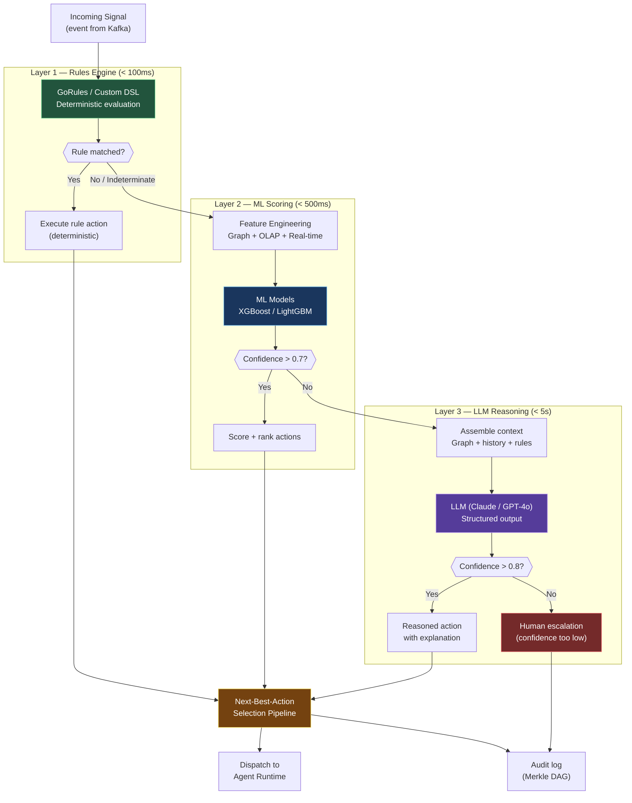
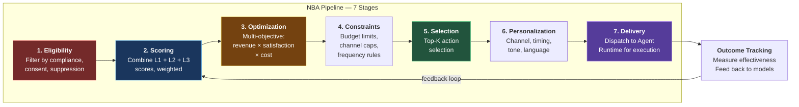

# ORDR-Connect — Decision Engine Design

> **Classification:** Confidential — Internal Engineering
> **Compliance Scope:** SOC 2 Type II | ISO 27001:2022 | HIPAA
> **Last Updated:** 2026-03-24
> **Owner:** ML Engineering

---

## 1. Three-Layer Architecture

The Decision Engine processes every customer signal through three layers of increasing
sophistication. Each layer adds intelligence, and each layer has an explicit latency
budget and confidence threshold. The system is designed so that **80% of decisions
complete at Layer 1** (rules) with sub-100ms latency, avoiding expensive ML/LLM calls
unless the situation demands nuanced reasoning.

| Layer | Type | Latency Budget | Confidence Threshold | Invocation |
|---|---|---|---|---|
| **L1 — Rules** | Deterministic | < 100ms | N/A (binary) | Every signal |
| **L2 — ML Scoring** | Probabilistic | < 500ms | > 0.7 confidence | When L1 indeterminate |
| **L3 — LLM Reasoning** | Contextual | < 5s | > 0.8 confidence | When L2 < threshold |

---

## 2. Three-Layer Decision Flow



---

## 3. Layer 1 — Rules Engine

### Implementation

The rules engine uses **GoRules** (open-source business rules engine) with a custom
DSL for non-technical users to define rules via UI.

### Rule Categories

| Category | Example Rule | Action |
|---|---|---|
| **Routing** | IF ticket.priority = 'critical' AND customer.tier = 'enterprise' | Route to senior support, notify account manager |
| **Escalation** | IF ticket.age_hours > 24 AND ticket.status = 'open' | Auto-escalate, increase priority |
| **Lead Scoring** | IF lead.source = 'inbound' AND company.size > 500 | Assign score 85, route to enterprise SDR |
| **Compliance** | IF customer.region = 'EU' AND action.type = 'email_marketing' | Check GDPR consent before execution |
| **SLA** | IF response_time > sla_threshold AND channel = 'phone' | Trigger SLA breach workflow |
| **Budget** | IF agent.daily_cost > $50 | Pause agent, require manager approval |

### Rule Schema

```typescript
interface Rule {
  id: string;
  tenantId: string;
  name: string;
  description: string;
  priority: number;          // Lower = higher priority, first match wins
  conditions: Condition[];   // AND-joined conditions
  action: RuleAction;
  enabled: boolean;
  effectiveFrom: Date;
  effectiveUntil?: Date;
  createdBy: string;
  version: number;
}

interface Condition {
  field: string;             // Dot-notation: "customer.health_score"
  operator: 'eq' | 'neq' | 'gt' | 'gte' | 'lt' | 'lte' | 'in' | 'contains' | 'regex';
  value: unknown;
}

interface RuleAction {
  type: 'route' | 'escalate' | 'score' | 'block' | 'notify' | 'trigger_agent';
  parameters: Record<string, unknown>;
}
```

---

## 4. Layer 2 — ML Scoring

### Models

| Model | Algorithm | Purpose | Features | Retraining |
|---|---|---|---|---|
| **Churn Prediction** | XGBoost | Predict customer churn probability | 45 features | Weekly |
| **Lead Scoring** | LightGBM | Score inbound leads 0-100 | 30 features | Weekly |
| **Propensity-to-Pay** | XGBoost | Collections prioritization | 25 features | Bi-weekly |
| **Expansion Propensity** | LightGBM | Upsell/cross-sell likelihood | 35 features | Weekly |
| **Deal Win Probability** | XGBoost | Forecast deal outcomes | 40 features | Weekly |
| **Support Urgency** | LightGBM | Ticket triage scoring | 20 features | Weekly |
| **Response Propensity** | LightGBM | Optimal send time/channel | 15 features | Daily |

### Feature Engineering

Features are assembled from three sources:

```typescript
interface FeatureVector {
  // Real-time features (Redis)
  recentInteractionCount: number;    // Last 7 days
  lastContactHoursAgo: number;
  openTicketCount: number;
  currentSessionDuration: number;

  // Graph features (Neo4j)
  contactCount: number;
  influenceScore: number;           // PageRank
  communitySize: number;            // Louvain cluster
  avgRelationshipStrength: number;
  decisionMakerAccessible: boolean;

  // OLAP features (ClickHouse)
  engagementTrend30d: number;       // Slope of engagement over 30 days
  npsScore: number;
  lifetimeValue: number;
  productAdoptionRate: number;
  ticketResolutionAvgDays: number;
  emailOpenRate30d: number;
  meetingFrequency30d: number;
}
```

### Model Serving

Models are served via a sidecar inference service:

- **Format:** ONNX Runtime for XGBoost/LightGBM models
- **Deployment:** Kubernetes sidecar per decision-engine pod
- **Latency:** p99 < 50ms for single prediction
- **Batch:** Up to 100 predictions per batch call
- **A/B Testing:** Traffic split via feature flags (champion/challenger)

---

## 5. Layer 3 — LLM Reasoning

### When to Invoke

LLM reasoning is triggered only when:

1. Layer 2 ML confidence is below 0.7, OR
2. The situation requires multi-step reasoning (complex escalation), OR
3. The action requires natural language output (email draft, meeting brief), OR
4. Regulatory context requires explanation (compliance-sensitive decisions)

### LLM Invocation

```typescript
interface LLMDecisionRequest {
  tenantId: string;
  signalType: string;
  customerContext: {
    profile: CustomerProfile;
    recentInteractions: Interaction[];  // Last 10
    openDeals: Deal[];
    openTickets: Ticket[];
    healthScore: number;
    graphNeighbors: GraphNeighborSummary;
  };
  rulesResult: RuleEvaluationResult | null;
  mlScores: MLScoreResult | null;
  availableActions: ActionDefinition[];
  constraints: DecisionConstraint[];    // Budget, compliance, etc.
}

interface LLMDecisionResponse {
  recommendedAction: string;
  confidence: number;           // 0.0-1.0
  reasoning: string;            // Human-readable explanation
  alternativeActions: string[]; // Ranked alternatives
  riskAssessment: string;       // Potential downsides
}
```

### Guardrails

| Guardrail | Implementation |
|---|---|
| **Structured Output** | JSON schema enforcement via function calling |
| **Hallucination Check** | Cross-validate LLM output against graph data |
| **Action Allowlist** | LLM can only recommend from predefined action set |
| **Confidence Floor** | Below 0.8 → escalate to human |
| **Cost Cap** | Maximum token budget per LLM call (4K input, 1K output) |
| **PHI Redaction** | PHI stripped before LLM context, restored after |

---

## 6. Next-Best-Action (NBA) Pipeline



### Stage Details

**Stage 1 — Eligibility:**
- Check GDPR/CCPA consent status
- Check communication suppression list
- Check channel-specific opt-outs
- Check compliance hold (legal, regulatory)
- Check customer do-not-contact flags

**Stage 2 — Scoring:**
```typescript
function computeNBAScore(
  rulesScore: number | null,    // 0-100 from L1
  mlScore: number | null,       // 0-100 from L2
  llmScore: number | null,      // 0-100 from L3
  weights: { rules: number; ml: number; llm: number }
): number {
  const scores = [
    rulesScore !== null ? { score: rulesScore, weight: weights.rules } : null,
    mlScore !== null ? { score: mlScore, weight: weights.ml } : null,
    llmScore !== null ? { score: llmScore, weight: weights.llm } : null,
  ].filter(Boolean);

  const totalWeight = scores.reduce((sum, s) => sum + s!.weight, 0);
  return scores.reduce((sum, s) => sum + (s!.score * s!.weight), 0) / totalWeight;
}
```

**Stage 3 — Optimization:**
Multi-objective function balancing:
- Revenue impact (deal progression, expansion)
- Customer satisfaction (NPS, CSAT prediction)
- Operational cost (agent tokens, channel cost)
- Risk mitigation (churn prevention value)

**Stage 4 — Constraints:**
- Per-customer: Max 3 outbound contacts per week
- Per-channel: Max 1 SMS per day, max 5 emails per week
- Per-tenant: Monthly budget ceiling for AI actions
- Per-agent: Token/action/cost limits per execution

**Stage 5 — Selection:**
Select top action from scored, constrained candidates.

**Stage 6 — Personalization:**
- Channel selection (email vs SMS vs call) based on preference model
- Send time optimization (response propensity model)
- Tone and language matching (formal vs casual, locale)
- Content personalization (merge fields, dynamic sections)

**Stage 7 — Delivery:**
Dispatch selected action to Agent Runtime with full context.

---

## 7. Model Retraining Pipeline

```mermaid
graph LR
    subgraph "Data Collection"
        OUTCOMES["Outcome Events<br/>(Kafka → ClickHouse)"]
        FEATURES["Feature Snapshots<br/>(ClickHouse materialized views)"]
    end

    subgraph "Training Pipeline (Weekly)"
        EXTRACT["Extract training set<br/>60-day window"]
        SPLIT["Train/validation/test split<br/>70/15/15"]
        TRAIN["Train model<br/>XGBoost / LightGBM"]
        EVAL["Evaluate<br/>AUC, precision, recall, F1"]
        COMPARE["Compare vs champion<br/>Statistical significance test"]
    end

    subgraph "Deployment"
        APPROVE{{"Performance improved?"}}
        STAGE["Stage as challenger<br/>10% traffic"]
        AB["A/B test<br/>7-day evaluation"]
        PROMOTE{{"Challenger wins?"}}
        DEPLOY["Promote to champion<br/>100% traffic"]
        ROLLBACK["Keep champion<br/>Archive challenger"]
    end

    OUTCOMES --> EXTRACT
    FEATURES --> EXTRACT
    EXTRACT --> SPLIT --> TRAIN --> EVAL --> COMPARE --> APPROVE
    APPROVE -->|"Yes"| STAGE --> AB --> PROMOTE
    APPROVE -->|"No"| ROLLBACK
    PROMOTE -->|"Yes"| DEPLOY
    PROMOTE -->|"No"| ROLLBACK

    style EVAL fill:#1a365d,stroke:#63b3ed,color:#fff
    style APPROVE fill:#744210,stroke:#f6e05e,color:#fff
    style PROMOTE fill:#744210,stroke:#f6e05e,color:#fff
    style DEPLOY fill:#22543d,stroke:#68d391,color:#fff
```



### Model Performance Monitoring

| Metric | Threshold | Action if Violated |
|---|---|---|
| AUC-ROC | < 0.75 | Trigger emergency retraining |
| Prediction drift (PSI) | > 0.2 | Alert ML team, schedule retraining |
| Feature drift (KL divergence) | > 0.1 per feature | Investigate data pipeline issue |
| Latency p99 | > 100ms | Scale inference replicas |
| Error rate | > 1% | Circuit breaker, fall back to rules only |

---

## 8. A/B Testing Framework

### Architecture

- **Feature flags:** LaunchDarkly / custom (Redis-backed) for traffic splitting
- **Assignment:** Deterministic hash of `(tenant_id, experiment_id)` for stable assignment
- **Metrics collection:** ClickHouse stores experiment events with variant labels
- **Statistical analysis:** Sequential testing with always-valid p-values (avoids peeking bias)

### Experiment Definition

```typescript
interface Experiment {
  id: string;
  name: string;
  description: string;
  status: 'draft' | 'running' | 'concluded';
  variants: {
    control: { weight: number; config: Record<string, unknown> };
    treatment: { weight: number; config: Record<string, unknown> };
  };
  primaryMetric: string;        // e.g., 'deal_conversion_rate'
  secondaryMetrics: string[];
  minimumSampleSize: number;
  maxDurationDays: number;
  startedAt?: Date;
  concludedAt?: Date;
  winner?: 'control' | 'treatment' | 'inconclusive';
}
```

---

## 9. Decision Auditability

Every decision is fully auditable with the following record:

```typescript
interface DecisionAuditRecord {
  decisionId: string;           // UUIDv7
  tenantId: string;
  signalEventId: string;        // Input event that triggered decision
  layersInvoked: ('rules' | 'ml' | 'llm')[];
  rulesResult?: {
    matchedRuleIds: string[];
    evaluationTimeMs: number;
  };
  mlResult?: {
    modelId: string;
    modelVersion: string;
    score: number;
    confidence: number;
    featureImportances: Record<string, number>; // Top 10
    evaluationTimeMs: number;
  };
  llmResult?: {
    modelId: string;
    promptTokens: number;
    completionTokens: number;
    confidence: number;
    reasoning: string;          // LLM explanation
    evaluationTimeMs: number;
  };
  nbaResult: {
    selectedAction: string;
    score: number;
    alternativeActions: { action: string; score: number }[];
    constraints_applied: string[];
  };
  totalLatencyMs: number;
  contentHash: string;          // Merkle DAG
  signature: string;            // Ed25519
}
```

---

## 10. Compliance — Decision Engine

| Control | SOC 2 | ISO 27001 | HIPAA | Implementation |
|---|---|---|---|---|
| Decision Audit Trail | CC7.2 | A.12.4.1 | 164.312(b) | Full decision record in Merkle DAG |
| Explainability | CC7.2 | A.12.4.1 | 164.312(b) | LLM reasoning, feature importances |
| Bias Detection | CC1.1 | A.18.2 | — | Fairness metrics in retraining pipeline |
| Model Governance | CC8.1 | A.14.2 | 164.308(a)(1) | Version control, approval workflow |
| PHI Protection | CC6.7 | A.10.1 | 164.312(a)(2)(iv) | PHI redacted before LLM, encrypted features |
| Access Control | CC6.1 | A.9.2 | 164.312(a)(1) | Only authorized services invoke engine |

---

*Next: [07-agent-runtime.md](./07-agent-runtime.md) — AI Agent Runtime with graduated autonomy*
