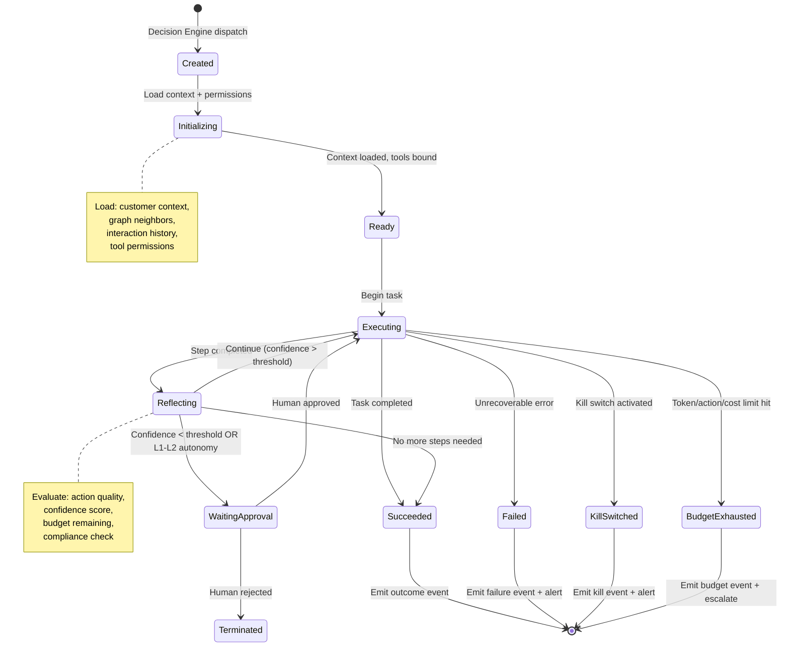
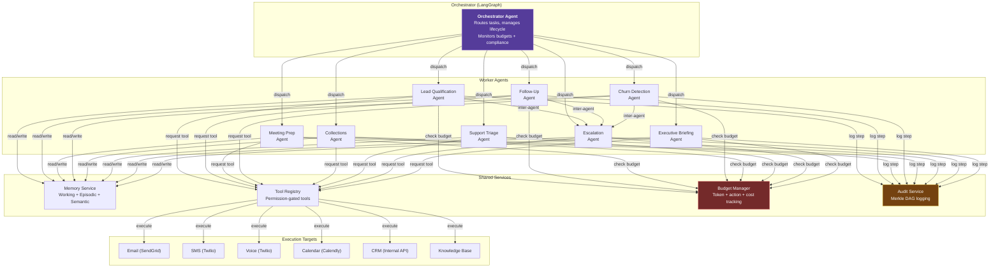
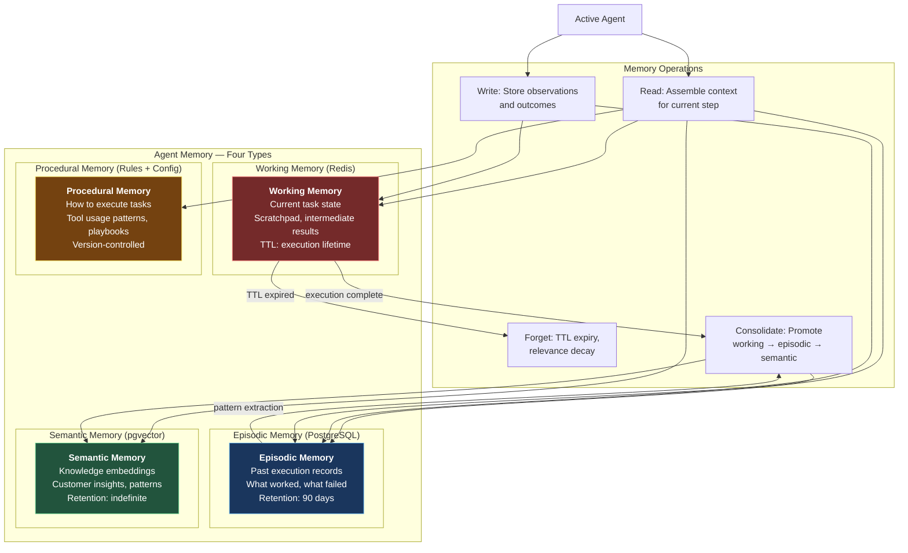

# ORDR-Connect — Agent Runtime Architecture

> **Classification:** Confidential — Internal Engineering
> **Compliance Scope:** SOC 2 Type II | ISO 27001:2022 | HIPAA
> **Last Updated:** 2026-03-24
> **Owner:** AI Engineering

---

## 1. Architecture Overview

The Agent Runtime is where intelligence meets execution. It orchestrates **autonomous AI
agents** that perform customer operations tasks — from lead qualification to churn
intervention to collections — with explicit permission boundaries, budget limits,
and kill switches at every level.

### Design Principles

| Principle | Implementation |
|---|---|
| **Graduated Autonomy** | 5 levels from human-confirms-all (L1) to fully autonomous (L5) |
| **Permission Boundaries** | Each agent type has explicit tool allowlists |
| **Budget Enforcement** | Token, action, and cost limits per execution |
| **Kill Switches** | Tenant-level, agent-type-level, and individual execution kill switches |
| **Hallucination Containment** | RAG + multi-agent validation + rules + confidence scoring |
| **Full Auditability** | Every agent step logged in Merkle DAG audit trail |

---

## 2. Agent Lifecycle



---

## 3. Agent Taxonomy

| Agent Type | Purpose | Autonomy Default | Key Tools |
|---|---|---|---|
| **Lead Qualification** | Score and qualify inbound leads | L3 | CRM read, enrichment, email draft |
| **Follow-Up** | Automated follow-up sequences | L3 | Email send, SMS send, calendar read |
| **Meeting Prep** | Generate pre-meeting briefs | L2 | Graph query, interaction history, doc generation |
| **Churn Detection** | Identify and intervene on churn signals | L3 | Health score, graph analysis, escalation |
| **Collections** | Manage overdue payment outreach | L2 | Invoice read, email send, escalation |
| **Support Triage** | Categorize and route support tickets | L4 | Ticket read/write, knowledge base, routing |
| **Escalation** | Handle complex multi-step escalations | L2 | Cross-team routing, executive notification |
| **Executive Briefing** | Generate executive summary reports | L2 | OLAP query, graph analytics, doc generation |

---

## 4. Multi-Agent Orchestration



### Orchestrator-Worker Pattern

The **Orchestrator** is a LangGraph supervisor agent that:

1. Receives task from Decision Engine
2. Selects appropriate worker agent(s)
3. Dispatches with context and constraints
4. Monitors execution progress
5. Handles inter-agent communication
6. Enforces global budget and compliance
7. Aggregates results and emits outcome events

### Inter-Agent Communication

Agents communicate via a structured message protocol:

```typescript
interface AgentMessage {
  fromAgent: string;          // Source agent execution ID
  toAgent: string;            // Target agent type or execution ID
  messageType: 'request' | 'response' | 'escalation' | 'notification';
  payload: {
    action: string;           // What is being requested
    context: Record<string, unknown>;
    priority: 'low' | 'normal' | 'high' | 'critical';
    deadline?: Date;          // Must respond by
  };
  traceId: string;            // Distributed trace correlation
}
```

---

## 5. Agent Memory Architecture



### Memory Implementation

```typescript
interface AgentMemory {
  working: {
    get(key: string): Promise<unknown>;
    set(key: string, value: unknown, ttlSeconds?: number): Promise<void>;
    getAll(): Promise<Record<string, unknown>>;
  };

  episodic: {
    recall(query: string, limit: number): Promise<EpisodicRecord[]>;
    store(record: EpisodicRecord): Promise<void>;
    getByAgentType(agentType: string, limit: number): Promise<EpisodicRecord[]>;
  };

  semantic: {
    search(embedding: number[], limit: number): Promise<SemanticRecord[]>;
    store(content: string, metadata: Record<string, unknown>): Promise<void>;
  };

  procedural: {
    getPlaybook(agentType: string, taskType: string): Promise<Playbook>;
    getToolUsage(toolName: string): Promise<ToolUsagePattern>;
  };
}

interface EpisodicRecord {
  executionId: string;
  agentType: string;
  taskSummary: string;
  outcome: 'success' | 'failure' | 'partial';
  lessonsLearned: string;
  toolsUsed: string[];
  durationMs: number;
  createdAt: Date;
}
```

---

## 6. Graduated Autonomy — Levels 1 through 5

| Level | Name | Human Involvement | Use Cases |
|---|---|---|---|
| **L1** | Human-in-the-Loop | Human approves every action before execution | Sensitive financial actions, first-time agent deployment |
| **L2** | Human-on-the-Loop | Human monitors, agent pauses on low confidence | Executive outreach, collections, escalations |
| **L3** | Supervised Autonomous | Agent executes within guardrails, human reviews outcomes | Lead qualification, follow-up, churn detection |
| **L4** | Mostly Autonomous | Agent executes freely, human alerted on anomalies | Support triage, routine follow-ups |
| **L5** | Fully Autonomous | No human involvement, post-hoc audit only | Data enrichment, internal tagging, analytics |

### Level Assignment

```typescript
interface AutonomyPolicy {
  agentType: string;
  defaultLevel: 1 | 2 | 3 | 4 | 5;
  overrides: {
    condition: string;          // e.g., "customer.tier == 'enterprise'"
    level: 1 | 2 | 3 | 4 | 5;  // Override to more conservative level
  }[];
  escalationRules: {
    confidenceBelow: number;    // If agent confidence drops below this
    escalateTo: 1 | 2 | 3;     // Reduce autonomy to this level
  };
}
```

---

## 7. Permission Boundaries & Tool Allowlists

### Tool Registry

Every tool the agent can use is registered with explicit permissions:

```typescript
interface ToolDefinition {
  name: string;
  description: string;
  category: 'read' | 'write' | 'communicate' | 'analyze';
  riskLevel: 'low' | 'medium' | 'high' | 'critical';
  requiresApproval: boolean;   // At L2 and below
  parameters: z.ZodSchema;     // Runtime validation
  allowedAgentTypes: string[];  // Which agents can use this tool
  rateLimits: {
    maxPerExecution: number;
    maxPerHour: number;
    maxPerDay: number;
  };
  auditLevel: 'minimal' | 'standard' | 'detailed';
}
```

### Tool Allowlists by Agent Type

| Agent Type | Read Tools | Write Tools | Communication Tools |
|---|---|---|---|
| **Lead Qualification** | customer.read, deal.read, enrichment.lookup | deal.update, score.write | email.draft (not send) |
| **Follow-Up** | customer.read, interaction.history | interaction.log | email.send, sms.send |
| **Meeting Prep** | customer.read, graph.query, deal.read | document.create | — |
| **Churn Detection** | customer.read, graph.analytics, ticket.read | alert.create | escalation.trigger |
| **Collections** | invoice.read, payment.history | payment.reminder.create | email.send |
| **Support Triage** | ticket.read, knowledge.search | ticket.categorize, ticket.route | — |
| **Escalation** | ticket.read, customer.read, graph.query | ticket.escalate | notification.send |
| **Executive Briefing** | analytics.query, graph.analytics | report.create | — |

---

## 8. Hallucination Containment

### Four-Layer Defense

```typescript
interface HallucinationDefense {
  // Layer 1: RAG grounding
  rag: {
    enabled: true;
    sources: ['customer_graph', 'interaction_history', 'knowledge_base'];
    requireCitation: true;     // Agent must cite source for claims
    maxContextTokens: 8000;
  };

  // Layer 2: Multi-agent validation
  validation: {
    enabled: true;
    validatorAgent: 'fact_checker';
    validateFields: ['customer_name', 'deal_amount', 'dates', 'commitments'];
    crossReferenceGraph: true;  // Validate against Neo4j
  };

  // Layer 3: Rules-based constraints
  rules: {
    enabled: true;
    disallowedPatterns: [
      'guarantee|promise|commit',   // Cannot make unauthorized commitments
      'discount|price reduction',   // Cannot offer unauthorized discounts
      'legal|lawsuit|litigation',   // Cannot make legal statements
    ];
    requiredPatterns: [
      'Based on (our records|your account)', // Must ground in data
    ];
  };

  // Layer 4: Confidence scoring
  confidence: {
    enabled: true;
    minimumScore: 0.75;         // Below this → human review
    factorWeights: {
      ragCoverage: 0.3,         // How much of the output is RAG-grounded
      validationPass: 0.3,      // Multi-agent validation result
      modelConfidence: 0.2,     // LLM self-reported confidence
      historicalAccuracy: 0.2,  // Past accuracy of this agent type
    };
  };
}
```

---

## 9. Kill Switches & Budget Enforcement

### Kill Switch Hierarchy

| Level | Scope | Trigger | Effect |
|---|---|---|---|
| **Platform** | All agents, all tenants | Critical security event | Immediate halt of all agent executions |
| **Tenant** | All agents for one tenant | Tenant admin action, budget exceeded | Halt all agent activity for tenant |
| **Agent Type** | All instances of one agent type | Performance degradation, policy violation | Halt specific agent type |
| **Execution** | Single running agent | Anomaly detected, human override | Terminate single execution |

### Budget Enforcement

```typescript
interface AgentBudget {
  executionId: string;
  tenantId: string;
  agentType: string;

  // Token limits
  maxInputTokens: number;       // Default: 50,000
  maxOutputTokens: number;      // Default: 10,000
  usedInputTokens: number;
  usedOutputTokens: number;

  // Action limits
  maxToolCalls: number;         // Default: 20
  maxExternalCalls: number;     // Default: 5 (email, SMS, etc.)
  usedToolCalls: number;
  usedExternalCalls: number;

  // Cost limits
  maxCostUsd: number;           // Default: $1.00 per execution
  accruedCostUsd: number;

  // Time limits
  maxDurationMs: number;        // Default: 300,000 (5 minutes)
  startedAt: Date;
}

async function checkBudget(budget: AgentBudget): Promise<BudgetCheckResult> {
  if (budget.usedInputTokens >= budget.maxInputTokens) return { allowed: false, reason: 'input_token_limit' };
  if (budget.usedOutputTokens >= budget.maxOutputTokens) return { allowed: false, reason: 'output_token_limit' };
  if (budget.usedToolCalls >= budget.maxToolCalls) return { allowed: false, reason: 'tool_call_limit' };
  if (budget.usedExternalCalls >= budget.maxExternalCalls) return { allowed: false, reason: 'external_call_limit' };
  if (budget.accruedCostUsd >= budget.maxCostUsd) return { allowed: false, reason: 'cost_limit' };
  if (Date.now() - budget.startedAt.getTime() >= budget.maxDurationMs) return { allowed: false, reason: 'duration_limit' };
  return { allowed: true, reason: null };
}
```

---

## 10. Failure Recovery

### Failure Modes

| Failure | Detection | Recovery |
|---|---|---|
| **LLM API timeout** | HTTP timeout (30s) | Retry with exponential backoff (3 attempts), then fallback to rules-only |
| **Tool execution failure** | Error response from tool | Retry once, then skip tool and continue with degraded context |
| **Budget exhaustion** | Budget check before each step | Graceful shutdown: save state, emit partial result, escalate to human |
| **Kill switch activation** | Checked before each step | Immediate halt: save state, emit cancellation event |
| **Memory corruption** | Checksum validation | Reload from last checkpoint, retry step |
| **Inter-agent deadlock** | Timeout on message response (60s) | Orchestrator breaks deadlock, terminates blocked agent |
| **Confidence collapse** | Confidence below floor for 3 consecutive steps | Halt execution, escalate to human with full context |

### Checkpoint and Resume

```typescript
interface AgentCheckpoint {
  executionId: string;
  stepNumber: number;
  workingMemory: Record<string, unknown>;
  completedActions: ActionRecord[];
  pendingActions: ActionRecord[];
  budget: AgentBudget;
  createdAt: Date;
}

// Saved to Redis with TTL matching max execution duration
async function saveCheckpoint(checkpoint: AgentCheckpoint): Promise<void> {
  const key = `agent:${checkpoint.executionId}:checkpoint:${checkpoint.stepNumber}`;
  await redis.set(key, JSON.stringify(checkpoint), 'EX', 3600);
}

async function resumeFromCheckpoint(executionId: string): Promise<AgentCheckpoint | null> {
  // Find latest checkpoint
  const keys = await redis.keys(`agent:${executionId}:checkpoint:*`);
  if (keys.length === 0) return null;
  const latestKey = keys.sort().pop()!;
  const data = await redis.get(latestKey);
  return data ? JSON.parse(data) : null;
}
```

---

## 11. LangGraph Implementation

### Agent Graph Definition

```typescript
import { StateGraph, Annotation } from '@langchain/langgraph';

const AgentState = Annotation.Root({
  executionId: Annotation<string>,
  tenantId: Annotation<string>,
  agentType: Annotation<string>,
  autonomyLevel: Annotation<number>,
  task: Annotation<TaskDefinition>,
  messages: Annotation<BaseMessage[]>({ reducer: messagesReducer }),
  workingMemory: Annotation<Record<string, unknown>>,
  budget: Annotation<AgentBudget>,
  completedSteps: Annotation<StepRecord[]>,
  status: Annotation<'running' | 'waiting_approval' | 'succeeded' | 'failed'>,
});

const agentGraph = new StateGraph(AgentState)
  .addNode('initialize', initializeNode)
  .addNode('plan', planNode)
  .addNode('execute_tool', executeToolNode)
  .addNode('reflect', reflectNode)
  .addNode('request_approval', requestApprovalNode)
  .addNode('finalize', finalizeNode)

  .addEdge('__start__', 'initialize')
  .addEdge('initialize', 'plan')
  .addConditionalEdges('plan', routeFromPlan, {
    execute: 'execute_tool',
    done: 'finalize',
  })
  .addEdge('execute_tool', 'reflect')
  .addConditionalEdges('reflect', routeFromReflect, {
    continue: 'plan',
    approval_needed: 'request_approval',
    done: 'finalize',
    budget_exceeded: 'finalize',
  })
  .addConditionalEdges('request_approval', routeFromApproval, {
    approved: 'plan',
    rejected: 'finalize',
  })
  .compile();
```

---

## 12. Compliance — Agent Runtime

| Control | SOC 2 | ISO 27001 | HIPAA | Implementation |
|---|---|---|---|---|
| Agent Audit Trail | CC7.2 | A.12.4.1 | 164.312(b) | Every step logged in Merkle DAG |
| Permission Enforcement | CC6.1 | A.9.2 | 164.312(a)(1) | Tool allowlists, autonomy levels |
| PHI Handling | CC6.7 | A.10.1 | 164.312(a)(2)(iv) | PHI redacted from agent context |
| Human Oversight | CC1.1 | A.6.1.2 | 164.308(a)(3) | Graduated autonomy, kill switches |
| Cost Controls | CC6.1 | A.9.2 | — | Budget enforcement per execution |
| Incident Response | CC7.3 | A.16.1 | 164.308(a)(6) | Kill switches, PagerDuty alerts |
| Data Minimization | CC6.5 | A.8.2.1 | 164.502(b) | Agents receive only necessary context |

---

*Previous: [06-decision-engine.md](./06-decision-engine.md) — Three-layer Decision Engine*
