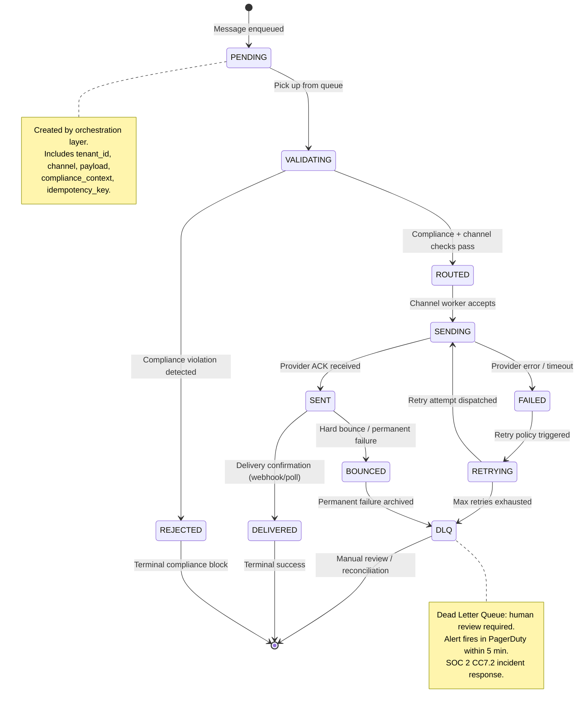
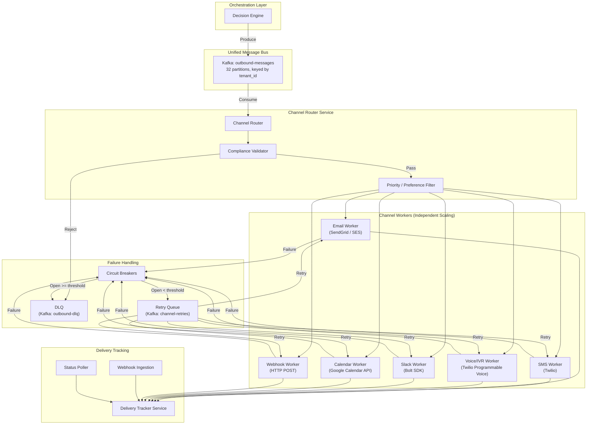
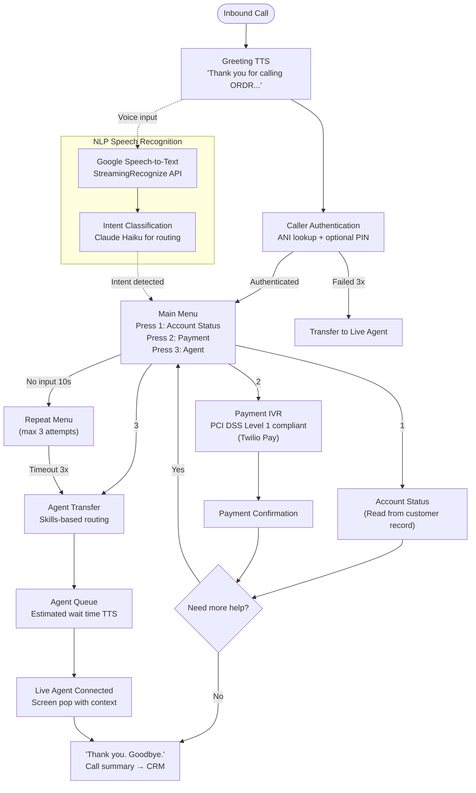

# 08 — Multi-Channel Execution Layer

> **ORDR-Connect — Customer Operations OS**
> Classification: INTERNAL — SOC 2 Type II | ISO 27001:2022 | HIPAA
> Last Updated: 2025-03-24

---

## 1. Overview

The execution layer is the final mile of every customer interaction. It receives
decisioned, compliant messages from the orchestration layer and delivers them
through the appropriate channel — email, SMS, voice/IVR, Slack, calendar, or
webhook — while guaranteeing exactly-once semantics, full delivery tracking, and
regulatory compliance per channel.

All outbound messages flow through a unified Kafka topic (`outbound-messages`)
before being dispatched to channel-specific workers. This decouples message
creation from delivery, enabling independent scaling, retry isolation, and
channel-specific optimization.

---

## 2. Message Delivery State Machine

Every message progresses through a deterministic state machine. States are
persisted in PostgreSQL with WORM audit logging at each transition.



### State Transition Rules

| From | To | Trigger | Audit Event |
|---|---|---|---|
| PENDING | VALIDATING | Worker poll | `msg.pickup` |
| VALIDATING | ROUTED | All checks pass | `msg.validated` |
| VALIDATING | REJECTED | TCPA/HIPAA/FDCPA block | `msg.compliance_rejected` |
| ROUTED | SENDING | Channel worker dequeue | `msg.sending` |
| SENDING | SENT | Provider 2xx + message ID | `msg.sent` |
| SENT | DELIVERED | Delivery webhook | `msg.delivered` |
| SENT | BOUNCED | Hard bounce notification | `msg.bounced` |
| SENDING | FAILED | 4xx/5xx or timeout | `msg.failed` |
| FAILED | RETRYING | Retry count < max | `msg.retry_scheduled` |
| RETRYING | DLQ | Retry count >= max | `msg.dlq` |

---

## 3. Channel Routing Architecture



### Routing Logic

The channel router applies a deterministic decision sequence:

1. **Compliance gate** — Validate against TCPA (SMS/voice timing), FDCPA (attempt
   limits), HIPAA (PHI content restrictions), tenant consent records.
2. **Channel preference** — Respect customer-stated preference (stored in
   `customer_channel_preferences` table).
3. **Channel availability** — Check circuit breaker state for target channel.
4. **Priority routing** — Urgent messages (e.g., breach notifications) bypass
   preference and go to all available channels simultaneously.
5. **Cost optimization** — When multiple channels are equivalent, prefer the
   lowest-cost option (email > Slack > SMS > voice).

---

## 4. Email Delivery — SendGrid / Amazon SES

### Architecture

Primary: **SendGrid** (transactional + marketing, dedicated IP pools).
Failover: **Amazon SES** (automatic failover when SendGrid circuit breaker opens).

### Domain Authentication

| Protocol | Implementation | Compliance |
|---|---|---|
| SPF | `v=spf1 include:sendgrid.net include:amazonses.com ~all` | ISO 27001 A.13.2.1 |
| DKIM | 2048-bit RSA keys rotated quarterly | SOC 2 CC6.1 |
| DMARC | `v=DMARC1; p=reject; rua=mailto:dmarc@ordr.io` | ISO 27001 A.13.2.1 |
| BIMI | Brand indicator with VMC certificate | — |
| MTA-STS | Enforce TLS for inbound/outbound SMTP | SOC 2 CC6.7 |

### Sending Configuration

```typescript
interface EmailWorkerConfig {
  provider: 'sendgrid' | 'ses';
  dedicatedIpPool: string;           // Per-tenant for premium tiers
  maxSendRate: number;               // 100/sec default, 1000/sec premium
  warmupEnabled: boolean;            // New IP pool warmup over 30 days
  bounceThreshold: number;           // 5% — pause sending if exceeded
  complaintThreshold: number;        // 0.1% — immediate pause
  unsubscribeHeaderEnabled: boolean; // RFC 8058 List-Unsubscribe-Post
  trackOpens: boolean;               // Disabled for HIPAA tenants
  trackClicks: boolean;              // Disabled for HIPAA tenants
}
```

### HIPAA Email Requirements

- PHI **never** appears in email subject lines.
- Body content uses secure link pattern: "You have a new message. Log in to view."
- All emails to PHI-context tenants use TLS-enforced delivery.
- Open/click tracking **disabled** (tracking pixels = PHI exposure risk).

---

## 5. SMS — Twilio with TCPA Compliance

### TCPA Compliance Engine

The Telephone Consumer Protection Act imposes strict rules on automated text
messages. Violations carry $500-$1,500 per message in statutory damages.

```typescript
interface TCPAComplianceCheck {
  // Pre-send validation — all must pass
  hasExpressWrittenConsent: boolean;  // Stored in consent_records table
  consentNotRevoked: boolean;         // Check opt-out registry
  withinTimingWindow: boolean;        // 8 AM - 9 PM in RECIPIENT timezone
  notOnDNCList: boolean;              // Internal + National DNC Registry
  messageContainsOptOut: boolean;     // "Reply STOP to unsubscribe"
  callerIdDisplayed: boolean;         // Must show real number
  isTransactional: boolean;           // Different consent rules apply
}
```

### Consent Management

| Consent Type | Required For | Storage | Retention |
|---|---|---|---|
| Express written | Marketing SMS | `consent_records` + S3 WORM | 5 years post-revocation |
| Express | Transactional SMS | `consent_records` | 5 years post-revocation |
| Implied | — | Not accepted | — |

### Opt-Out Processing

- **STOP** keyword triggers immediate opt-out (< 1 second processing).
- Opt-out persisted to `sms_opt_outs` table with WORM audit log.
- Confirmation message sent: "You have been unsubscribed. Reply START to resubscribe."
- All future SMS to that number are blocked at the compliance gate.
- Opt-out records are **never deleted** (regulatory retention).

### SMS Rate Limits

| Tier | Type | Rate | Throughput |
|---|---|---|---|
| Long code | Transactional | 1 msg/sec | Low volume |
| Toll-free | Mixed | 25 msg/sec | Medium volume |
| Short code | Marketing | 100 msg/sec | High volume |
| 10DLC | A2P registered | 75 msg/sec | Registered campaigns |

---

## 6. Voice / IVR — Twilio Programmable Voice + Studio

### IVR Flow Design



### Cost Analysis

| Component | Rate | Monthly Estimate (50K calls) |
|---|---|---|
| Inbound voice | $0.0085/min | $2,125 (avg 5 min/call) |
| Outbound voice | $0.014/min | $3,500 (avg 5 min/call) |
| TTS (Amazon Polly) | $4.00/1M chars | $80 |
| STT (Google) | $0.006/15-sec | $1,200 |
| Twilio Studio | $0.001/execution | $50 |
| **Total** | | **~$6,955/month** |

### HIPAA Voice Requirements

- Call recordings stored in HIPAA-compliant storage (Twilio encrypted at rest).
- PHI spoken only after caller authentication.
- BAA required with Twilio for any PHI-handling tenant.
- Recording retention: 6 years per HIPAA, auto-deleted after.

---

## 7. Slack Integration

### Implementation

Built on **Slack Bolt SDK** (TypeScript) with Socket Mode for firewall-friendly
deployment.

| Feature | Implementation |
|---|---|
| Message delivery | `chat.postMessage` / `chat.postEphemeral` |
| Interactive actions | Block Kit with action handlers |
| Slash commands | `/ordr status`, `/ordr approve`, `/ordr escalate` |
| App Home tab | Customer summary dashboard |
| Threads | Conversation threading by case ID |

### Security Controls

- OAuth 2.0 scopes limited to minimum necessary (ISO 27001 A.9.4.1).
- Messages containing PHI are sent as ephemeral (visible only to recipient).
- Token rotation every 90 days.
- Audit log of all Slack interactions stored in WORM log.

---

## 8. Calendar Management

Google Calendar API integration for scheduling appointments, follow-ups, and
compliance deadlines.

| Operation | API | Use Case |
|---|---|---|
| Create event | `events.insert` | Schedule follow-up call |
| Update event | `events.patch` | Reschedule from IVR |
| Watch changes | `events.watch` | Sync cancellations |
| Free/busy query | `freebusy.query` | Availability for scheduling |

---

## 9. Webhook Delivery

Outbound webhook delivery for tenant integrations (CRM sync, billing systems,
custom workflows).

### Reliability Pipeline

1. **Payload construction** — JSON with HMAC-SHA256 signature in `X-ORDR-Signature` header.
2. **Fast dispatch** — HTTP POST with 5-second connect timeout, 30-second read timeout.
3. **Idempotency** — `X-ORDR-Idempotency-Key` header on every delivery.
4. **Retry on failure** — Exponential backoff (see below).
5. **DLQ** — After max retries, payload stored for manual replay.

---

## 10. Retry Policies by Channel

Each channel has tuned retry behavior based on provider characteristics and
regulatory constraints.

| Channel | Max Retries | Base Delay | Backoff | Jitter | Max Delay | Notes |
|---|---|---|---|---|---|---|
| Email | 5 | 30s | Exponential (2x) | ±20% | 30 min | Pause on bounce spike |
| SMS | 3 | 60s | Exponential (2x) | ±30% | 15 min | TCPA timing re-check |
| Voice | 2 | 5 min | Linear | ±10% | 30 min | FDCPA attempt limits |
| Slack | 5 | 10s | Exponential (2x) | ±20% | 10 min | Rate limit aware |
| Webhook | 8 | 30s | Exponential (2x) | ±25% | 4 hours | Longest retry window |
| Calendar | 3 | 15s | Exponential (2x) | ±15% | 5 min | Conflict re-check |

### Retry Formula

```
delay = min(base_delay * (2 ^ attempt), max_delay) * (1 + random(-jitter, +jitter))
```

---

## 11. Circuit Breakers

Per-channel circuit breakers prevent cascading failures and protect provider
rate limits.

```typescript
interface CircuitBreakerConfig {
  failureThreshold: number;       // Failures before opening (default: 5)
  successThreshold: number;       // Successes to close (default: 3)
  timeout: number;                // Half-open probe interval (default: 60s)
  monitorWindow: number;          // Rolling window size (default: 60s)
  volumeThreshold: number;        // Minimum requests before evaluating (default: 10)
}
```

| State | Behavior |
|---|---|
| **Closed** | Normal operation; failures counted in rolling window |
| **Open** | All requests fail-fast; routed to fallback channel or DLQ |
| **Half-Open** | Single probe request allowed; success closes, failure re-opens |

Circuit breaker state changes fire alerts to PagerDuty (SOC 2 CC7.2) and are
logged to the WORM audit trail.

---

## 12. Idempotency Guarantees

Every message carries an `idempotency_key` (UUID v7, time-ordered). The
execution layer enforces exactly-once delivery semantics:

1. **Producer side** — Kafka producer uses `enable.idempotence=true` and
   transactional writes.
2. **Consumer side** — Before processing, check `processed_messages` table for
   the idempotency key. If found, skip (return cached result).
3. **Provider side** — Pass idempotency key to providers that support it
   (SendGrid `X-Idempotency-Key`, Twilio `IdempotencyKey`).

```sql
CREATE TABLE processed_messages (
    idempotency_key UUID PRIMARY KEY,
    channel VARCHAR(20) NOT NULL,
    provider_message_id VARCHAR(255),
    status VARCHAR(20) NOT NULL,
    processed_at TIMESTAMPTZ NOT NULL DEFAULT NOW(),
    tenant_id UUID NOT NULL
);

-- Partition by tenant for RLS enforcement
ALTER TABLE processed_messages ENABLE ROW LEVEL SECURITY;
CREATE POLICY tenant_isolation ON processed_messages
    USING (tenant_id = current_setting('app.current_tenant')::UUID);
```

---

## 13. Delivery Tracking

### Webhook Ingestion

Each provider posts delivery events to dedicated webhook endpoints:

| Provider | Endpoint | Events |
|---|---|---|
| SendGrid | `/webhooks/sendgrid` | delivered, bounced, opened, clicked, spam_report |
| Twilio SMS | `/webhooks/twilio/sms` | sent, delivered, failed, undelivered |
| Twilio Voice | `/webhooks/twilio/voice` | initiated, ringing, answered, completed |
| Slack | `/webhooks/slack/events` | message_delivered (via Events API) |

### Metrics Tracked

- **Delivery rate** — per channel, per tenant, per message type.
- **Latency** — time from PENDING to DELIVERED (p50, p95, p99).
- **Bounce rate** — hard/soft breakdown, per sending domain.
- **Engagement** — open rate, click rate (non-HIPAA tenants only).
- **Cost per delivery** — calculated per message, aggregated per tenant.

All metrics flow to ClickHouse for real-time analytics and Grafana dashboards.

---

## 14. Channel-Specific Optimization

### Email

- **Send time optimization** — ML model predicts optimal delivery time per
  recipient based on historical engagement patterns.
- **Content personalization** — Liquid template rendering with tenant-scoped
  variables.
- **IP reputation management** — Dedicated IP pools per tenant tier; shared pool
  for low-volume tenants with warm-up schedule.

### SMS

- **Message segmentation** — Auto-split messages exceeding 160 chars (GSM-7) or
  70 chars (UCS-2) with segment linking.
- **URL shortening** — Branded short links (`ordr.io/x/abc`) for click tracking.
- **Quiet hours enforcement** — Timezone-aware delivery window (8 AM - 9 PM
  recipient local time per TCPA).

### Voice

- **Answering machine detection** — Twilio AMD with 3-second timeout; leave
  voicemail on machine detection.
- **Speech-to-text** — Real-time transcription for agent assist and compliance
  monitoring.
- **Call recording** — Dual-channel recording for quality assurance; auto-redact
  PCI data.

---

## 15. Compliance Controls Summary

| Control | Standard | Implementation |
|---|---|---|
| Message encryption in transit | SOC 2 CC6.7, ISO 27001 A.10.1.1 | TLS 1.3 for all provider connections |
| Delivery audit trail | SOC 2 CC8.1, HIPAA §164.312(b) | WORM log of every state transition |
| Consent verification | TCPA, GDPR Art. 7 | Pre-send consent check, immutable consent records |
| PHI protection | HIPAA §164.502(b) | Minimum necessary content, secure link pattern |
| Attempt limits | FDCPA/Reg F | 7 attempts per debt per 7-day period enforced |
| Data residency | GDPR Art. 44-49 | Channel workers deployed per region |
| Incident response | SOC 2 CC7.2, ISO 27001 A.16.1.5 | Circuit breaker alerts → PagerDuty < 5 min |
