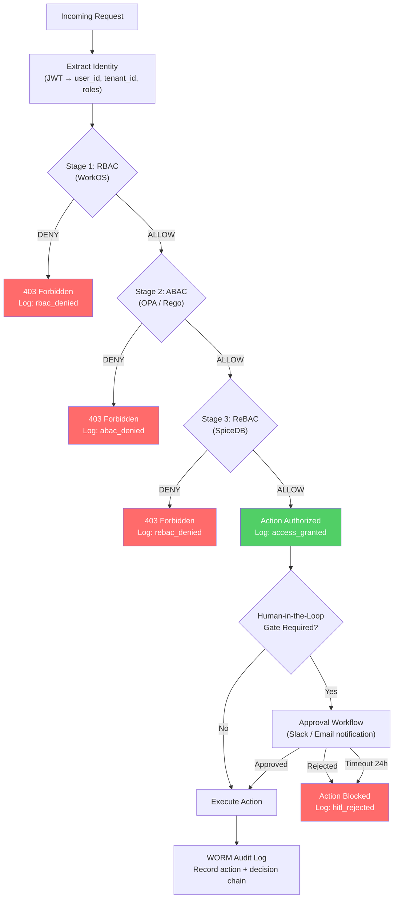
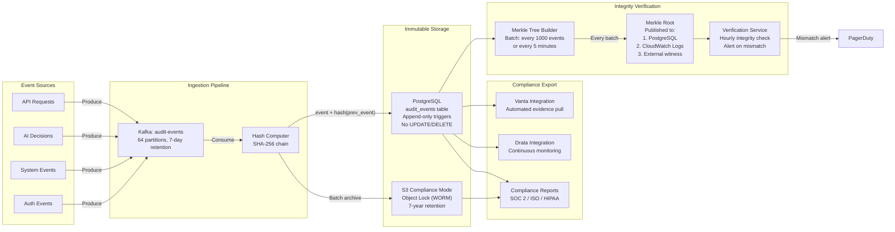
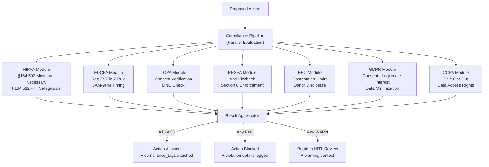

# 09 — Governance & Compliance Layer

> **ORDR-Connect — Customer Operations OS**
> Classification: INTERNAL — SOC 2 Type II | ISO 27001:2022 | HIPAA
> Last Updated: 2025-03-24

---

## 1. Overview

The governance layer enforces authorization, audit, explainability, and
regulatory compliance across every operation in ORDR-Connect. No action — human
or AI — bypasses this layer. It is the single enforcement point for access
control decisions, audit trail integrity, and compliance rule evaluation.

Three pillars:

1. **Authorization** — RBAC + ABAC + ReBAC evaluated in sequence.
2. **Audit** — Append-only WORM logs with Merkle tree integrity verification.
3. **Compliance** — Per-regulation rule engines with automated evidence collection.

---

## 2. Authorization Decision Flow

Authorization follows a three-stage evaluation chain. Each stage can DENY
(short-circuit) or PASS (continue to next). All three must ALLOW for the
action to proceed.



### Stage 1: RBAC — WorkOS

Role-Based Access Control provides the coarse-grained permission layer.

| Role | Scope | Permissions |
|---|---|---|
| `platform_admin` | Global | Full system access, tenant provisioning |
| `tenant_admin` | Tenant | Tenant configuration, user management, billing |
| `tenant_manager` | Tenant | Workflow configuration, reporting, team management |
| `tenant_agent` | Tenant | Customer interactions, case management |
| `tenant_viewer` | Tenant | Read-only dashboards and reports |
| `compliance_officer` | Tenant | Audit log access, compliance reports, evidence export |
| `ai_service` | Tenant | Scoped API access for AI agents (no PHI by default) |

```typescript
// WorkOS role check — called first in every request
const rbacResult = await workos.fga.check({
  user: `user:${userId}`,
  relation: requiredPermission,
  object: `tenant:${tenantId}`,
});

if (!rbacResult.allowed) {
  auditLog.write({ event: 'rbac_denied', userId, tenantId, permission: requiredPermission });
  throw new ForbiddenError('Insufficient role permissions');
}
```

### Stage 2: ABAC — OPA / Rego

Attribute-Based Access Control evaluates contextual policies — time of day,
IP range, data sensitivity, request attributes.

```rego
# policy/data_access.rego
package ordr.access

default allow = false

# Allow access if user has required role AND satisfies attribute constraints
allow {
    input.rbac_passed == true
    valid_time_window
    valid_ip_range
    valid_data_classification
}

valid_time_window {
    now := time.now_ns()
    clock := time.clock(now)
    clock[0] >= 6    # After 6 AM
    clock[0] <= 22   # Before 10 PM
}

valid_ip_range {
    net.cidr_contains("10.0.0.0/8", input.source_ip)
}

valid_ip_range {
    input.vpn_connected == true
}

valid_data_classification {
    input.data_classification != "PHI"
}

valid_data_classification {
    input.data_classification == "PHI"
    input.user_roles[_] == "hipaa_authorized"
    input.baa_signed == true
}
```

### Stage 3: ReBAC — SpiceDB

Relationship-Based Access Control models organizational hierarchies. SpiceDB
(Zanzibar-inspired) evaluates "does user X have relationship Y with object Z?"

```
// SpiceDB schema
definition user {}

definition organization {
    relation admin: user
    relation member: user
    permission manage = admin
    permission view = admin + member
}

definition team {
    relation org: organization
    relation lead: user
    relation member: user
    permission manage = lead + org->admin
    permission view = lead + member + org->admin
}

definition customer_record {
    relation owner_team: team
    relation assigned_agent: user
    permission edit = assigned_agent + owner_team->manage
    permission view = assigned_agent + owner_team->view
    permission delete = owner_team->manage
}
```

---

## 3. WORM Audit Log Architecture

Every action, decision, and state change is recorded in an append-only,
tamper-evident audit log. This satisfies SOC 2 CC8.1, ISO 27001 A.12.4.1-3,
and HIPAA §164.312(b).



### Audit Event Schema

```sql
CREATE TABLE audit_events (
    id              BIGINT GENERATED ALWAYS AS IDENTITY,
    event_id        UUID NOT NULL DEFAULT gen_random_uuid(),
    tenant_id       UUID NOT NULL,
    actor_id        UUID NOT NULL,         -- User or service identity
    actor_type      VARCHAR(20) NOT NULL,  -- 'user', 'ai_agent', 'system'
    event_type      VARCHAR(100) NOT NULL, -- 'customer.updated', 'message.sent', etc.
    resource_type   VARCHAR(50) NOT NULL,  -- 'customer', 'message', 'workflow'
    resource_id     UUID NOT NULL,
    action          VARCHAR(20) NOT NULL,  -- 'create', 'read', 'update', 'delete'
    details         JSONB NOT NULL,        -- Action-specific payload
    ai_context      JSONB,                 -- AI decision reasoning (if actor_type='ai_agent')
    compliance_tags TEXT[] NOT NULL DEFAULT '{}', -- ['HIPAA', 'FDCPA', 'SOX']
    hash            BYTEA NOT NULL,        -- SHA-256(event_data || prev_hash)
    prev_hash       BYTEA NOT NULL,        -- Hash of previous event (chain link)
    ip_address      INET,
    user_agent      TEXT,
    created_at      TIMESTAMPTZ NOT NULL DEFAULT NOW(),

    CONSTRAINT pk_audit_events PRIMARY KEY (id),
    CONSTRAINT no_future_events CHECK (created_at <= NOW() + INTERVAL '1 minute')
);

-- CRITICAL: Prevent modification of audit records
CREATE OR REPLACE FUNCTION prevent_audit_modification()
RETURNS TRIGGER AS $$
BEGIN
    RAISE EXCEPTION 'Audit records are immutable — updates and deletes are prohibited';
END;
$$ LANGUAGE plpgsql;

CREATE TRIGGER audit_immutable_update
    BEFORE UPDATE ON audit_events FOR EACH ROW
    EXECUTE FUNCTION prevent_audit_modification();

CREATE TRIGGER audit_immutable_delete
    BEFORE DELETE ON audit_events FOR EACH ROW
    EXECUTE FUNCTION prevent_audit_modification();

-- Partitioned by month for retention management
-- Older partitions archived to S3 WORM, then detached (never deleted from S3)
```

### Merkle Tree Verification

Events are batched (every 1,000 events or every 5 minutes, whichever comes
first) and their hashes are organized into a Merkle tree.

```
Batch Merkle Tree:

              Root Hash (published)
             /                    \
        Hash(H1+H2)          Hash(H3+H4)
        /        \            /        \
    H1=hash(E1) H2=hash(E2) H3=hash(E3) H4=hash(E4)
```

| Component | Implementation | Purpose |
|---|---|---|
| Batch root | SHA-256 Merkle root | Single hash represents entire batch |
| Root publication | PostgreSQL + CloudWatch + S3 | Multi-witness anchoring |
| Hourly verification | Cron job recomputes roots | Detect any tampering |
| Inclusion proof | Log(N) proof for any single event | Auditor can verify one event without full dataset |

---

## 4. AI Explainability

Every AI decision must be explainable for compliance audits and customer
disputes. This is not optional — HIPAA, FDCPA, and FEC all require
demonstrable decision reasoning.

### Decision Catalog

Every AI capability has a registered decision type with expected inputs,
outputs, and reasoning format.

```typescript
interface AIDecisionRecord {
  decision_id: string;                    // UUID v7
  decision_type: string;                  // 'communication_draft', 'risk_score', 'routing'
  model_id: string;                       // 'claude-3.5-sonnet', 'gpt-4o-mini'
  model_version: string;                  // Pinned version hash
  input_summary: Record<string, unknown>; // Sanitized inputs (no raw PHI)
  output: Record<string, unknown>;        // The decision/recommendation
  reasoning_trace: string[];              // Step-by-step reasoning chain
  confidence_score: number;               // 0.0 - 1.0
  compliance_rules_applied: string[];     // ['FDCPA_7_in_7', 'TCPA_timing']
  human_review_required: boolean;         // Was HITL gate triggered?
  human_review_outcome?: string;          // 'approved' | 'rejected' | 'modified'
  latency_ms: number;
  cost_usd: number;                       // Token cost for this decision
  tenant_id: string;
  created_at: string;                     // ISO 8601
}
```

### Reasoning Traces

Every AI agent in LangGraph produces structured reasoning traces:

```json
{
  "reasoning_trace": [
    "1. Retrieved customer record: account_status=active, last_contact=2025-03-20",
    "2. Checked FDCPA compliance: 3 of 7 attempts used in current 7-day window",
    "3. Checked TCPA timing: customer timezone is EST, current local time 14:30 — within window",
    "4. Evaluated channel preference: customer prefers SMS (set 2025-01-15)",
    "5. Drafted message using template: payment_reminder_friendly_v3",
    "6. Confidence: 0.92 — proceeding without human review (threshold: 0.85)"
  ]
}
```

---

## 5. Human-in-the-Loop Gates

HITL gates trigger when AI confidence is below threshold, regulatory risk is
high, or the action type mandates human approval.

### Gate Trigger Conditions

| Condition | Threshold | Escalation |
|---|---|---|
| AI confidence below threshold | < 0.85 (configurable per tenant) | Route to assigned agent |
| PHI content detected in outbound | Always | Compliance officer review |
| First contact with new customer | Always for regulated industries | Agent approval |
| Financial amount exceeds limit | > $10,000 (configurable) | Manager approval |
| Legal/compliance language | Detected by classifier | Compliance officer |
| Negative sentiment detected | Sentiment score < -0.7 | Supervisor review |
| Bulk operation (> 100 records) | Always | Tenant admin approval |

### Approval Workflow

1. **Gate triggered** — Action paused, approval request created.
2. **Notification** — Slack DM + email to designated approver(s).
3. **Review UI** — Approver sees: original context, AI reasoning trace,
   recommended action, compliance flags.
4. **Decision** — Approve (action proceeds), Reject (action cancelled),
   Modify (approver edits then approves).
5. **Timeout** — 24-hour default; configurable per gate type. Timeout = reject.
6. **Audit** — Full decision chain logged to WORM audit.

---

## 6. Compliance Modules

Each regulatory framework is implemented as an independent module that plugs
into the governance layer's compliance evaluation pipeline.



### Module Configuration per Tenant

Tenants are configured with applicable compliance modules at onboarding.
Modules are **additive** — a tenant in healthcare debt collection would have
HIPAA + FDCPA + TCPA active.

```typescript
interface TenantComplianceConfig {
  tenant_id: string;
  active_modules: ComplianceModule[];
  hipaa?: {
    baa_signed: boolean;
    phi_encryption_key_id: string;
    minimum_necessary_level: 'strict' | 'standard';
  };
  fdcpa?: {
    max_attempts_per_period: number;  // Default: 7
    period_days: number;              // Default: 7
    quiet_hours_start: string;        // Default: '21:00'
    quiet_hours_end: string;          // Default: '08:00'
    mini_miranda_template_id: string;
  };
  tcpa?: {
    consent_type_required: 'express_written' | 'express';
    dnc_check_enabled: boolean;
    autodialer_rules: boolean;
  };
  gdpr?: {
    lawful_basis: 'consent' | 'legitimate_interest' | 'contract';
    dpo_email: string;
    data_residency_region: 'eu-west-1' | 'eu-central-1';
  };
}
```

---

## 7. Tenant Isolation Enforcement

The governance layer enforces tenant isolation at the authorization level.
Every query, every action, every data access is scoped to the authenticated
tenant.

### Enforcement Points

| Layer | Mechanism | Bypass Prevention |
|---|---|---|
| API Gateway | JWT tenant_id extraction | Token validation via JWKS |
| Application | Middleware sets `app.current_tenant` | No direct SQL allowed |
| Database | PostgreSQL RLS policies | Superuser access logged + alerted |
| Kafka | Topic prefix `tenant_{id}.` | ACL enforcement |
| Cache | Redis key prefix `t:{tenant_id}:` | Key validation in wrapper |
| Object Storage | S3 prefix `tenants/{tenant_id}/` | IAM policy enforcement |

---

## 8. Automated Evidence Collection

Continuous compliance monitoring with automated evidence generation for SOC 2,
ISO 27001, and HIPAA audits.

### Vanta Integration

```typescript
interface VantaEvidenceSync {
  syncInterval: '6h';
  evidenceTypes: [
    'access_reviews',           // Monthly access review logs
    'change_management',        // All code deployments with approvals
    'vulnerability_scans',      // Weekly scan results from Snyk
    'penetration_tests',        // Annual pentest reports
    'incident_response',        // PagerDuty incident records
    'encryption_verification',  // Certificate inventory + rotation logs
    'backup_verification',      // Daily backup success/failure logs
    'audit_log_integrity',      // Merkle root verification results
    'training_records',         // Security awareness completion
  ];
}
```

### Drata Integration

Continuous monitoring for control drift:

- **Infrastructure** — AWS Config rules mapped to SOC 2 controls.
- **Access** — WorkOS role assignments monitored for segregation of duties.
- **Encryption** — Certificate expiry monitoring (alert at 30 days).
- **Vulnerability** — Snyk findings synced daily; SLA: critical = 24h,
  high = 7 days, medium = 30 days.

---

## 9. Compliance Reporting

### Automated Reports

| Report | Frequency | Audience | Format |
|---|---|---|---|
| Access review | Monthly | Compliance officer | PDF + CSV |
| Audit log integrity | Daily | Security team | Dashboard + alert |
| HIPAA PHI access log | Weekly | Privacy officer | Encrypted PDF |
| FDCPA compliance summary | Weekly | Operations manager | Dashboard |
| Incident response summary | Monthly | Leadership | PDF |
| SOC 2 evidence package | Quarterly | External auditor | Vanta export |
| ISO 27001 ISMS status | Quarterly | ISMS manager | Drata export |

### Retention Periods

| Data Type | Retention | Standard | Storage |
|---|---|---|---|
| Audit logs | 7 years | SOC 2, ISO 27001 | S3 WORM (Compliance mode) |
| PHI access logs | 6 years | HIPAA §164.530(j) | S3 WORM + PostgreSQL |
| FDCPA communication logs | 3 years | Regulation F | S3 WORM |
| TCPA consent records | 5 years post-revocation | TCPA | PostgreSQL + S3 WORM |
| FEC contribution records | 3 years | FEC | S3 WORM |
| GDPR processing records | Duration of processing + 3 years | GDPR Art. 30 | S3 WORM |

---

## 10. Governance Layer Performance

Authorization decisions must not meaningfully impact request latency.

| Operation | Target Latency | Implementation |
|---|---|---|
| RBAC check (WorkOS) | < 5ms | Local cache with 60s TTL |
| ABAC evaluation (OPA) | < 3ms | In-process OPA with compiled Rego |
| ReBAC check (SpiceDB) | < 10ms | gRPC with connection pooling |
| Full auth chain | < 20ms | Parallel where possible |
| Audit log write | < 2ms | Async Kafka produce (fire-and-forget with ack=1) |
| Compliance evaluation | < 50ms | Parallel module execution |

---

## 11. Security Controls Summary

| Control | Standard | Implementation |
|---|---|---|
| Least privilege access | ISO 27001 A.9.4.1, SOC 2 CC6.3 | Three-stage RBAC+ABAC+ReBAC |
| Audit trail integrity | SOC 2 CC8.1, ISO 27001 A.12.4.1 | Hash chain + Merkle tree + WORM |
| Separation of duties | SOC 2 CC6.1, ISO 27001 A.6.1.2 | Role restrictions + HITL gates |
| Access review | SOC 2 CC6.2, ISO 27001 A.9.2.5 | Monthly automated review via Vanta |
| Incident detection | SOC 2 CC7.2, ISO 27001 A.16.1.4 | Real-time alert on auth anomalies |
| Compliance evidence | SOC 2 CC4.1, ISO 27001 A.18.2.1 | Automated collection via Vanta/Drata |
| AI governance | ISO 42001 (emerging) | Decision catalogs, reasoning traces, HITL |
