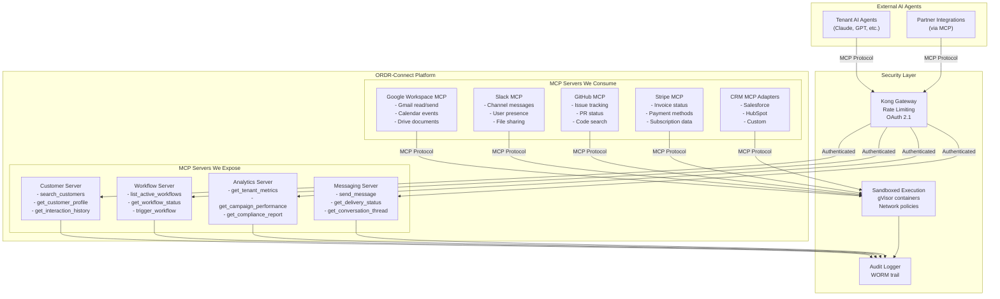
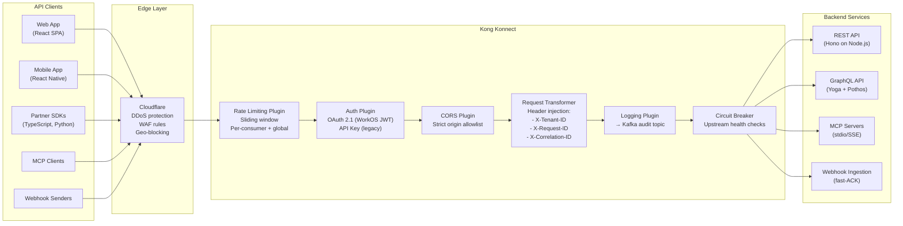
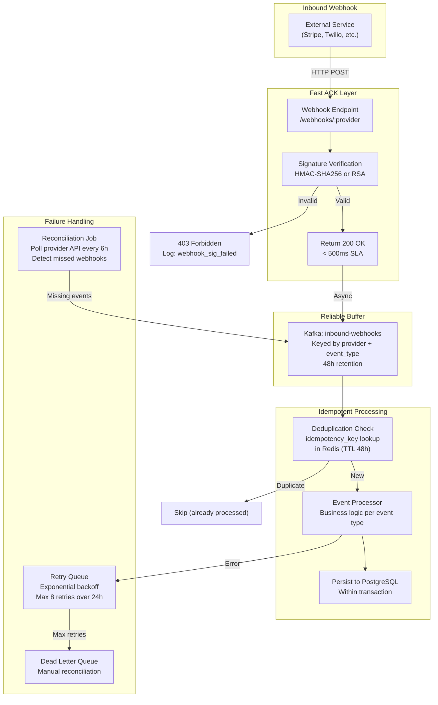

# 10 — Integration Architecture

> **ORDR-Connect — Customer Operations OS**
> Classification: INTERNAL — SOC 2 Type II | ISO 27001:2022 | HIPAA
> Last Updated: 2025-03-24

---

## 1. Overview

The integration layer connects ORDR-Connect to the outside world — external
services consume our data via APIs and MCP servers, and we consume external
data through the same protocols. Every integration flows through a hardened
pipeline: Kong API Gateway for traffic management, OAuth 2.1 for
authentication, and Kafka for reliable async processing.

Three integration patterns:

1. **MCP (Model Context Protocol)** — AI-native data exchange for LLM agents.
2. **API Gateway (Kong)** — RESTful and GraphQL APIs for human and machine clients.
3. **Webhooks** — Event-driven push notifications to tenant systems.

---

## 2. MCP Integration Topology

Model Context Protocol (MCP) is the primary integration pattern for AI agent
interoperability. ORDR-Connect both exposes and consumes MCP servers.



### MCP Server Implementation

Each ORDR-Connect MCP server follows a standard pattern:

```typescript
// Example: Customer MCP Server
import { McpServer } from '@modelcontextprotocol/sdk/server';

const customerServer = new McpServer({
  name: 'ordr-customers',
  version: '1.0.0',
});

// Tool: Search customers
customerServer.tool(
  'search_customers',
  {
    query: z.string().describe('Search query for customer name, email, or ID'),
    tenant_id: z.string().uuid().describe('Tenant scope — auto-injected from auth'),
    limit: z.number().int().min(1).max(100).default(20),
  },
  async ({ query, tenant_id, limit }) => {
    // RLS enforced — tenant_id set in DB session
    const results = await customerService.search(query, tenant_id, limit);

    // PHI fields redacted unless caller has HIPAA authorization
    const sanitized = redactPHI(results, callerPermissions);

    // Audit log
    await auditLog.record({
      event: 'mcp.search_customers',
      actor: callerIdentity,
      tenant_id,
      details: { query, resultCount: sanitized.length },
    });

    return { content: [{ type: 'text', text: JSON.stringify(sanitized) }] };
  }
);
```

### MCP Security Model

| Layer | Control | Implementation |
|---|---|---|
| Transport | TLS 1.3 | Kong terminates TLS, internal mTLS |
| Authentication | OAuth 2.1 + DPoP | Kong OAuth plugin, token-bound to client |
| Authorization | Scoped tokens | MCP tool access tied to OAuth scopes |
| Rate limiting | Per-client, per-tool | Kong rate-limiting plugin (sliding window) |
| Sandboxing | gVisor containers | External MCP servers run in isolated runtime |
| Data filtering | RLS + field redaction | PHI/PII stripped unless explicitly authorized |
| Audit | WORM log | Every MCP call logged with full context |

### MCP Client Consumption

When ORDR-Connect consumes external MCP servers (e.g., Google Workspace), the
connection runs inside a sandboxed container:

1. **Network isolation** — Kubernetes NetworkPolicy allows egress only to the
   specific MCP server endpoint.
2. **Credential injection** — OAuth tokens retrieved from Vault at runtime;
   never stored in environment variables.
3. **Response validation** — All MCP responses are schema-validated before
   entering the ORDR data pipeline.
4. **Timeout enforcement** — 30-second hard timeout per MCP call.
5. **Circuit breaker** — Per-server circuit breaker (5 failures in 60s = open).

---

## 3. API Gateway Architecture — Kong Konnect

Kong serves as the single entry point for all external API traffic. It handles
authentication, rate limiting, request transformation, and observability.



### Kong Configuration

| Parameter | Value | Rationale |
|---|---|---|
| Target TPS | 50,000+ | Peak load for largest tenant tier |
| Rate limit (free tier) | 100 req/min | Prevent abuse |
| Rate limit (standard) | 1,000 req/min | Normal operations |
| Rate limit (premium) | 10,000 req/min | High-volume integrations |
| Rate limit (internal) | 50,000 req/min | Service-to-service |
| Auth method | OAuth 2.1 (JWT) | WorkOS-issued tokens, RS256 verification |
| Token lifetime | 15 minutes | Short-lived; refresh tokens for session |
| Request size limit | 10 MB | Prevent payload abuse |
| Connection timeout | 10s | Fast failure on unresponsive upstream |
| Read timeout | 60s | Allow complex queries to complete |

### Kong Plugins Active

| Plugin | Purpose | Compliance |
|---|---|---|
| `jwt` | Token verification | SOC 2 CC6.1 |
| `rate-limiting` | Abuse prevention | ISO 27001 A.13.1.1 |
| `correlation-id` | Request tracing | SOC 2 CC7.1 |
| `request-transformer` | Header injection | — |
| `response-transformer` | Strip internal headers | ISO 27001 A.14.1.2 |
| `ip-restriction` | IP allowlist for admin API | SOC 2 CC6.6 |
| `opentelemetry` | Distributed tracing → Grafana Tempo | SOC 2 CC7.1 |
| `prometheus` | Metrics export | ISO 27001 A.12.1.3 |
| `acl` | Consumer group access control | SOC 2 CC6.3 |

---

## 4. Webhook Reliability Pipeline

Inbound webhooks from external services (Stripe, Twilio, SendGrid, CRM
systems) are processed through a reliability pipeline that guarantees no event
is lost.



### Fast ACK Contract

The webhook endpoint MUST return 200 OK within 500ms. This is critical because
external providers will retry (and eventually disable) endpoints that are slow
to respond.

```typescript
// Webhook handler — fast ACK pattern
app.post('/webhooks/:provider', async (c) => {
  const provider = c.req.param('provider');
  const body = await c.req.text();
  const signature = c.req.header('x-webhook-signature');

  // Step 1: Verify signature (< 1ms for HMAC)
  if (!verifySignature(provider, body, signature)) {
    auditLog.record({ event: 'webhook.signature_failed', provider });
    return c.json({ error: 'Invalid signature' }, 403);
  }

  // Step 2: Produce to Kafka (< 5ms with acks=1)
  await kafka.produce('inbound-webhooks', {
    key: `${provider}:${extractEventType(body)}`,
    value: body,
    headers: {
      provider,
      received_at: new Date().toISOString(),
      idempotency_key: extractIdempotencyKey(provider, body),
    },
  });

  // Step 3: Return immediately
  return c.json({ received: true }, 200);
});
```

### Reconciliation

Webhooks can be lost (network issues, provider outages). A reconciliation job
runs every 6 hours:

1. Query each provider's API for recent events (e.g., Stripe Events API,
   Twilio Message Status API).
2. Compare against processed events in PostgreSQL.
3. Any missing events are re-ingested into the Kafka topic.
4. Reconciliation results logged to WORM audit trail.

---

## 5. REST API Design Principles

### URL Structure

```
https://api.ordr.io/v1/{resource}
https://api.ordr.io/v1/{resource}/{id}
https://api.ordr.io/v1/{resource}/{id}/{sub-resource}
```

### Standard Patterns

| Pattern | Example | Notes |
|---|---|---|
| List | `GET /v1/customers?limit=20&cursor=abc` | Cursor-based pagination |
| Get | `GET /v1/customers/{id}` | Include `?expand=interactions` |
| Create | `POST /v1/customers` | Idempotency-Key header required |
| Update | `PATCH /v1/customers/{id}` | Partial update only |
| Delete | `DELETE /v1/customers/{id}` | Soft delete; hard delete via compliance API |
| Search | `POST /v1/customers/search` | Complex queries in body |
| Bulk | `POST /v1/customers/bulk` | Max 100 items per request |

### Response Envelope

```typescript
interface APIResponse<T> {
  data: T;
  meta: {
    request_id: string;     // Correlation ID from Kong
    timestamp: string;      // ISO 8601
    pagination?: {
      cursor: string | null;
      has_more: boolean;
      total_count?: number; // Only on first page
    };
  };
  errors?: APIError[];      // Present only on 4xx/5xx
}

interface APIError {
  code: string;             // Machine-readable: 'CUSTOMER_NOT_FOUND'
  message: string;          // Human-readable
  field?: string;           // For validation errors
  docs_url?: string;        // Link to error documentation
}
```

### Versioning Strategy

- URL-based versioning: `/v1/`, `/v2/`.
- Major version = breaking changes only.
- Minor changes (new fields, new optional parameters) are backwards-compatible
  within the same major version.
- Deprecation policy: 12-month sunset period with `Sunset` and `Deprecation`
  HTTP headers.

---

## 6. GraphQL API

For clients that need flexible querying (dashboards, mobile apps), a GraphQL
API is available alongside REST.

### Implementation

- **Server**: GraphQL Yoga (Envelop plugin system).
- **Schema**: Code-first with Pothos (TypeScript type safety).
- **Auth**: Same JWT validation as REST (Kong-injected headers).
- **Complexity limiting**: Query depth limit (10), complexity budget (1000 points).
- **Persisted queries**: APQ (Automatic Persisted Queries) for production.

### Query Complexity Limits

| Dimension | Limit | Rationale |
|---|---|---|
| Depth | 10 levels | Prevent recursive traversal |
| Complexity | 1000 points | Each field = 1 point, connections = 10 |
| Aliases | 20 per query | Prevent alias-based amplification |
| Batch | 5 operations | Limit batched queries |

---

## 7. SDK Strategy

Official SDKs reduce integration friction and enforce best practices
(idempotency keys, retry logic, error handling).

### Supported Languages

| Language | Package | Priority | Status |
|---|---|---|---|
| TypeScript/JavaScript | `@ordr/sdk` | P0 | First-party, auto-generated + hand-tuned |
| Python | `ordr-python` | P0 | First-party, auto-generated + hand-tuned |
| Go | `ordr-go` | P1 | Auto-generated from OpenAPI |
| Ruby | `ordr-ruby` | P2 | Auto-generated from OpenAPI |
| Java/Kotlin | `ordr-java` | P2 | Auto-generated from OpenAPI |

### SDK Features

All SDKs include:

- **Auto-retry** — Exponential backoff with jitter for 429 and 5xx responses.
- **Idempotency** — Auto-generated UUID v7 for all write operations.
- **Pagination** — Auto-paginating iterators for list endpoints.
- **Type safety** — Generated from OpenAPI 3.1 spec.
- **Webhook verification** — `sdk.webhooks.verify(payload, signature)` helper.
- **MCP client** — `sdk.mcp.connect(serverUrl)` for AI agent integration.

```typescript
// SDK usage example
import { OrdrClient } from '@ordr/sdk';

const ordr = new OrdrClient({
  apiKey: process.env.ORDR_API_KEY,  // OAuth2 client credentials
  baseUrl: 'https://api.ordr.io/v1',
});

// Auto-paginating iterator
for await (const customer of ordr.customers.list({ status: 'active' })) {
  console.log(customer.name);
}

// Idempotent create (auto-generated Idempotency-Key)
const message = await ordr.messages.send({
  customer_id: 'cust_abc123',
  channel: 'sms',
  body: 'Your appointment is confirmed for tomorrow at 2 PM.',
});
```

---

## 8. Integration Security Summary

| Control | Standard | Implementation |
|---|---|---|
| Transport encryption | SOC 2 CC6.7, ISO 27001 A.10.1.1 | TLS 1.3 for all external, mTLS for internal |
| Authentication | SOC 2 CC6.1 | OAuth 2.1 with DPoP, API keys for legacy |
| Authorization | SOC 2 CC6.3 | Scoped tokens, per-endpoint ACLs |
| Rate limiting | ISO 27001 A.13.1.1 | Per-consumer sliding window via Kong |
| Input validation | ISO 27001 A.14.2.5 | Schema validation at gateway + service |
| Webhook integrity | SOC 2 CC6.1 | HMAC-SHA256 signature verification |
| API versioning | ISO 27001 A.14.2.2 | 12-month deprecation policy |
| Data filtering | HIPAA §164.502(b) | PHI redacted from API responses by default |
| Audit trail | SOC 2 CC8.1 | Every API call logged to WORM audit |
| DDoS protection | ISO 27001 A.13.1.1 | Cloudflare WAF + Kong rate limiting |
