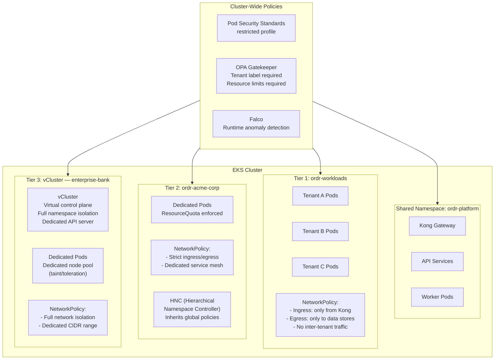
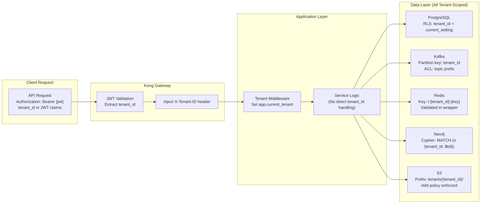

# 11 — Multi-Tenant Architecture

> **ORDR-Connect — Customer Operations OS**
> Classification: INTERNAL — SOC 2 Type II | ISO 27001:2022 | HIPAA
> Last Updated: 2025-03-24

---

## 1. Overview

Multi-tenancy is the foundational architecture decision for ORDR-Connect. Every
layer of the stack — from Kubernetes namespaces to database rows — enforces
tenant isolation. The model is hybrid: shared infrastructure for cost
efficiency at lower tiers, fully isolated infrastructure for premium/compliance
tenants.

Tenant isolation is not a feature; it is a security invariant. A failure in
tenant isolation is treated as a P0 security incident with immediate incident
response (SOC 2 CC7.2, ISO 27001 A.16.1.5).

---

## 2. Tenant Isolation Tiers

```mermaid
flowchart TD
    subgraph Tier1["Tier 1: Starter\n(Shared Everything)"]
        direction TB
        T1_K8S["Shared Kubernetes Namespace\nordr-workloads"]
        T1_DB["Shared PostgreSQL Database\nRLS enforced per table"]
        T1_KF["Shared Kafka Topics\ntenant_id in message key"]
        T1_CACHE["Shared Redis\nKey prefix: t:{tenant_id}:"]
        T1_NEO["Shared Neo4j Database\nTenant label on every node"]
    end

    subgraph Tier2["Tier 2: Professional\n(Schema-per-Tenant)"]
        direction TB
        T2_K8S["Dedicated Namespace\nordr-{tenant_slug}"]
        T2_DB["Dedicated PostgreSQL Schema\nschema_{tenant_id}"]
        T2_KF["Dedicated Kafka Topics\ntenant_{id}.outbound-messages"]
        T2_CACHE["Dedicated Redis Keyspace\ndb per tenant (0-15 mapping)"]
        T2_NEO["Shared Neo4j\nPartitioned subgraph"]
    end

    subgraph Tier3["Tier 3: Enterprise\n(Database-per-Tenant)"]
        direction TB
        T3_K8S["vCluster\nFull virtual Kubernetes cluster"]
        T3_DB["Dedicated PostgreSQL Instance\nRDS per tenant"]
        T3_KF["Dedicated Kafka Cluster\nConfluent per tenant"]
        T3_CACHE["Dedicated Redis Instance\nElastiCache per tenant"]
        T3_NEO["Dedicated Neo4j Instance\nAura Enterprise per tenant"]
    end

    ONBOARD[Tenant Onboarding] -->|Starter plan| Tier1
    ONBOARD -->|Professional plan| Tier2
    ONBOARD -->|Enterprise plan| Tier3
    ONBOARD -->|HIPAA required| Tier3

    style Tier3 fill:#e7f5ff,stroke:#1971c2
```



### Tier Selection Matrix

| Factor | Tier 1 (Starter) | Tier 2 (Professional) | Tier 3 (Enterprise) |
|---|---|---|---|
| Isolation | RLS | Schema | Database + Compute |
| HIPAA eligible | No | No | Yes (mandatory) |
| Max customers | 10,000 | 500,000 | Unlimited |
| Custom domain | No | Yes | Yes |
| Dedicated IPs | No | Optional | Yes |
| SLA | 99.5% | 99.9% | 99.99% |
| Price | $$ | $$$ | $$$$ |
| Data residency | Shared region | Regional preference | Guaranteed region |

---

## 3. PostgreSQL Row-Level Security

RLS is the primary data isolation mechanism for Tier 1 and Tier 2 tenants.
Every table containing tenant data has RLS enabled.

### Implementation Pattern

```sql
-- Step 1: Every tenant-scoped table includes tenant_id
CREATE TABLE customers (
    id UUID PRIMARY KEY DEFAULT gen_random_uuid(),
    tenant_id UUID NOT NULL REFERENCES tenants(id),
    email VARCHAR(255) NOT NULL,
    name VARCHAR(255) NOT NULL,
    -- ... other columns
    created_at TIMESTAMPTZ NOT NULL DEFAULT NOW(),
    updated_at TIMESTAMPTZ NOT NULL DEFAULT NOW()
);

-- Step 2: Enable RLS
ALTER TABLE customers ENABLE ROW LEVEL SECURITY;

-- Step 3: Force RLS even for table owners (critical security measure)
ALTER TABLE customers FORCE ROW LEVEL SECURITY;

-- Step 4: Create isolation policy
CREATE POLICY tenant_isolation_select ON customers
    FOR SELECT
    USING (tenant_id = current_setting('app.current_tenant')::UUID);

CREATE POLICY tenant_isolation_insert ON customers
    FOR INSERT
    WITH CHECK (tenant_id = current_setting('app.current_tenant')::UUID);

CREATE POLICY tenant_isolation_update ON customers
    FOR UPDATE
    USING (tenant_id = current_setting('app.current_tenant')::UUID)
    WITH CHECK (tenant_id = current_setting('app.current_tenant')::UUID);

CREATE POLICY tenant_isolation_delete ON customers
    FOR DELETE
    USING (tenant_id = current_setting('app.current_tenant')::UUID);

-- Step 5: Index for RLS performance
CREATE INDEX idx_customers_tenant_id ON customers (tenant_id);

-- Step 6: Composite indexes for common queries
CREATE INDEX idx_customers_tenant_email ON customers (tenant_id, email);
CREATE INDEX idx_customers_tenant_created ON customers (tenant_id, created_at DESC);
```

### Application Middleware

```typescript
// Drizzle ORM middleware — sets tenant context on every query
export async function withTenantContext<T>(
  tenantId: string,
  operation: (tx: Transaction) => Promise<T>
): Promise<T> {
  return db.transaction(async (tx) => {
    // Set RLS context — this is the critical line
    await tx.execute(
      sql`SET LOCAL app.current_tenant = ${tenantId}`
    );

    // Verify setting took effect (defense in depth)
    const result = await tx.execute(
      sql`SELECT current_setting('app.current_tenant')`
    );
    if (result.rows[0].current_setting !== tenantId) {
      throw new SecurityError('Tenant context mismatch — aborting transaction');
    }

    return operation(tx);
  });
}
```

### RLS Bypass Prevention

| Risk | Mitigation |
|---|---|
| Direct SQL bypass | Application database user has NO superuser privileges |
| Missing RLS on new table | CI/CD check: all tables with `tenant_id` must have RLS enabled |
| Forgot `FORCE ROW LEVEL SECURITY` | Automated audit: weekly scan for tables with RLS but without FORCE |
| `SET ROLE` escalation | Database role cannot `SET ROLE` to any privileged role |
| Connection pool poisoning | `SET LOCAL` scoped to transaction; pool connections are stateless |
| Migration bypass | Migrations run as a separate role that cannot read tenant data |

---

## 4. Kubernetes Namespace Isolation



### ResourceQuota per Tier

```yaml
# Tier 2: Per-tenant namespace ResourceQuota
apiVersion: v1
kind: ResourceQuota
metadata:
  name: tenant-quota
  namespace: ordr-acme-corp
spec:
  hard:
    requests.cpu: "8"
    requests.memory: "16Gi"
    limits.cpu: "16"
    limits.memory: "32Gi"
    pods: "50"
    services: "20"
    persistentvolumeclaims: "10"
    requests.storage: "100Gi"
```

### NetworkPolicy

```yaml
# Tier 1: Prevent inter-tenant pod communication
apiVersion: networking.k8s.io/v1
kind: NetworkPolicy
metadata:
  name: deny-inter-tenant
  namespace: ordr-workloads
spec:
  podSelector: {}
  policyTypes:
    - Ingress
    - Egress
  ingress:
    - from:
        - namespaceSelector:
            matchLabels:
              app.kubernetes.io/component: gateway
  egress:
    - to:
        - namespaceSelector:
            matchLabels:
              app.kubernetes.io/component: datastore
    - to:
        - ipBlock:
            cidr: 0.0.0.0/0
        ports:
          - port: 443
            protocol: TCP
```

---

## 5. Data Flow with Tenant Boundaries



---

## 6. Kafka Topic Partitioning

### Tier 1: Shared Topics

```
outbound-messages          (32 partitions, keyed by tenant_id)
inbound-webhooks           (16 partitions, keyed by provider:tenant_id)
audit-events               (64 partitions, keyed by tenant_id)
workflow-events            (16 partitions, keyed by tenant_id)
```

Kafka ACLs restrict consumer groups to their assigned tenant prefixes.
The message key ensures all events for a single tenant are processed
in order within a partition.

### Tier 2: Dedicated Topics

```
tenant_{id}.outbound-messages    (8 partitions)
tenant_{id}.inbound-webhooks     (4 partitions)
tenant_{id}.audit-events         (16 partitions)
tenant_{id}.workflow-events      (4 partitions)
```

### Tier 3: Dedicated Cluster

Enterprise tenants get a dedicated Confluent cluster with full
administrative control over topics, partitions, and retention.

---

## 7. Neo4j Tenant Isolation

### Shared Mode (Tier 1 & 2)

Every node and relationship carries a `tenant_id` property. All Cypher
queries filter by tenant.

```cypher
// ALWAYS include tenant_id in MATCH patterns
MATCH (c:Customer {tenant_id: $tenantId})-[:HAS_INTERACTION]->(i:Interaction {tenant_id: $tenantId})
WHERE c.id = $customerId
RETURN c, i
ORDER BY i.created_at DESC
LIMIT 20
```

A Neo4j procedure wrapper enforces tenant filtering at the query layer,
preventing queries without `tenant_id` from executing.

### Dedicated Mode (Tier 3)

Enterprise tenants receive a dedicated Neo4j Aura instance with full
database isolation. No `tenant_id` property needed — the entire database
belongs to one tenant.

---

## 8. Redis Key Namespacing

### Key Format

```
t:{tenant_id}:{namespace}:{key}

Examples:
t:550e8400:cache:customer:abc123
t:550e8400:session:user:def456
t:550e8400:ratelimit:api:ghi789
t:550e8400:lock:workflow:jkl012
```

### Enforcement

```typescript
// Redis wrapper — prevents key access outside tenant scope
class TenantRedis {
  constructor(private redis: Redis, private tenantId: string) {}

  private scopeKey(key: string): string {
    const scoped = `t:${this.tenantId}:${key}`;

    // Defense in depth: verify key contains correct tenant prefix
    if (!scoped.startsWith(`t:${this.tenantId}:`)) {
      throw new SecurityError('Redis key tenant mismatch');
    }
    return scoped;
  }

  async get(key: string): Promise<string | null> {
    return this.redis.get(this.scopeKey(key));
  }

  async set(key: string, value: string, ttl?: number): Promise<void> {
    if (ttl) {
      await this.redis.setex(this.scopeKey(key), ttl, value);
    } else {
      await this.redis.set(this.scopeKey(key), value);
    }
  }

  // SCAN is restricted to tenant prefix to prevent enumeration
  async keys(pattern: string): Promise<string[]> {
    return this.redis.keys(this.scopeKey(pattern));
  }
}
```

---

## 9. Tenant Onboarding Lifecycle

### Provisioning Sequence

| Step | Action | Tier 1 | Tier 2 | Tier 3 |
|---|---|---|---|---|
| 1 | Create tenant record | PostgreSQL row | PostgreSQL row | PostgreSQL row |
| 2 | Provision database | RLS policies verified | Create schema | Provision RDS instance |
| 3 | Provision Kafka | Verify shared topic ACLs | Create dedicated topics | Provision Confluent cluster |
| 4 | Provision Redis | Verify key prefix isolation | Assign Redis DB number | Provision ElastiCache |
| 5 | Provision Neo4j | Verify label isolation | Create subgraph | Provision Aura instance |
| 6 | Provision K8s | Verify namespace access | Create namespace + HNC | Create vCluster |
| 7 | Configure WorkOS | Create organization | Create organization | Create organization |
| 8 | Seed data | Default templates, configs | Default + industry templates | Custom configuration |
| 9 | Compliance setup | Select applicable modules | Select + configure modules | Full compliance audit |
| 10 | Validation | Automated isolation test | Automated isolation test | Manual + automated test |

### Tenant Offboarding

Offboarding follows a strict data handling protocol:

1. **Disable** — Tenant marked inactive; all API access returns 403.
2. **Export** — Full data export generated (GDPR Art. 20, data portability).
3. **Retention hold** — Data retained per compliance schedule (see doc 09).
4. **Crypto-shred** — Tenant encryption keys destroyed (GDPR erasure).
5. **Infrastructure teardown** — Tier 2/3 resources deprovisioned.
6. **Verification** — Automated scan confirms no tenant data remains.
7. **Audit** — Full offboarding process logged to WORM audit.

---

## 10. Cross-Tenant Data Prevention

### Automated Detection

| Check | Method | Frequency |
|---|---|---|
| RLS enforcement | SQL query: tables without RLS | Every deployment |
| Query analysis | Drizzle query interceptor: reject queries without tenant context | Every query |
| API response scan | Middleware: verify all response objects have matching tenant_id | Every response |
| Kafka consumer audit | Verify consumer group ACLs match topic prefix | Daily |
| Redis key audit | SCAN for keys without tenant prefix | Weekly |
| Log correlation | Cross-reference request tenant_id with data access logs | Continuous |

### Incident Response for Tenant Leak

If cross-tenant data exposure is detected:

1. **Immediate** — Kill affected service instance (< 1 minute).
2. **Contain** — Block all API traffic to affected endpoint.
3. **Assess** — Determine scope of exposure from audit logs.
4. **Notify** — Affected tenants notified within 72 hours (GDPR Art. 33).
5. **Remediate** — Root cause fix deployed.
6. **Report** — Incident report filed with compliance team + auditors.

---

## 11. Tenant-Aware Caching

### Cache Hierarchy

| Layer | Scope | TTL | Invalidation |
|---|---|---|---|
| L1: In-process | Per-pod | 30s | Time-based expiry |
| L2: Redis | Per-tenant | 5 min | Event-driven invalidation via Kafka |
| L3: CDN | Per-tenant (via Vary header) | 1 hour | Purge API on data change |

### Cache Key Strategy

```
L1: tenant:{tid}:entity:{type}:{id}:{version}
L2: t:{tid}:cache:{type}:{id}
L3: /api/v1/tenants/{tid}/...  (Vary: Authorization)
```

---

## 12. Noisy Neighbor Prevention

| Resource | Protection | Implementation |
|---|---|---|
| CPU | ResourceQuota per namespace | K8s resource limits |
| Memory | ResourceQuota per namespace | K8s resource limits |
| Database connections | Per-tenant pool limit | pgBouncer `max_client_conn` per pool |
| Kafka throughput | Per-tenant quota | Confluent client quotas (bytes/sec) |
| API rate | Per-tenant rate limit | Kong rate-limiting plugin |
| Storage | Per-tenant quota | S3 bucket policy + monitoring |
| AI inference | Per-tenant token budget | LangGraph token counter middleware |

### Monitoring

Grafana dashboards track per-tenant resource consumption. Alerts fire when
any tenant exceeds 80% of their quota, enabling proactive intervention
before service degradation.

---

## 13. Compliance Controls Summary

| Control | Standard | Implementation |
|---|---|---|
| Logical separation | SOC 2 CC6.4, ISO 27001 A.13.1.3 | RLS + schema + database isolation tiers |
| Network segmentation | SOC 2 CC6.6, ISO 27001 A.13.1.1 | K8s NetworkPolicies, vCluster |
| Access control | SOC 2 CC6.3, ISO 27001 A.9.4.1 | Tenant-scoped RBAC + RLS |
| Data isolation verification | SOC 2 CC8.1 | Automated cross-tenant leak detection |
| Resource isolation | ISO 27001 A.13.1.3 | ResourceQuotas, noisy neighbor prevention |
| Encryption at rest | SOC 2 CC6.7, HIPAA §164.312(a)(2)(iv) | Per-tenant encryption keys (Tier 3) |
| Secure offboarding | GDPR Art. 17, ISO 27001 A.8.3.2 | Crypto-shredding + verification |
| Incident response | SOC 2 CC7.2, ISO 27001 A.16.1.5 | Cross-tenant leak = P0 incident |
