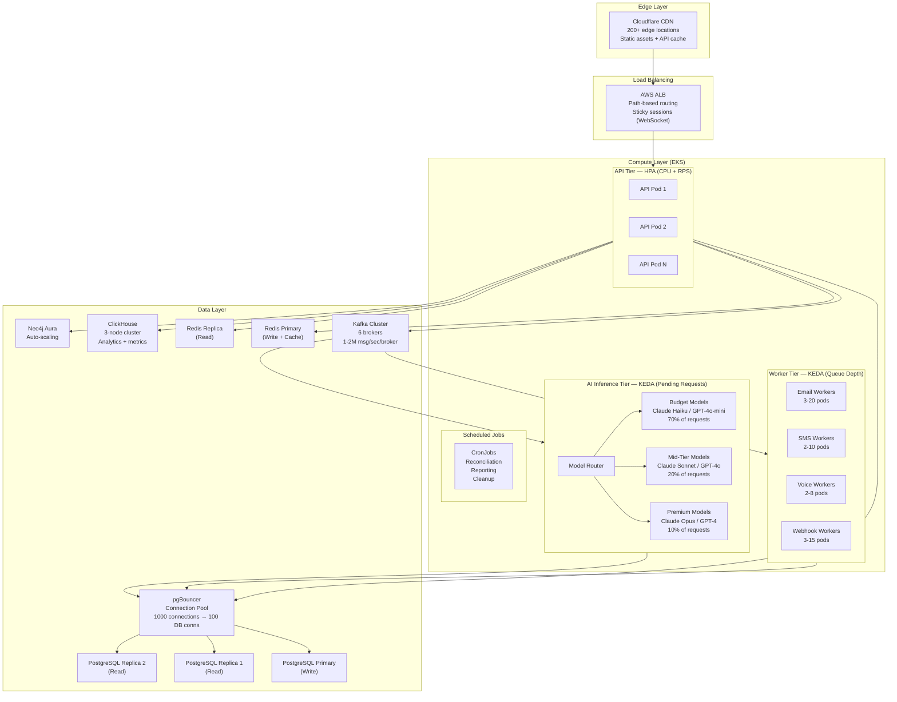
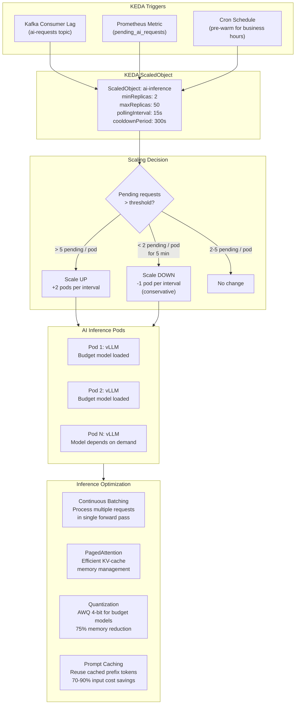

# 12 — Scalability Architecture

> **ORDR-Connect — Customer Operations OS**
> Classification: INTERNAL — SOC 2 Type II | ISO 27001:2022 | HIPAA
> Last Updated: 2025-03-24

---

## 1. Overview

ORDR-Connect is designed to scale from a single tenant doing 100 operations/day
to thousands of tenants processing millions of messages daily — without
re-architecture. Scalability is achieved through horizontal scaling of stateless
services, partition-based scaling of Kafka, intelligent AI inference routing,
and KEDA-driven autoscaling tied to actual workload metrics.

Key targets:

- **API throughput**: 50,000+ TPS at p99 < 200ms.
- **Message processing**: 1-2M messages/second through Kafka.
- **AI inference**: Sub-second response for 95% of requests.
- **Database**: 10TB+ with < 10ms query latency for indexed queries.
- **Cost efficiency**: 60-80% reduction in AI inference costs through
  multi-model routing and prompt caching.

---

## 2. Horizontal Scaling Topology



---

## 3. Kafka Scaling

### Cluster Configuration

| Parameter | Value | Rationale |
|---|---|---|
| Brokers | 6 (3 AZ, 2 per AZ) | High availability + throughput |
| Replication factor | 3 | Survive AZ failure |
| Min ISR | 2 | Guarantee durability with `acks=all` |
| Max message size | 1 MB | Prevent large payload abuse |
| Retention | 7 days (audit: 30 days) | Balance storage vs replay capability |
| Compaction | Enabled on state topics | Latest state always available |

### Topic Partition Strategy

| Topic | Partitions | Key | Throughput Target |
|---|---|---|---|
| `outbound-messages` | 32 | `tenant_id` | 500K msg/sec |
| `inbound-webhooks` | 16 | `provider:tenant_id` | 100K msg/sec |
| `audit-events` | 64 | `tenant_id` | 1M msg/sec |
| `workflow-events` | 16 | `tenant_id:workflow_id` | 200K msg/sec |
| `ai-requests` | 32 | `tenant_id:priority` | 300K msg/sec |
| `channel-retries` | 8 | `channel:tenant_id` | 50K msg/sec |
| `outbound-dlq` | 4 | `channel:tenant_id` | 10K msg/sec |

### Consumer Group Scaling

Each consumer group scales independently. Adding partitions allows adding
consumers up to partition count. Consumer lag is the primary KEDA trigger.

```
consumer_lag > threshold → KEDA scales up workers
consumer_lag < threshold / 2 → KEDA scales down (cooldown: 5 min)
```

---

## 4. AI Inference Scaling with KEDA



### KEDA ScaledObject Configuration

```yaml
apiVersion: keda.sh/v1alpha1
kind: ScaledObject
metadata:
  name: ai-inference-scaler
  namespace: ordr-platform
spec:
  scaleTargetRef:
    name: ai-inference-deployment
  minReplicaCount: 2
  maxReplicaCount: 50
  pollingInterval: 15
  cooldownPeriod: 300
  triggers:
    - type: kafka
      metadata:
        bootstrapServers: kafka:9092
        consumerGroup: ai-inference-consumer
        topic: ai-requests
        lagThreshold: "5"        # Scale when > 5 messages pending per partition
    - type: prometheus
      metadata:
        serverAddress: http://prometheus:9090
        metricName: ordr_ai_pending_requests
        threshold: "10"          # Scale when > 10 pending requests total
        query: |
          sum(ordr_ai_pending_requests{namespace="ordr-platform"})
    - type: cron
      metadata:
        timezone: America/New_York
        start: "0 7 * * 1-5"    # Pre-warm at 7 AM ET weekdays
        end: "0 20 * * 1-5"     # Scale down after 8 PM ET
        desiredReplicas: "10"
```

---

## 5. Multi-Model Routing — Cost Optimization

The model router assigns each AI request to the most cost-effective model
that can handle the task at the required quality level.

### Routing Tiers

| Tier | Models | Use Cases | Cost | Allocation |
|---|---|---|---|---|
| Budget | Claude 3.5 Haiku, GPT-4o-mini | Classification, extraction, simple drafts | $0.25-0.60/1M tokens | 70% of requests |
| Mid-tier | Claude 3.5 Sonnet, GPT-4o | Complex drafts, analysis, summarization | $3-10/1M tokens | 20% of requests |
| Premium | Claude Opus, GPT-4 | Legal language, compliance review, complex reasoning | $15-60/1M tokens | 10% of requests |

### Cost Projection

| Scenario | All-Premium Cost | Multi-Model Cost | Savings |
|---|---|---|---|
| 1M requests/month | $50,000-$100,000 | $5,000-$15,000 | 70-85% |
| 5M requests/month | $250,000-$500,000 | $25,000-$75,000 | 70-85% |

### Routing Logic

```typescript
function routeToModel(request: AIRequest): ModelTier {
  // Rule 1: Compliance-critical tasks always use premium
  if (request.complianceTags.includes('HIPAA_PHI_REVIEW') ||
      request.complianceTags.includes('LEGAL_LANGUAGE')) {
    return 'premium';
  }

  // Rule 2: Tasks with established templates use budget
  if (request.taskType === 'template_fill' ||
      request.taskType === 'classification' ||
      request.taskType === 'extraction') {
    return 'budget';
  }

  // Rule 3: Customer-facing drafts use mid-tier minimum
  if (request.taskType === 'communication_draft' &&
      request.customerFacing) {
    return 'mid_tier';
  }

  // Rule 4: Default to budget, escalate on retry
  if (request.retryCount > 0) {
    return 'mid_tier';  // Quality issue on budget — escalate
  }

  return 'budget';
}
```

---

## 6. Prompt Caching

Anthropic and OpenAI both support prompt caching, which dramatically
reduces costs for requests with shared prefixes (system prompts,
few-shot examples, context documents).

### Caching Strategy

| Cache Type | Savings | Implementation |
|---|---|---|
| System prompt cache | 90% on system tokens | Static system prompt per agent type |
| Few-shot cache | 85% on example tokens | Shared examples per task category |
| Context document cache | 70% on document tokens | Customer record prefix reuse |
| Conversation cache | 80% on history tokens | Multi-turn conversations |

### Cost Impact

```
Without caching:  1M requests × avg 2000 tokens × $3/1M = $6,000/month
With caching:     1M requests × avg 2000 tokens × $0.30-0.90/1M = $600-1,800/month
Savings:          70-90% on input token costs
```

### Implementation

```typescript
// Prompt structure optimized for caching
const prompt = {
  system: CACHED_SYSTEM_PROMPT,       // Static — cached after first call
  context: [
    ...CACHED_FEW_SHOT_EXAMPLES,      // Static — cached
    customerRecord,                    // Semi-static — cached per session
  ],
  messages: conversationHistory,       // Dynamic — not cached
  userMessage: currentRequest,         // Dynamic — not cached
};

// Anthropic: use cache_control breakpoints
// OpenAI: use system fingerprinting for auto-cache
```

---

## 7. Database Scaling

### PostgreSQL Read Replicas

| Configuration | Value |
|---|---|
| Primary | `db.r6g.2xlarge` (8 vCPU, 64 GB) |
| Read replicas | 2 (same AZ + cross-AZ) |
| Replica lag target | < 100ms |
| Failover | Automated via RDS Multi-AZ |

### Connection Pooling — pgBouncer

```
[pgbouncer]
pool_mode = transaction          ; Release connection after transaction (critical for RLS)
max_client_conn = 1000           ; Total client connections accepted
default_pool_size = 25           ; Connections per user/database pair
min_pool_size = 5                ; Keep warm connections
reserve_pool_size = 5            ; Emergency connections
reserve_pool_timeout = 3         ; Wait time before using reserve
server_idle_timeout = 600        ; Close idle server connections after 10 min
query_timeout = 30               ; Kill queries running > 30s
```

### Read/Write Splitting

```typescript
// Drizzle ORM read/write routing
const readDb = drizzle(readReplicaPool);   // Read replica
const writeDb = drizzle(primaryPool);       // Primary

// Automatic routing based on operation type
function getDb(operation: 'read' | 'write'): DrizzleInstance {
  if (operation === 'write') return writeDb;

  // Check replica lag before routing reads
  if (replicaLag > MAX_ACCEPTABLE_LAG_MS) {
    metrics.increment('db.read.primary_fallback');
    return writeDb;  // Fallback to primary if replica is lagging
  }

  return readDb;
}
```

### Database Partitioning

Large tables are partitioned by time for query performance and retention
management:

```sql
-- Audit events: partitioned by month
CREATE TABLE audit_events (
    id BIGINT GENERATED ALWAYS AS IDENTITY,
    tenant_id UUID NOT NULL,
    created_at TIMESTAMPTZ NOT NULL DEFAULT NOW(),
    -- ... columns
) PARTITION BY RANGE (created_at);

-- Auto-create monthly partitions
CREATE TABLE audit_events_2025_03 PARTITION OF audit_events
    FOR VALUES FROM ('2025-03-01') TO ('2025-04-01');

-- Older partitions: detach and archive to S3, never delete
```

---

## 8. CDN and Edge Caching

### Cloudflare Configuration

| Resource | Cache TTL | Purge Strategy |
|---|---|---|
| Static assets (JS, CSS, images) | 1 year (fingerprinted) | Deploy-time purge |
| API responses (public) | 5 minutes | Event-driven purge via API |
| API responses (authenticated) | No cache | — |
| Webhook endpoints | No cache | — |
| MCP endpoints | No cache | — |

### Edge Functions

Cloudflare Workers handle:

- **Geo-routing** — Route to nearest region for data residency compliance.
- **Bot detection** — Block scraping attempts before reaching origin.
- **Request coalescing** — Deduplicate identical concurrent requests.

---

## 9. Load Testing Strategy

### Tools

| Tool | Purpose | Frequency |
|---|---|---|
| k6 | API load testing | Pre-release + weekly |
| Gatling | Sustained load / soak testing | Monthly |
| Chaos Mesh | Failure injection | Quarterly |
| Custom Kafka producer | Message bus stress testing | Pre-release |

### Test Scenarios

| Scenario | Target | Pass Criteria |
|---|---|---|
| Steady state | 10,000 RPS for 1 hour | p99 < 200ms, 0 errors |
| Peak load | 50,000 RPS for 15 min | p99 < 500ms, < 0.1% errors |
| Spike | 0 → 50,000 RPS in 30s | Recovery to p99 < 200ms in < 2 min |
| Soak | 5,000 RPS for 24 hours | No memory leaks, no connection leaks |
| Tenant isolation | 1 noisy tenant at 10x normal load | Other tenants unaffected |
| Failover | Kill 1 AZ during peak load | < 30s recovery, no data loss |

### k6 Test Script Pattern

```javascript
import http from 'k6/http';
import { check, sleep } from 'k6';

export const options = {
  stages: [
    { duration: '2m', target: 1000 },   // Ramp up
    { duration: '10m', target: 10000 },  // Sustained peak
    { duration: '2m', target: 0 },       // Ramp down
  ],
  thresholds: {
    http_req_duration: ['p(99)<200'],     // 99th percentile < 200ms
    http_req_failed: ['rate<0.001'],      // < 0.1% error rate
  },
};

export default function () {
  const res = http.get('https://api.ordr.io/v1/health', {
    headers: { Authorization: `Bearer ${__ENV.TEST_TOKEN}` },
  });
  check(res, { 'status 200': (r) => r.status === 200 });
}
```

---

## 10. Performance SLAs

| Metric | Target | Measurement |
|---|---|---|
| API latency (p50) | < 50ms | Grafana / Prometheus |
| API latency (p95) | < 100ms | Grafana / Prometheus |
| API latency (p99) | < 200ms | Grafana / Prometheus |
| Message delivery (email) | < 30s to SENT state | ClickHouse analytics |
| Message delivery (SMS) | < 10s to SENT state | ClickHouse analytics |
| AI inference (budget) | < 2s | Grafana / Prometheus |
| AI inference (premium) | < 10s | Grafana / Prometheus |
| Kafka consumer lag | < 1000 messages | Confluent Control Center |
| Database query (indexed) | < 10ms | pg_stat_statements |
| Uptime | 99.95% (Tier 1), 99.99% (Tier 3) | Datadog Synthetics |

---

## 11. Scaling Cost Projections

| Component | Small (100 tenants) | Medium (1K tenants) | Large (10K tenants) |
|---|---|---|---|
| EKS compute | $3,000/mo | $15,000/mo | $80,000/mo |
| PostgreSQL (RDS) | $1,500/mo | $5,000/mo | $25,000/mo |
| Kafka (Confluent) | $2,000/mo | $8,000/mo | $40,000/mo |
| AI inference | $5,000/mo | $25,000/mo | $150,000/mo |
| Redis (ElastiCache) | $500/mo | $2,000/mo | $10,000/mo |
| ClickHouse | $500/mo | $3,000/mo | $15,000/mo |
| CDN (Cloudflare) | $200/mo | $500/mo | $2,000/mo |
| **Total** | **~$12,700/mo** | **~$58,500/mo** | **~$322,000/mo** |
| **Per-tenant** | **~$127** | **~$58.50** | **~$32.20** |

Cost per tenant decreases significantly at scale due to shared infrastructure
economics — a key advantage of the multi-tenant architecture.

---

## 12. Compliance Controls Summary

| Control | Standard | Implementation |
|---|---|---|
| Capacity management | ISO 27001 A.12.1.3 | KEDA autoscaling + load testing |
| Performance monitoring | SOC 2 CC7.1 | Grafana dashboards + PagerDuty alerts |
| Availability | SOC 2 A1.1 | Multi-AZ deployment, automated failover |
| Backup & recovery | SOC 2 A1.2, ISO 27001 A.12.3.1 | Automated daily backups, tested monthly |
| Change management | SOC 2 CC8.1 | Load tests required pre-release |
| Incident response | SOC 2 CC7.2 | Automatic scaling prevents many incidents |
| Data integrity | SOC 2 PI1.1 | Kafka replication factor 3, DB replication |
