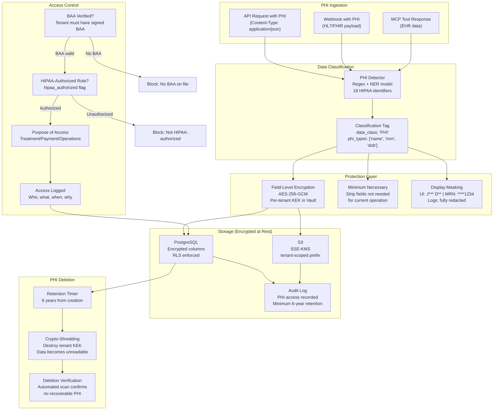

# 13 — Per-Regulation Compliance Implementation

> **ORDR-Connect — Customer Operations OS**
> Classification: INTERNAL — SOC 2 Type II | ISO 27001:2022 | HIPAA
> Last Updated: 2025-03-24

---

## 1. Overview

ORDR-Connect serves multiple regulated industries simultaneously. Each tenant
is configured with the compliance modules applicable to their business.
This document specifies the concrete implementation for each regulatory
framework — not abstract policy, but the exact code patterns, database
schemas, validation logic, and testing strategies that enforce compliance.

Compliance is not optional. Every module listed here runs as a pre-execution
gate in the governance layer (doc 09). A compliance failure blocks the action
and logs the violation.

---

## 2. HIPAA — Health Insurance Portability and Accountability Act

### PHI Lifecycle



### PHI Detection — 18 HIPAA Identifiers

```typescript
const HIPAA_IDENTIFIERS = [
  'name',                    // Patient name
  'geographic_data',         // Address (smaller than state)
  'dates',                   // DOB, admission, discharge, death
  'phone',                   // Phone numbers
  'fax',                     // Fax numbers
  'email',                   // Email addresses
  'ssn',                     // Social Security Number
  'mrn',                     // Medical Record Number
  'health_plan_beneficiary', // Health plan ID
  'account_number',          // Account numbers
  'certificate_license',     // Certificate/license numbers
  'vehicle_id',              // Vehicle identifiers
  'device_id',               // Device identifiers/serial numbers
  'url',                     // Web URLs
  'ip_address',              // IP addresses
  'biometric_id',            // Biometric identifiers
  'photo',                   // Full-face photographs
  'other_unique_id',         // Any other unique identifying number
] as const;
```

### BAA Management

| Requirement | Implementation |
|---|---|
| BAA signed before PHI access | `tenant_baa` table; checked on every PHI operation |
| BAA covers subprocessors | Cascade BAA for Twilio, AWS, SendGrid, etc. |
| BAA breach notification | Automated alert pipeline: detect → assess → notify 60 days |
| BAA termination | Triggers crypto-shredding of all tenant PHI |

### Breach Notification Timeline

| Action | Deadline | Implementation |
|---|---|---|
| Internal detection | Continuous | Automated anomaly detection (Falco + custom rules) |
| Risk assessment | Within 24 hours | Compliance team notification via PagerDuty |
| HHS notification | Within 60 days | Automated report generation |
| Individual notification | Within 60 days | Template-based notification via execution layer |
| Media notification | If 500+ individuals | PR team alert trigger |

### HIPAA Testing Patterns

```typescript
describe('HIPAA Compliance', () => {
  it('blocks PHI access without signed BAA', async () => {
    const tenant = await createTenant({ baa_signed: false });
    const response = await api.get('/customers/123/phi', {
      headers: { 'X-Tenant-ID': tenant.id },
    });
    expect(response.status).toBe(403);
    expect(response.body.error.code).toBe('BAA_REQUIRED');
  });

  it('encrypts PHI fields at rest', async () => {
    const customer = await createCustomerWithPHI(hipaaEnabledTenant);
    const rawRow = await db.query('SELECT ssn_encrypted FROM customers WHERE id = $1', [customer.id]);
    expect(rawRow.ssn_encrypted).not.toEqual(customer.ssn); // Encrypted, not plaintext
    expect(rawRow.ssn_encrypted).toMatch(/^vault:v1:/);      // Vault transit encryption prefix
  });

  it('logs every PHI access to audit trail', async () => {
    await api.get('/customers/123/phi', {
      headers: { 'X-Tenant-ID': hipaaEnabledTenant.id },
    });
    const auditEntries = await getAuditEntries({ event_type: 'phi.accessed', resource_id: '123' });
    expect(auditEntries.length).toBeGreaterThan(0);
    expect(auditEntries[0].details).toContain('purpose');
  });

  it('redacts PHI from email subject lines', async () => {
    const message = await createMessage({
      channel: 'email',
      tenant_id: hipaaEnabledTenant.id,
      subject: 'Lab results for John Smith',  // Contains PHI
    });
    expect(message.subject).toBe('You have a new secure message');  // Redacted
  });

  it('retains PHI access logs for 6 years', async () => {
    const retentionPolicy = await getRetentionPolicy(hipaaEnabledTenant.id, 'phi_access_log');
    expect(retentionPolicy.retention_days).toBeGreaterThanOrEqual(2190); // 6 years
  });
});
```

---

## 3. FDCPA / Regulation F — Debt Collection

### 7-in-7 Rule Engine

Regulation F limits debt collectors to 7 communication attempts per debt
per 7-day rolling window. This is enforced at the compliance gate before
any outbound message is dispatched.

```typescript
interface FDCPAComplianceCheck {
  tenant_id: string;
  customer_id: string;
  debt_id: string;
  proposed_channel: Channel;
  proposed_time: Date;
}

async function checkFDCPA(check: FDCPAComplianceCheck): Promise<ComplianceResult> {
  // Rule 1: 7-in-7 attempt limit
  const attemptsInWindow = await db.query(`
    SELECT COUNT(*) as attempt_count
    FROM communication_attempts
    WHERE tenant_id = $1
      AND customer_id = $2
      AND debt_id = $3
      AND attempted_at >= NOW() - INTERVAL '7 days'
      AND status IN ('sent', 'delivered', 'attempted')
  `, [check.tenant_id, check.customer_id, check.debt_id]);

  if (attemptsInWindow.attempt_count >= 7) {
    return { allowed: false, reason: 'FDCPA_7_IN_7_EXCEEDED', details: attemptsInWindow };
  }

  // Rule 2: Timing restrictions (8 AM - 9 PM in CUSTOMER timezone)
  const customerTimezone = await getCustomerTimezone(check.customer_id);
  const localTime = check.proposed_time.toLocaleTimeString('en-US', {
    timeZone: customerTimezone,
    hour12: false,
  });
  const hour = parseInt(localTime.split(':')[0]);

  if (hour < 8 || hour >= 21) {
    return { allowed: false, reason: 'FDCPA_OUTSIDE_TIMING_WINDOW', details: { localTime, timezone: customerTimezone } };
  }

  // Rule 3: Not within 7 days of customer requesting cease
  const ceaseRequest = await getCeaseRequest(check.customer_id, check.debt_id);
  if (ceaseRequest && ceaseRequest.requested_at > new Date(Date.now() - 7 * 86400000)) {
    return { allowed: false, reason: 'FDCPA_CEASE_REQUESTED' };
  }

  return { allowed: true, remaining_attempts: 7 - attemptsInWindow.attempt_count };
}
```

### Mini-Miranda Disclosure

Every debt collection communication must include the Mini-Miranda disclosure
(15 USC 1692e(11)):

```
"This is an attempt to collect a debt. Any information obtained will be
used for that purpose. This communication is from a debt collector."
```

This is automatically appended to all outbound messages for tenants with
the FDCPA module enabled. Removal is blocked at the template engine level.

### FDCPA Testing Patterns

```typescript
describe('FDCPA Compliance', () => {
  it('blocks 8th attempt in 7-day window', async () => {
    // Create 7 previous attempts
    for (let i = 0; i < 7; i++) {
      await createCommunicationAttempt({ debt_id: 'debt_1', status: 'sent' });
    }
    const result = await checkFDCPA({ debt_id: 'debt_1', channel: 'sms' });
    expect(result.allowed).toBe(false);
    expect(result.reason).toBe('FDCPA_7_IN_7_EXCEEDED');
  });

  it('blocks messages outside 8AM-9PM customer timezone', async () => {
    await setCustomerTimezone('customer_1', 'America/New_York');
    // 10 PM ET
    const result = await checkFDCPA({
      customer_id: 'customer_1',
      proposed_time: new Date('2025-03-24T02:00:00Z'), // 10 PM ET
    });
    expect(result.allowed).toBe(false);
    expect(result.reason).toBe('FDCPA_OUTSIDE_TIMING_WINDOW');
  });

  it('includes Mini-Miranda in all debt collection messages', async () => {
    const message = await renderMessage({
      tenant_id: fdcpaTenant.id,
      template: 'payment_reminder',
      debt_id: 'debt_1',
    });
    expect(message.body).toContain('attempt to collect a debt');
  });
});
```

---

## 4. TCPA — Telephone Consumer Protection Act

### Consent Management System

```sql
CREATE TABLE tcpa_consent_records (
    id UUID PRIMARY KEY DEFAULT gen_random_uuid(),
    tenant_id UUID NOT NULL,
    customer_id UUID NOT NULL,
    phone_number VARCHAR(20) NOT NULL,
    consent_type VARCHAR(30) NOT NULL,      -- 'express_written', 'express', 'transactional'
    consent_method VARCHAR(50) NOT NULL,     -- 'web_form', 'paper_signed', 'ivr_recording'
    consent_text TEXT NOT NULL,              -- Exact text the consumer agreed to
    consent_evidence_url TEXT,               -- S3 URL to signed form / recording
    granted_at TIMESTAMPTZ NOT NULL,
    revoked_at TIMESTAMPTZ,                  -- NULL if still active
    revocation_method VARCHAR(50),           -- 'sms_stop', 'web_form', 'verbal'
    created_at TIMESTAMPTZ NOT NULL DEFAULT NOW()
);

-- Consent is NEVER deleted — regulatory retention requirement
ALTER TABLE tcpa_consent_records ENABLE ROW LEVEL SECURITY;
CREATE POLICY tenant_isolation ON tcpa_consent_records
    USING (tenant_id = current_setting('app.current_tenant')::UUID);

-- DNC (Do Not Call) Registry
CREATE TABLE tcpa_dnc_list (
    id UUID PRIMARY KEY DEFAULT gen_random_uuid(),
    tenant_id UUID NOT NULL,
    phone_number VARCHAR(20) NOT NULL,
    source VARCHAR(30) NOT NULL,            -- 'national_dnc', 'internal', 'customer_request'
    added_at TIMESTAMPTZ NOT NULL DEFAULT NOW(),
    UNIQUE(tenant_id, phone_number)
);
```

### TCPA Pre-Send Validation

| Check | Failure Action | Statutory Penalty |
|---|---|---|
| Express written consent exists | Block send | $500-$1,500 per message |
| Consent not revoked | Block send | $500-$1,500 per message |
| Not on DNC list | Block send | $500-$1,500 per call |
| Within 8 AM - 9 PM recipient time | Queue for valid window | $500-$1,500 per call |
| Caller ID displayed | Block if cannot display | $500-$1,500 per call |
| STOP keyword in opt-out list | Block send | $500-$1,500 per message |

---

## 5. RESPA — Real Estate Settlement Procedures Act

### Anti-Kickback Enforcement (Section 8)

RESPA Section 8 prohibits giving or accepting "any fee, kickback, or
thing of value" in exchange for referrals of settlement service business.

```typescript
interface RESPAComplianceCheck {
  tenant_id: string;
  transaction_type: 'referral' | 'marketing' | 'service_agreement';
  parties: Party[];
  payment_amount?: number;
  services_rendered: string[];
}

async function checkRESPA(check: RESPAComplianceCheck): Promise<ComplianceResult> {
  // Rule 1: No referral fees between settlement service providers
  if (check.transaction_type === 'referral' && check.payment_amount > 0) {
    const isSettlementService = check.parties.some(p =>
      SETTLEMENT_SERVICE_TYPES.includes(p.service_type)
    );
    if (isSettlementService) {
      return {
        allowed: false,
        reason: 'RESPA_SECTION_8_REFERRAL_FEE',
        details: 'Referral fees between settlement service providers are prohibited',
      };
    }
  }

  // Rule 2: Marketing agreements must have bona fide services
  if (check.transaction_type === 'marketing') {
    if (check.services_rendered.length === 0) {
      return {
        allowed: false,
        reason: 'RESPA_SECTION_8_NO_SERVICES',
        details: 'Payment without bona fide services rendered violates Section 8',
      };
    }
  }

  // Rule 3: Affiliated business disclosure required
  const affiliatedParties = check.parties.filter(p => p.affiliated);
  if (affiliatedParties.length > 0) {
    const disclosureExists = await checkAffilatedBusinessDisclosure(
      check.tenant_id,
      affiliatedParties,
    );
    if (!disclosureExists) {
      return {
        allowed: false,
        reason: 'RESPA_AFFILIATED_DISCLOSURE_MISSING',
        hitl_required: true,  // Route to compliance officer
      };
    }
  }

  return { allowed: true };
}
```

---

## 6. FEC — Federal Election Commission

### Contribution Limits Engine

```typescript
const FEC_LIMITS_2025_2026 = {
  individual_to_candidate: 3_300,          // Per election (primary + general separate)
  individual_to_pac: 5_000,                // Per year
  individual_to_party_national: 41_300,    // Per year
  individual_to_party_state: 10_000,       // Per year (combined)
  pac_to_candidate: 5_000,                 // Per election
  aggregate_individual: null,              // No aggregate limit post-McCutcheon
} as const;

async function checkFECContribution(contribution: Contribution): Promise<ComplianceResult> {
  // Rule 1: Individual contribution limits
  const ytdContributions = await getYTDContributions(
    contribution.donor_id,
    contribution.recipient_id,
    contribution.election_cycle,
  );

  const limit = FEC_LIMITS_2025_2026[contribution.limit_type];
  if (limit && ytdContributions + contribution.amount > limit) {
    return {
      allowed: false,
      reason: 'FEC_CONTRIBUTION_LIMIT_EXCEEDED',
      details: {
        current_ytd: ytdContributions,
        proposed: contribution.amount,
        limit,
        remaining: limit - ytdContributions,
      },
    };
  }

  // Rule 2: Donor disclosure requirement (contributions > $200)
  if (contribution.amount > 200) {
    const disclosureComplete = await checkDonorDisclosure(contribution.donor_id);
    if (!disclosureComplete) {
      return {
        allowed: false,
        reason: 'FEC_DONOR_DISCLOSURE_REQUIRED',
        hitl_required: true,
        details: 'Contributions > $200 require name, address, occupation, employer',
      };
    }
  }

  // Rule 3: Foreign national prohibition
  if (contribution.donor_citizenship !== 'US' && !contribution.donor_permanent_resident) {
    return {
      allowed: false,
      reason: 'FEC_FOREIGN_NATIONAL_PROHIBITED',
    };
  }

  return { allowed: true };
}
```

---

## 7. GDPR — General Data Protection Regulation

### Data Subject Rights Workflow

```mermaid
flowchart TD
    DSR["Data Subject Request\n(Web form / Email / API)"]
    DSR --> VERIFY["Identity Verification\n(2FA or government ID)"]
    VERIFY -->|Verified| CLASSIFY{"Request Type?"}
    VERIFY -->|Failed| REJECT["Reject: Identity not verified\nLog attempt"]

    CLASSIFY -->|Access (Art. 15)| ACCESS["Data Access\nExport all personal data\nStructured JSON format\nDelivery via secure portal"]
    CLASSIFY -->|Rectification (Art. 16)| RECTIFY["Data Rectification\nUpdate incorrect data\nNotify all processors"]
    CLASSIFY -->|Erasure (Art. 17)| ERASE["Right to Erasure\n1. Check legal hold\n2. Crypto-shred personal data\n3. Notify processors\n4. Verify deletion"]
    CLASSIFY -->|Portability (Art. 20)| PORT["Data Portability\nExport in machine-readable\nJSON / CSV format"]
    CLASSIFY -->|Object (Art. 21)| OBJECT["Right to Object\nStop processing for\nspecified purpose"]
    CLASSIFY -->|Restrict (Art. 18)| RESTRICT["Restrict Processing\nMark data as restricted\nBlock all non-storage ops"]

    ACCESS & RECTIFY & ERASE & PORT & OBJECT & RESTRICT --> DEADLINE["SLA: 30 days\n(Extendable to 90 days\nfor complex requests)"]
    DEADLINE --> CONFIRM["Confirm completion\nto data subject"]
    CONFIRM --> AUDIT_DSR["WORM Audit Log\nFull DSR lifecycle recorded"]
```

### Crypto-Shredding Implementation (Right to Erasure)

Instead of hunting for every copy of personal data, ORDR-Connect encrypts all
personal data with a per-customer encryption key. Erasure = destroy the key.

```typescript
// Crypto-shredding: destroy the customer's encryption key
async function eraseCustomerData(tenantId: string, customerId: string): Promise<void> {
  // Step 1: Check for legal holds
  const legalHold = await checkLegalHold(tenantId, customerId);
  if (legalHold.active) {
    throw new ComplianceError('Cannot erase: active legal hold', {
      hold_id: legalHold.id,
      reason: legalHold.reason,
    });
  }

  // Step 2: Destroy the customer's encryption key in Vault
  await vault.transit.deleteKey(`customer-${customerId}`);

  // Step 3: Clear plaintext caches
  await redis.del(`t:${tenantId}:customer:${customerId}`);

  // Step 4: Mark database records as shredded (but do not delete rows)
  await db.execute(sql`
    UPDATE customers
    SET data_status = 'crypto_shredded',
        shredded_at = NOW()
    WHERE id = ${customerId}
      AND tenant_id = ${tenantId}
  `);

  // Step 5: Notify downstream processors
  await kafka.produce('data-erasure-notifications', {
    key: `${tenantId}:${customerId}`,
    value: { action: 'erasure_completed', customer_id: customerId },
  });

  // Step 6: Audit log (this record is retained — it proves erasure occurred)
  await auditLog.record({
    event: 'gdpr.erasure_completed',
    tenant_id: tenantId,
    resource_id: customerId,
    details: { method: 'crypto_shredding', vault_key_destroyed: true },
  });
}
```

### Consent Tracking

```sql
CREATE TABLE gdpr_consent_records (
    id UUID PRIMARY KEY DEFAULT gen_random_uuid(),
    tenant_id UUID NOT NULL,
    customer_id UUID NOT NULL,
    purpose VARCHAR(100) NOT NULL,          -- 'marketing', 'analytics', 'profiling'
    lawful_basis VARCHAR(30) NOT NULL,      -- 'consent', 'legitimate_interest', 'contract'
    consent_given BOOLEAN NOT NULL,
    consent_text TEXT NOT NULL,              -- Exact text shown to user
    consent_version VARCHAR(20) NOT NULL,   -- Version of consent text
    collected_at TIMESTAMPTZ NOT NULL,
    withdrawn_at TIMESTAMPTZ,
    ip_address INET,
    user_agent TEXT,
    created_at TIMESTAMPTZ NOT NULL DEFAULT NOW()
);
```

---

## 8. CCPA — California Consumer Privacy Act

### Consumer Rights Implementation

| Right | Endpoint | Implementation |
|---|---|---|
| Right to Know | `GET /privacy/data-access` | Full data export (JSON/CSV) |
| Right to Delete | `DELETE /privacy/data` | Crypto-shredding (same as GDPR) |
| Right to Opt-Out of Sale | `POST /privacy/opt-out-sale` | `do_not_sell` flag on customer record |
| Right to Non-Discrimination | — | No service degradation for exercising rights |
| Right to Correct | `PATCH /privacy/data` | Update with audit trail |

### "Do Not Sell" Implementation

```typescript
// Middleware: check do-not-sell status before any data sharing
async function dnsMiddleware(c: Context, next: Next) {
  const customerId = c.req.header('X-Customer-ID');
  if (!customerId) return next();

  const dnsStatus = await redis.get(`t:${tenantId}:dns:${customerId}`);

  if (dnsStatus === 'opted_out') {
    // Block data sharing with third parties
    c.set('data_sharing_blocked', true);
    c.set('blocked_reason', 'CCPA_DO_NOT_SELL');
  }

  return next();
}
```

---

## 9. Cross-Framework Compliance Matrix

| Requirement | HIPAA | FDCPA | TCPA | RESPA | FEC | GDPR | CCPA |
|---|---|---|---|---|---|---|---|
| Encryption at rest | Required | — | — | — | — | Required | — |
| Encryption in transit | Required | — | — | — | — | Required | — |
| Consent management | — | — | Required | — | — | Required | Required |
| Access logging | Required | Required | — | — | — | Required | Required |
| Data retention limits | 6 years | 3 years | 5 years | 3 years | 3 years | Purpose-limited | 12 months |
| Right to erasure | — | — | — | — | — | Required | Required |
| Breach notification | 60 days | — | — | — | — | 72 hours | — |
| Communication limits | — | 7/7 days | Consent-based | — | — | — | — |
| Timing restrictions | — | 8AM-9PM | 8AM-9PM | — | — | — | — |
| Anti-discrimination | — | — | — | Anti-kickback | — | — | Required |

---

## 10. Compliance Testing Automation

All compliance rules are covered by automated tests that run in CI/CD.
A compliance test failure blocks deployment.

### Test Counts by Framework

| Framework | Unit Tests | Integration Tests | E2E Tests |
|---|---|---|---|
| HIPAA | 45 | 20 | 10 |
| FDCPA | 30 | 15 | 8 |
| TCPA | 25 | 12 | 6 |
| RESPA | 15 | 8 | 4 |
| FEC | 20 | 10 | 5 |
| GDPR | 35 | 18 | 8 |
| CCPA | 20 | 10 | 5 |
| **Total** | **190** | **93** | **46** |

---

## 11. Compliance Controls Summary

| Control | Standard | Implementation |
|---|---|---|
| Data classification | ISO 27001 A.8.2.1 | Automated PHI/PII detection on ingestion |
| Encryption | SOC 2 CC6.7, HIPAA §164.312(a)(2)(iv) | AES-256-GCM field-level, TLS 1.3 in transit |
| Access control | SOC 2 CC6.3, HIPAA §164.312(a)(1) | RBAC + ABAC + purpose-of-access logging |
| Consent management | GDPR Art. 7, TCPA | Immutable consent records with evidence |
| Data minimization | GDPR Art. 5(1)(c), HIPAA §164.502(b) | Minimum necessary access enforcement |
| Breach notification | HIPAA §164.408, GDPR Art. 33 | Automated detection + notification pipeline |
| Data retention | All frameworks | Per-regulation retention policies, automated enforcement |
| Right to erasure | GDPR Art. 17, CCPA §1798.105 | Crypto-shredding with verification |
| Communication limits | FDCPA/Reg F | 7-in-7 engine with audit trail |
| Audit trail | SOC 2 CC8.1, HIPAA §164.312(b) | WORM audit log with Merkle verification |
