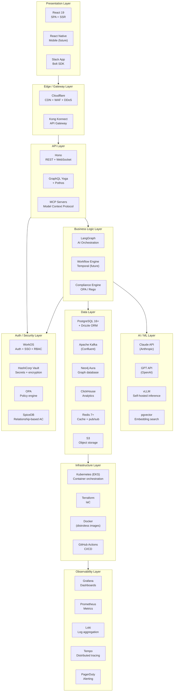
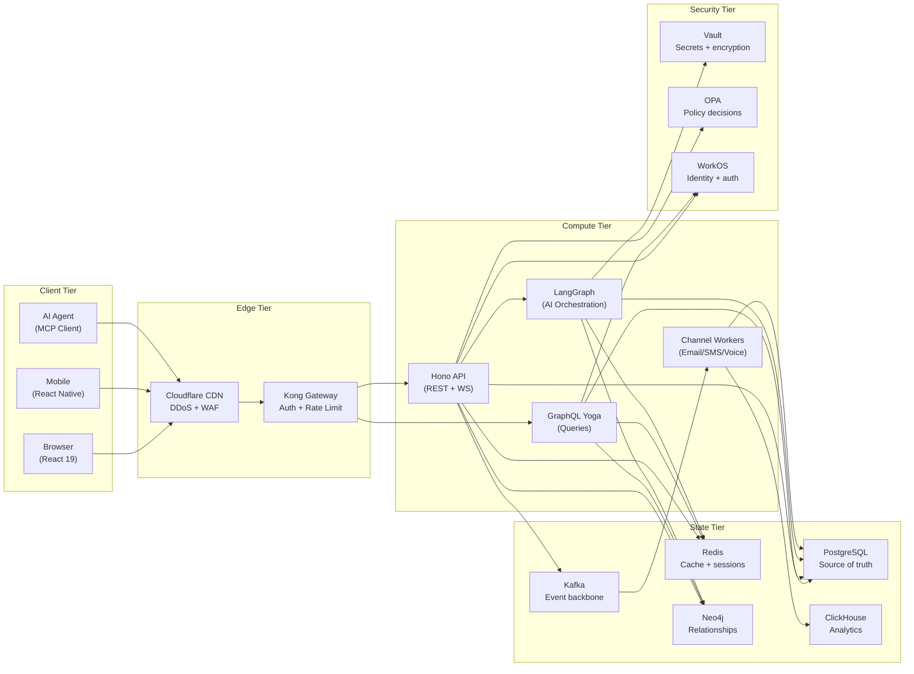

# 14 — Technology Stack & Decision Rationale

> **ORDR-Connect — Customer Operations OS**
> Classification: INTERNAL — SOC 2 Type II | ISO 27001:2022 | HIPAA
> Last Updated: 2025-03-24

---

## 1. Overview

Every technology in ORDR-Connect was selected through a deliberate evaluation
of compliance requirements, scalability characteristics, developer experience,
and total cost of ownership. This document records the "what, why, what else
we considered, and what it costs" for every component in the stack.

No technology is added without a compliance impact assessment. No technology
is adopted without a documented rejection of alternatives.

---

## 2. Full Stack Architecture

---

## 3. Language & Runtime

### TypeScript (Strict Mode)

| Aspect | Detail |
|---|---|
| **What** | TypeScript 5.x with `strict: true`, `noUncheckedIndexedAccess`, `exactOptionalPropertyTypes` |
| **Why** | Type safety catches bugs at compile time. Strict mode eliminates entire categories of runtime errors. Single language across frontend, backend, and infrastructure reduces context switching. |
| **Alternatives rejected** | **Go** — Better performance but weaker ecosystem for rapid feature development, no frontend code sharing. **Python** — Dynamic typing unacceptable for compliance-critical code; Django ORM inferior to Drizzle for type-safe SQL. **Rust** — Excessive development overhead for a product-stage company; reserved for future performance-critical components. |
| **Compliance** | Static typing supports ISO 27001 A.14.2.1 (secure development policy). Strict mode prevents implicit `any` that could mask data handling errors. |
| **Cost** | $0 (open source). Developer productivity gain estimated at 20-30% over dynamic languages. |

### Node.js 22 LTS

| Aspect | Detail |
|---|---|
| **What** | Node.js 22 LTS (Active LTS through April 2027) |
| **Why** | Native ESM, built-in test runner, stable `fetch` API, V8 performance improvements. LTS guarantees security patches for 30 months. |
| **Alternatives rejected** | **Bun** — Faster cold starts but ecosystem compatibility gaps; not LTS-backed for enterprise. **Deno** — Excellent security model but smaller ecosystem, import map complexity. |
| **Compliance** | LTS support cycle aligns with SOC 2 CC7.1 (security patch availability). |
| **Scaling** | Single-threaded event loop scales well for I/O-bound workloads. CPU-bound work (AI inference) offloaded to dedicated services. Worker threads available for parallelism. |

---

## 4. Web Framework

### Hono

| Aspect | Detail |
|---|---|
| **What** | Hono — ultra-fast web framework for edge and server runtimes |
| **Why** | 3-5x faster than Express. Built-in middleware for CORS, JWT, rate limiting. First-class TypeScript. Runs on Node, Bun, Cloudflare Workers, Deno. Router benchmarks: ~150K req/sec on Node.js. |
| **Alternatives rejected** | **Express** — Legacy; no built-in TypeScript, middleware ecosystem aging. **Fastify** — Strong contender but heavier; Hono's edge portability is a differentiator. **NestJS** — Too opinionated; decorator-heavy patterns complicate debugging. |
| **Compliance** | Middleware pipeline enables consistent security controls (auth, audit, tenant isolation) across all routes. |
| **Cost** | $0 (open source, MIT license). |

---

## 5. ORM — Drizzle

| Aspect | Detail |
|---|---|
| **What** | Drizzle ORM — type-safe SQL query builder with zero overhead |
| **Why** | Generates SQL at build time (no runtime query building overhead). Full TypeScript inference from schema. Supports raw SQL when needed. Migration system with diffing. |
| **Alternatives rejected** | **Prisma** — Runtime query engine adds latency (~3-5ms per query); binary dependency complicates container builds; less control over generated SQL. **Kysely** — Excellent query builder but no migration system; less ecosystem. **TypeORM** — ActiveRecord pattern leaks abstractions; poor TypeScript inference. |
| **Compliance** | Type-safe queries prevent SQL injection (ISO 27001 A.14.2.5). Schema-as-code enables change auditing (SOC 2 CC8.1). |
| **Cost** | $0 (open source, Apache-2.0). |

---

## 6. Primary Database — PostgreSQL 16+

| Aspect | Detail |
|---|---|
| **What** | PostgreSQL 16+ on Amazon RDS (Multi-AZ) |
| **Why** | Row-Level Security for tenant isolation. JSONB for flexible schemas. Partitioning for time-series data. pgvector extension for embedding search. Mature replication. 30+ years of battle-tested reliability. |
| **Alternatives rejected** | **CockroachDB** — Distributed SQL but 2-3x latency vs single-node PG for simple queries; unnecessary complexity at current scale. **MySQL** — No native RLS; weaker JSONB support. **Supabase** — PG under the hood but managed layer adds latency and reduces control. |
| **Compliance** | RLS enforces tenant isolation (SOC 2 CC6.4). Encryption at rest via RDS (HIPAA §164.312(a)(2)(iv)). Audit logging via triggers. FIPS 140-2 compliant (AWS GovCloud available). |
| **Cost at scale** | `db.r6g.2xlarge`: ~$1,500/mo. With 2 read replicas: ~$4,500/mo. Enterprise (dedicated per tenant): $1,500-$3,000/mo per tenant. |
| **Scaling** | Vertical to 96 vCPU / 768 GB RAM. Horizontal via read replicas (up to 15). Partitioning for tables > 100M rows. |

---

## 7. Message Broker — Apache Kafka (Confluent)

| Aspect | Detail |
|---|---|
| **What** | Apache Kafka on Confluent Cloud (dedicated clusters for enterprise tenants) |
| **Why** | 1-2M messages/sec/broker throughput. Persistent log enables replay. Consumer groups for parallel processing. Exactly-once semantics with transactions. Schema Registry for payload validation. |
| **Alternatives rejected** | **RabbitMQ** — Lower throughput ceiling; no native log replay. **Amazon SQS** — No consumer groups; 256KB message limit; no cross-AZ replay. **Redis Streams** — Insufficient durability guarantees for compliance data. **NATS** — Lightweight but lacks Schema Registry and mature exactly-once semantics. |
| **Compliance** | Encrypted in transit (TLS) and at rest. ACLs for tenant topic isolation. Audit log of all producer/consumer activity. Confluent is SOC 2 Type II certified. |
| **Cost at scale** | Confluent Cloud Basic: ~$2,000/mo (100 tenants). Dedicated: ~$8,000/mo (1K tenants). |
| **Scaling** | Add brokers for throughput. Add partitions for parallelism. Consumer groups scale independently per topic. |

---

## 8. Graph Database — Neo4j Aura

| Aspect | Detail |
|---|---|
| **What** | Neo4j Aura (managed) for relationship-heavy queries — customer journeys, org hierarchies, interaction networks |
| **Why** | Native graph storage eliminates JOIN explosion. Cypher query language is intuitive for relationship traversal. 5-10x faster than SQL for multi-hop relationship queries. |
| **Alternatives rejected** | **Amazon Neptune** — Weaker query language (Gremlin/SPARQL vs Cypher); vendor lock-in. **Dgraph** — Smaller community; less mature managed offering. **PostgreSQL recursive CTEs** — Feasible for simple hierarchies but degrades beyond 3-4 hops. |
| **Compliance** | SOC 2 Type II certified (Aura). Encryption at rest and in transit. Role-based access control. |
| **Cost at scale** | Aura Professional: ~$1,000/mo (shared). Enterprise: ~$5,000/mo (dedicated). |

---

## 9. Analytics — ClickHouse

| Aspect | Detail |
|---|---|
| **What** | ClickHouse (self-hosted on EKS or ClickHouse Cloud) for real-time analytics |
| **Why** | 100-1000x faster than PostgreSQL for analytical queries on billion-row tables. Columnar storage compresses 10:1. Real-time ingestion from Kafka. SQL-compatible. |
| **Alternatives rejected** | **BigQuery** — Higher latency for real-time dashboards; per-query pricing unpredictable at scale. **Snowflake** — Expensive for high-frequency ingestion; designed for batch analytics. **TimescaleDB** — Good for time-series but lacks ClickHouse's columnar performance for ad-hoc analytics. |
| **Compliance** | Data encrypted at rest. Tenant isolation via `tenant_id` column + query-level enforcement. |
| **Cost at scale** | Self-hosted (3 nodes): ~$1,500/mo. ClickHouse Cloud: ~$3,000/mo. |

---

## 10. Vector Search — pgvector

| Aspect | Detail |
|---|---|
| **What** | pgvector extension in PostgreSQL for embedding similarity search |
| **Why** | No additional infrastructure — runs in existing PostgreSQL. HNSW indexes for sub-100ms search on millions of vectors. Combines vector search with traditional SQL filters (e.g., `WHERE tenant_id = X AND embedding <-> query < 0.5`). |
| **Alternatives rejected** | **Pinecone** — Dedicated service adds operational complexity; overkill for current vector volumes. **Weaviate** — Full vector DB is unnecessary when pgvector handles our scale. **Qdrant** — Same reasoning as Pinecone. |
| **Compliance** | Inherits all PostgreSQL compliance controls (RLS, encryption, audit). |
| **Cost** | $0 incremental (runs on existing PostgreSQL instances). |

---

## 11. Cache — Redis 7+

| Aspect | Detail |
|---|---|
| **What** | Redis 7+ on Amazon ElastiCache (cluster mode) |
| **Why** | Sub-millisecond latency. Pub/sub for real-time events. Streams for lightweight queuing. Lua scripting for atomic operations. ACLs for security. |
| **Alternatives rejected** | **Memcached** — No persistence, no pub/sub, no data structures. **DragonflyDB** — Promising but immature for production compliance workloads. **Valkey** — Redis fork; monitoring ecosystem maturity. |
| **Compliance** | Encryption in transit (TLS) and at rest. AUTH required. ACLs for tenant key isolation. ElastiCache is HIPAA-eligible. |
| **Cost at scale** | `cache.r6g.large` (2 nodes): ~$500/mo. Cluster mode (6 nodes): ~$3,000/mo. |

---

## 12. Authentication & Authorization — WorkOS

| Aspect | Detail |
|---|---|
| **What** | WorkOS for SSO, directory sync, RBAC, and MFA |
| **Why** | Enterprise SSO (SAML, OIDC) out of the box. Directory sync with Okta, Azure AD, Google Workspace. Fine-grained authorization (FGA) built in. SOC 2 Type II certified. |
| **Alternatives rejected** | **Auth0** — More expensive at scale; less enterprise-focused. **Clerk** — Consumer-oriented; weak enterprise SSO. **Custom auth** — Security risk; compliance overhead of maintaining auth infra. **Keycloak** — Self-hosted operational burden; no managed offering with SLA. |
| **Compliance** | SOC 2 Type II certified. HIPAA BAA available. MFA enforcement for compliance roles. Session management with configurable expiry. |
| **Cost at scale** | $0.50/MAU. 1K MAU = $500/mo. 10K MAU = $5,000/mo. |

---

## 13. AI Orchestration — LangGraph

| Aspect | Detail |
|---|---|
| **What** | LangGraph (LangChain) for stateful, multi-step AI agent orchestration |
| **Why** | Graph-based workflow execution with cycles and conditionals. Built-in state management. Human-in-the-loop gates. Streaming support. Tool calling abstraction across model providers. |
| **Alternatives rejected** | **CrewAI** — Less control over agent behavior; abstraction leaks at scale. **AutoGen** — Microsoft-oriented; weaker TypeScript support. **Custom orchestration** — High development cost; LangGraph handles 90% of our patterns. **Semantic Kernel** — C#/.NET oriented; TypeScript SDK immature. |
| **Compliance** | Reasoning trace capture for AI explainability. HITL checkpoints for compliance review. Deterministic graph execution enables reproducible audits. |
| **Cost** | $0 (open source, MIT license). LangSmith (optional tracing): $39/mo per seat. |

---

## 14. AI Models — Claude + GPT (Multi-Model)

| Aspect | Detail |
|---|---|
| **What** | Anthropic Claude (Haiku, Sonnet, Opus) + OpenAI GPT (4o-mini, 4o, 4) with intelligent routing |
| **Why** | Multi-model strategy prevents vendor lock-in. Route by cost/quality tradeoff: 70% budget, 20% mid, 10% premium. Prompt caching reduces costs 70-90%. |
| **Alternatives rejected** | **Single vendor** — Vendor lock-in risk; no fallback during outages. **Self-hosted only** — Latency and cost at scale exceed API pricing for most tasks. **Open source only** — Quality gap on compliance-critical tasks (legal language, PHI handling). |
| **Compliance** | Both vendors offer zero data retention APIs. Enterprise agreements include BAAs for HIPAA. No training on customer data. |
| **Cost at scale** | Budget tier: $0.25-0.60/1M tokens. Mid: $3-10/1M. Premium: $15-60/1M. Blended: ~$1.50/1M (with caching + routing). |

---

## 15. Communication — Twilio + SendGrid

| Aspect | Detail |
|---|---|
| **What** | Twilio (SMS, voice, IVR) + SendGrid (email) |
| **Why** | Twilio: industry-leading SMS/voice API, TCPA-compliant tools, Programmable Voice + Studio for IVR. SendGrid: high-deliverability email with dedicated IP management, DKIM/SPF/DMARC automation. |
| **Alternatives rejected** | **Amazon SNS/SES** — Lower cost but less feature-rich for SMS. SES used as email failover. **Vonage** — Smaller ecosystem; weaker IVR tooling. **MessageBird** — European focus; weaker North American coverage. |
| **Compliance** | Twilio: HIPAA BAA available, SOC 2 Type II. SendGrid: SOC 2 Type II, GDPR-compliant. Both support opt-out management. |
| **Cost** | SMS: $0.0079/msg. Voice: $0.0085/min. Email: ~$0.001/email at volume. |

---

## 16. Infrastructure — Terraform + Kubernetes + Docker

### Terraform

| Aspect | Detail |
|---|---|
| **What** | Terraform (OpenTofu compatible) for all infrastructure-as-code |
| **Why** | Declarative infrastructure. State management. Drift detection. Multi-cloud capable. Massive provider ecosystem. |
| **Compliance** | All infrastructure changes are version-controlled (SOC 2 CC8.1). Plan output reviewed before apply (change management). State encrypted at rest in S3. |

### Kubernetes (EKS)

| Aspect | Detail |
|---|---|
| **What** | Amazon EKS with managed node groups |
| **Why** | Container orchestration with auto-scaling (HPA, KEDA). Namespace isolation for tenants. NetworkPolicies for network segmentation. Pod Security Standards for runtime hardening. |
| **Compliance** | HIPAA-eligible (EKS). Pod Security Standards enforce `restricted` profile. RBAC for cluster access. Audit logging to CloudWatch. |

### Docker (Distroless)

| Aspect | Detail |
|---|---|
| **What** | Docker with Google distroless base images |
| **Why** | Distroless images contain no shell, no package manager, no OS utilities — attack surface reduced by 90%+ compared to Alpine. Image size: ~50 MB vs ~150 MB (Alpine). |
| **Alternatives rejected** | **Alpine** — Has shell and package manager (attack surface). **Ubuntu** — 200+ MB, large attack surface. **Scratch** — No CA certificates, no timezone data; too minimal. |
| **Compliance** | Minimal attack surface (ISO 27001 A.14.2.5). No shell = no shell-based exploits. Scanned by Snyk/Trivy in CI. |

---

## 17. Secrets Management — HashiCorp Vault

| Aspect | Detail |
|---|---|
| **What** | HashiCorp Vault (HCP Vault Dedicated) for secrets, encryption keys, and PKI |
| **Why** | Dynamic secret generation. Transit encryption engine (encrypt data without exposing keys). PKI for mTLS certificates. Audit log of all secret access. |
| **Alternatives rejected** | **AWS Secrets Manager** — No transit encryption engine; vendor lock-in. **SOPS** — File-based; no dynamic secrets. **Doppler** — Less mature for enterprise compliance workloads. |
| **Compliance** | FIPS 140-2 compliant. Audit trail for every secret access (SOC 2 CC6.1). Auto-rotation of secrets. HIPAA BAA available. |
| **Cost** | HCP Vault Dedicated: ~$1.58/hr (~$1,150/mo). |

---

## 18. Observability — Grafana + Prometheus + Loki

| Aspect | Detail |
|---|---|
| **What** | Grafana (dashboards), Prometheus (metrics), Loki (logs), Tempo (traces) |
| **Why** | Open-source stack with no vendor lock-in. Unified querying across metrics, logs, and traces. PromQL is the industry standard. Loki indexes labels (not log content) for cost efficiency. |
| **Alternatives rejected** | **Datadog** — Excellent but expensive at scale ($15-$30/host/mo + log volume). Reserved for synthetic monitoring only. **New Relic** — Similar cost concerns. **ELK Stack** — Elasticsearch is resource-hungry; Loki is 10x more cost-efficient for log storage. |
| **Compliance** | Log retention configurable per compliance requirement. Metrics enable SLA monitoring (SOC 2 A1.1). Alert rules for anomaly detection (ISO 27001 A.12.4.1). Tenant-scoped dashboards prevent data leakage. |
| **Cost** | Self-hosted on EKS: ~$2,000/mo (compute + storage). Grafana Cloud: ~$3,000/mo at scale. |

---

## 19. API Gateway — Kong Konnect

| Aspect | Detail |
|---|---|
| **What** | Kong Konnect (managed Kong Gateway) |
| **Why** | 50,000+ TPS capacity. Plugin ecosystem (auth, rate limiting, transformation, logging). Declarative configuration. Native Kubernetes ingress. |
| **Alternatives rejected** | **AWS API Gateway** — 10K TPS hard limit; vendor lock-in. **Traefik** — Lighter but weaker plugin ecosystem for enterprise auth. **Envoy (raw)** — Powerful but requires significant custom configuration. **Apigee** — Google Cloud lock-in; expensive. |
| **Compliance** | mTLS between gateway and upstreams. Request/response logging for audit. Rate limiting prevents abuse (ISO 27001 A.13.1.1). IP restriction for admin endpoints. |
| **Cost** | Kong Konnect Plus: ~$2,500/mo. Enterprise: ~$10,000/mo. |

---

## 20. Policy Engine — OPA (Open Policy Agent)

| Aspect | Detail |
|---|---|
| **What** | Open Policy Agent with Rego policies, deployed as sidecar + Gatekeeper for K8s |
| **Why** | Decouple policy from application code. Rego is purpose-built for policy decisions. Sub-3ms evaluation for compiled policies. Gatekeeper enforces K8s admission control. |
| **Alternatives rejected** | **Cedar (AWS)** — AWS-oriented; smaller community. **Casbin** — Less expressive policy language; library, not engine. **Custom policy code** — Mixes policy with business logic; untestable in isolation. |
| **Compliance** | Policies are version-controlled and auditable (SOC 2 CC8.1). ABAC decisions are logged. Gatekeeper prevents non-compliant K8s resources from being created. |
| **Cost** | $0 (open source, Apache-2.0). Styra DAS (optional management): ~$500/mo. |

---

## 21. CI/CD — GitHub Actions

| Aspect | Detail |
|---|---|
| **What** | GitHub Actions for CI/CD pipelines |
| **Why** | Native GitHub integration. Matrix builds for parallel testing. Reusable workflows. OIDC for AWS authentication (no long-lived credentials). Extensive marketplace. |
| **Alternatives rejected** | **GitLab CI** — Requires GitLab platform migration. **CircleCI** — Third-party dependency; recent security incidents. **Jenkins** — Self-hosted operational burden; antiquated UX. **AWS CodePipeline** — Vendor lock-in; weaker developer experience. |
| **Compliance** | Branch protection enforces PR reviews (SOC 2 CC8.1). Required status checks prevent deployment of failing code. Audit log of all pipeline executions. OIDC eliminates static credentials. |
| **Cost** | Team plan: $4/user/mo. ~2,000 CI minutes/mo included. Overage: $0.008/min. |

---

## 22. Data Flow Through the Stack

---

## 23. Technology Stack Summary Table

| Layer | Technology | License | Compliance Certifications |
|---|---|---|---|
| Language | TypeScript 5.x (strict) | Apache-2.0 | — |
| Runtime | Node.js 22 LTS | MIT | — |
| Framework | Hono | MIT | — |
| ORM | Drizzle | Apache-2.0 | — |
| Primary DB | PostgreSQL 16+ (RDS) | PostgreSQL | SOC 2, HIPAA, ISO 27001 (AWS) |
| Message Broker | Apache Kafka (Confluent) | Apache-2.0 | SOC 2 Type II |
| Graph DB | Neo4j Aura | Commercial | SOC 2 Type II |
| Analytics DB | ClickHouse | Apache-2.0 | — |
| Vector Search | pgvector | PostgreSQL | Inherits PostgreSQL |
| Cache | Redis 7+ (ElastiCache) | BSD-3 | SOC 2, HIPAA (AWS) |
| Auth | WorkOS | Commercial | SOC 2 Type II |
| AI Orchestration | LangGraph | MIT | — |
| AI Models | Claude + GPT | Commercial | SOC 2 (both vendors) |
| Communication | Twilio + SendGrid | Commercial | SOC 2 Type II, HIPAA BAA |
| IaC | Terraform | BSL 1.1 | — |
| Orchestration | Kubernetes (EKS) | Apache-2.0 | SOC 2, HIPAA (AWS) |
| Containers | Docker (distroless) | Apache-2.0 | — |
| Secrets | HashiCorp Vault | BSL 1.1 | FIPS 140-2, SOC 2, HIPAA |
| Observability | Grafana + Prometheus + Loki | AGPL-3.0 / Apache-2.0 | — |
| API Gateway | Kong Konnect | Apache-2.0 / Commercial | SOC 2 Type II |
| Policy Engine | OPA | Apache-2.0 | — |
| CI/CD | GitHub Actions | Commercial | SOC 2 Type II |
